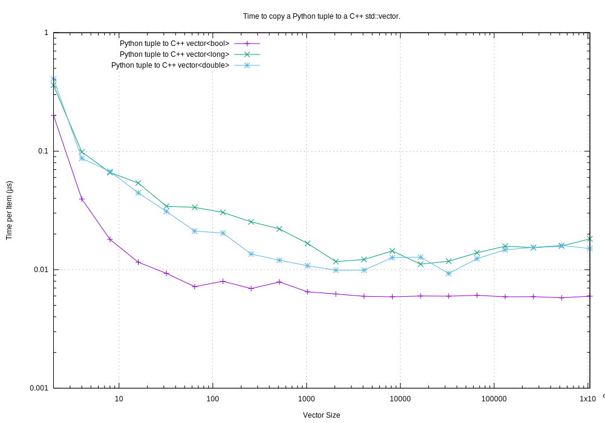
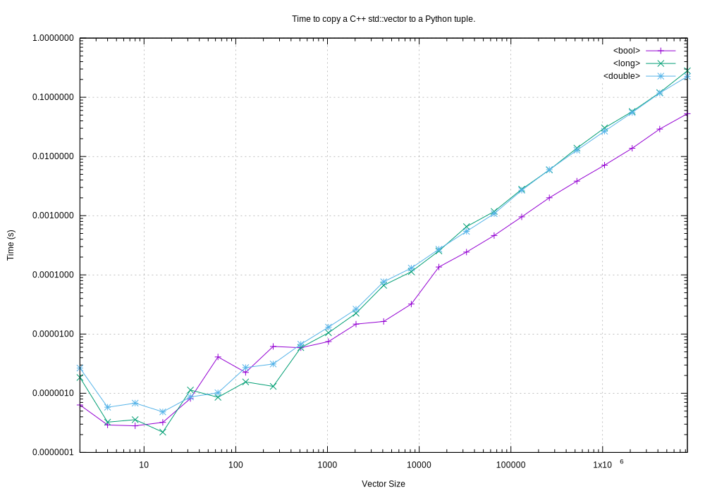
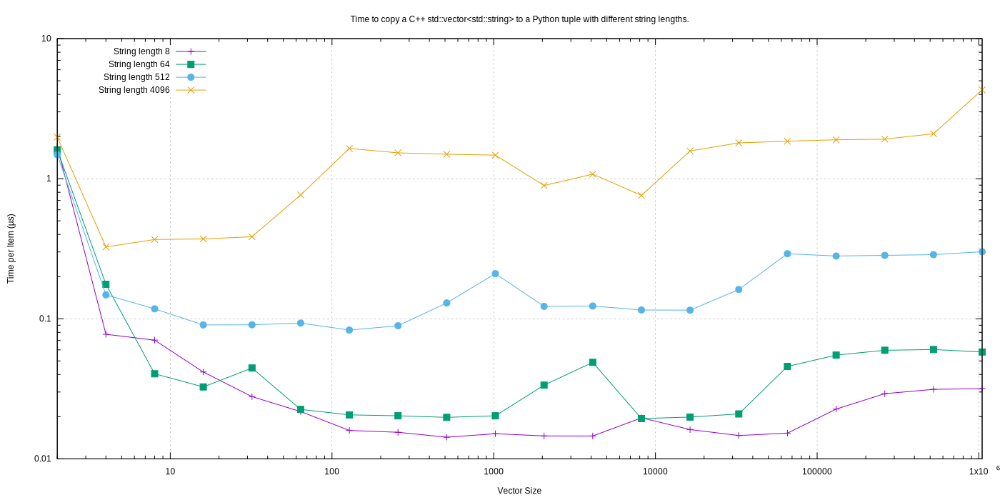
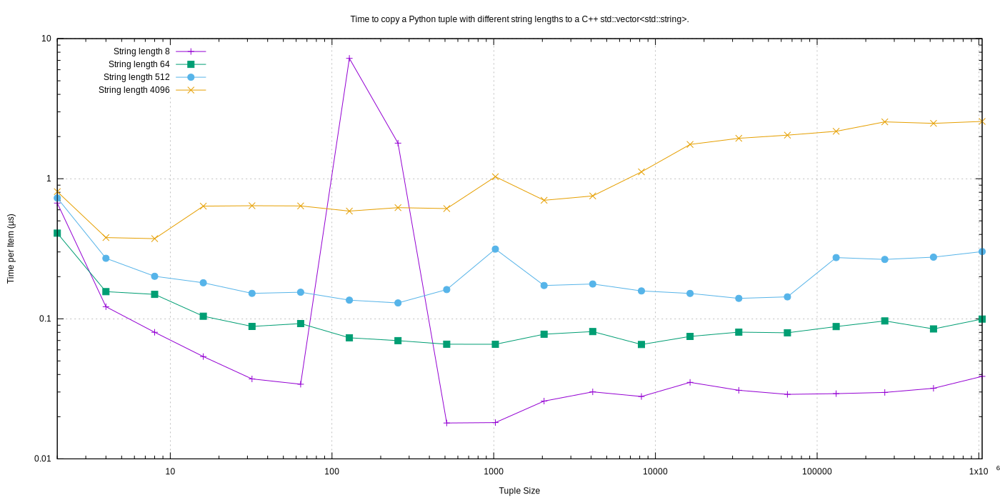
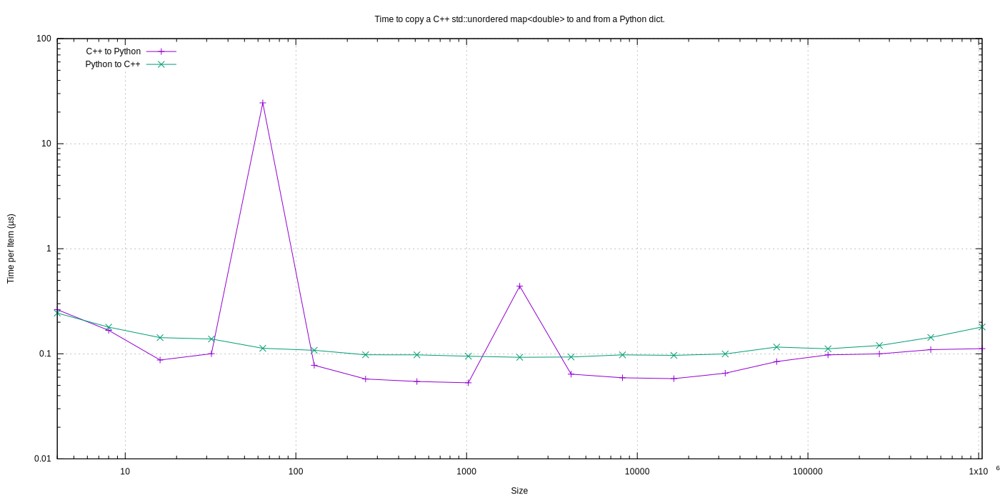
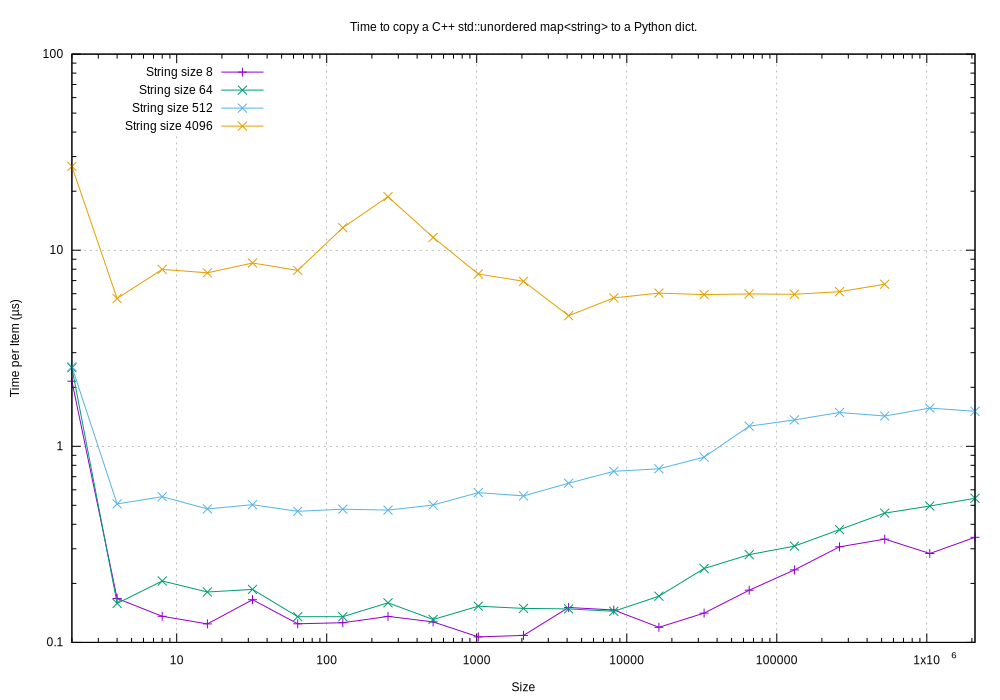

Performance
===================

Summary
-----------------

Fundamental Types
^^^^^^^^^^^^^^^^^^^^^

Converting and copying of ``int``/``long`` and ``float``/``double`` takes about 0.1 µs per object (10m objects per second).
``boolean``/``bool`` is around 2x to 5x faster.

Strings of Different Lengths
^^^^^^^^^^^^^^^^^^^^^^^^^^^^^^^^^^

With ``bytes``/``std::string`` converting and conversion takes about the following.
The performance appears appears linear (with some latency for small strings):

=============== ======================= =========================== ===================
String size     ~Time per object (µs)   ~Rate, million per second   ~Rate x Size Mb/s
=============== ======================= =========================== ===================
8               0.02                    50                          400
64              0.03                    30                          2000
512             0.1                     10                          5000
4096            1.0                     1                           4000
=============== ======================= =========================== ===================

Python Tuple to a C++ ``std::vector``
-----------------------------------------------

Here is an example of converting a Python tuple to a C++ ``std::vector<T>`` for up to 1m ``bool``, ``long`` and ``double`` types.
Time is per-object in µs.
So 1m float/long conversion takes about 0.02 seconds.

C++ ``std::vector`` to a Python Tuple
-----------------------------------------------

This is the reverse of the above, the time to convert a C++ ``std::vector<T>`` to a Python  ``tuple`` for up to 1m ``bool``, ``long`` and ``double`` types.

Python Tuple of ``bytes`` to a C++ ``std::vector<std::string>>``
-----------------------------------------------------------------

C++ ``std::vector<std::string>>`` to a Python Tuple of ``bytes``
-----------------------------------------------------------------

Python Dict of ``[float, float]`` to a C++ ``std::unordered_map<double, double>``
----------------------------------------------------------------------------------------------

Python Dict of ``[bytes, bytes]`` to a C++ ``std::unordered_map<std::string, std::string>``
------------------------------------------------------------------------------------------------------------

