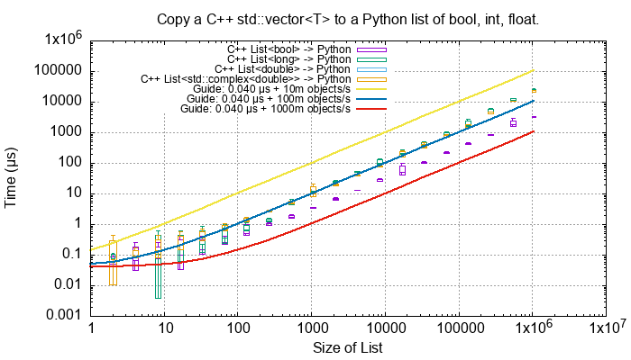
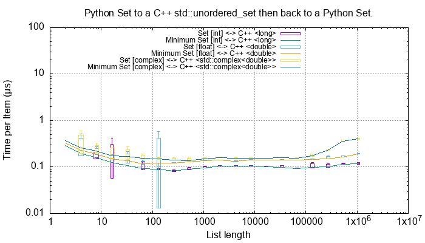
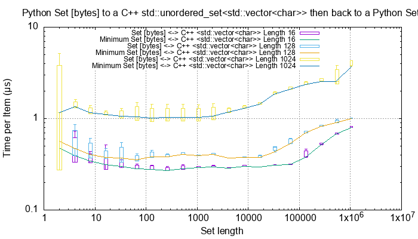
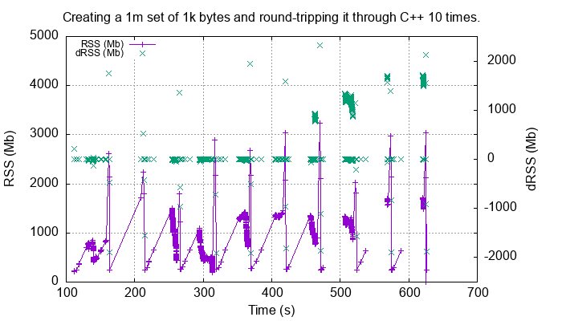

Performance
===================

Here are some benchmarks for converting Python containers to and from their C++ equivalents.

The C++ code was compiled with ``-O3`` and run on the following hardware:

.. code-block:: none

    Model Name:	                MacBook Pro
    Model Identifier:           MacBookPro15,2
    Processor Name:             Intel Core i7
    Processor Speed:            2.7 GHz
    Number of Processors:       1
    Total Number of Cores:      4
    L2 Cache (per Core):        256 KB
    L3 Cache:                   8 MB
    Hyper-Threading Technology: Enabled
    Memory:                     16 GB

    System Version:             macOS 10.14.6 (18G9323)
    Kernel Version:             Darwin 18.7.0

Mac Mini 'B':

.. code-block:: none

    Model Name:	Mac mini
    Model Identifier:	Macmini9,1
    Chip:	Apple M1
    Total Number of Cores:	8 (4 performance and 4 efficiency)
    Memory:	16 GB
    System Firmware Version:	6723.120.36
    OS Loader Version:	6723.120.36

    System Version:	macOS 11.4 (20F71)
    Kernel Version:	Darwin 20.5.0

C++ Performance Tests
-------------------------

These tests are in ``src/cpy/tests/test_performance.h`` and ``src/cpy/tests/test_performance.cpp``.

Conversion of Fundamental Types
^^^^^^^^^^^^^^^^^^^^^^^^^^^^^^^^^^^^^^^^^^^^

These C++ functions test the cost of converting ints, floats and bytes objects between Python and C++.
These test are executed if the macro ``TEST_PERFORMANCE_FUNDAMENTAL_TYPES`` is defined.

.. list-table::
   :widths: 40 25 25 30
   :header-rows: 1

   * - Operation
     - C++ to Python (µs)
     - Python to C++ (µs)
     - Notes
   * - C++ ``bool`` <-> Python ``bool``
     - 0.0027
     - 0.0016
     -
   * - C++ ``long`` <-> Python ``int``
     - 0.0146
     - 0.0046
     -
   * - C++ ``double`` <-> Python ``float``
     - 0.0086
     - 0.0027
     -

For C++ ``string`` <-> Python ``bytes`` of different lengths:

.. list-table::
   :widths: 20 25 25 50
   :header-rows: 1

   * - Length
     - C++ to Python (µs)
     - Python to C++ (µs)
     - Notes
   * - 2
     - 0.0173
     - 0.0047
     -
   * - 16
     - 0.0169
     - 0.0040
     -
   * - 128
     - 0.0201
     - 0.0641
     -
   * - 1024
     - 0.0807
     - 0.0671
     - Corresponds to about 14 Gb/s
   * - 8192
     - 0.1317
     - 0.1197
     - Corresponds to about 64 Gb/s
   * - 65536
     - 1.567
     - 1.551
     - Corresponds to about 41 Gb/s

Python List and C++ ``std::vector<T>``
^^^^^^^^^^^^^^^^^^^^^^^^^^^^^^^^^^^^^^^^^^^^^^^^^^^^^^^^^^^^^^^^^^^^^^^^^^^^^^

TODO: Use this as an extensive example of the methodology.

TODO: bool, int, float Python -> C++

.. image:: plots/images/cpp_py_list_bool_int_float_vector_bool_long_double_time.png
    :height: 300px
    :align: center

.. image:: plots/images/cpp_py_list_bool_int_float_vector_bool_long_double_rate.png
    :height: 300px
    :align: center

TODO: bool, int, float C++ -> Python

.. image:: plots/images/cpp_vector_bool_long_double_py_list_bool_int_float_rate.png
    :height: 300px
    :align: center

TODO: Describe bytes
TODO: Python -> C++

.. image:: plots/images/cpp_py_list_bytes_vector_string_time.png
    :height: 300px
    :align: center

TODO:

.. image:: plots/images/cpp_py_list_bytes_vector_string_rate.png
    :height: 300px
    :align: center

TODO:

=============== ======================= =========================== ===================
Object          ~Time per object (µs)   Rate Mb/s                   Notes
=============== ======================= =========================== ===================
bytes[2]        0.01                    200
bytes[16]       0.01                    1600
bytes[128]      0.07                    1,800
bytes[1024]     0.15 to 0.6             1,600 to 6,800
=============== ======================= =========================== ===================

TODO: C++ -> Python
TODO:

.. image:: plots/images/cpp_vector_string_py_list_bytes_time.png
    :height: 300px
    :align: center

TODO:

.. image:: plots/images/cpp_vector_string_py_list_bytes_rate.png
    :height: 300px
    :align: center

TODO:

=============== ======================= =========================== ===================
Object          ~Time per object (µs)   Rate Mb/s                   Notes
=============== ======================= =========================== ===================
bytes[2]        0.015 to 0.03           67 to 133
bytes[16]       0.015 to 0.04           400 to 133
bytes[128]      0.02 to 0.09            1,400 to 6,400
bytes[1024]     0.1 to 0.6              1,600 to 10,000
=============== ======================= =========================== ===================

Example of Python Tuple of ``bytes`` to a C++ ``std::vector<std::string>``
^^^^^^^^^^^^^^^^^^^^^^^^^^^^^^^^^^^^^^^^^^^^^^^^^^^^^^^^^^^^^^^^^^^^^^^^^^^^^^

TODO: Use this as an example of the methodology, this shows RATE, the rest show time.

This shows the conversion cost of various length strings from a Python tuple to a C++ vector.
Each test was repeated 5 times.
The line shows the mean time per object in µs.
The extreme whiskers show the minimum and maximum test values.
The box shows the mean time ±the standard deviation, this is asymmetric as it is plotted on a log scale.
The box will often extend beyond a minimum value where the minimum is close to the mean and the maximum large.

.. image:: plots/images/cpp_py_tuple_bytes_vector_string_time.png
    :height: 300px
    :align: center

TODO:
Line shows minimum.

.. image:: plots/images/cpp_py_tuple_bytes_vector_string_rate.png
    :height: 300px
    :align: center

=============== ======================= =========================== ===================
Object          ~Time per object (µs)   Rate Mb/s                   Notes
=============== ======================= =========================== ===================
bytes[8]        0.01                    800
bytes[64]       0.06                    1,000
bytes[512]      0.1                     5,000
bytes[4096]     0.2 to 2.0              20,000 to 2,000             Slower large arrays are probably because the 8Gb memory demand is hitting the virtual memory system.
=============== ======================= =========================== ===================

Python Tuple and Lists to and from a C++ ``std::vector`` - Fundamental Types
^^^^^^^^^^^^^^^^^^^^^^^^^^^^^^^^^^^^^^^^^^^^^^^^^^^^^^^^^^^^^^^^^^^^^^^^^^^^^^^^^^^^

Here is an example of converting a Python tuple or list to and from a C++ ``std::vector<T>`` for up to 1m ``bool``, ``long`` and ``double`` types.

TODO:

.. image:: plots/images/cpp_vs_size_tuple_list_time.png
    :height: 300px
    :align: center

TODO:

.. image:: plots/images/cpp_vs_size_tuple_list_rate.png
    :height: 300px
    :align: center

Notes:

TODO:

* For int and float the  conversion rate is around 0.015 µs per item or around 70m objects per second.
* booleans are twice as quick taking around 0.007 µs/object or around 150m/s.
* A 1m float/long conversion takes about 10 to 20 ms in total.

Python Lists to and from a C++ ``std::vector`` - ``bytes`` of Varying Length
^^^^^^^^^^^^^^^^^^^^^^^^^^^^^^^^^^^^^^^^^^^^^^^^^^^^^^^^^^^^^^^^^^^^^^^^^^^^^^^^^^^^^^^^^

TODO:

.. image:: plots/images/cpp_py_list_bytes_vector_string_rate.png
    :height: 300px
    :align: center

TODO:

.. image:: plots/images/cpp_vector_string_py_list_bytes_rate.png
    :height: 300px
    :align: center

TODO:

Python Tuples to and from a C++ ``std::vector`` - ``bytes`` of Varying Length
^^^^^^^^^^^^^^^^^^^^^^^^^^^^^^^^^^^^^^^^^^^^^^^^^^^^^^^^^^^^^^^^^^^^^^^^^^^^^^^^^^^^^^^^^

TODO:

.. image:: plots/images/cpp_py_tuple_bytes_vector_string_rate.png
    :height: 300px
    :align: center

TODO:

.. image:: plots/images/cpp_vector_string_py_tuple_bytes_rate.png
    :height: 300px
    :align: center

TODO:

Sets and Dictionaries with ``int`` and ``float``
^^^^^^^^^^^^^^^^^^^^^^^^^^^^^^^^^^^^^^^^^^^^^^^^^^^^^^^^^^^^^^^^^^^^^^^^^^^^^^^^^^^^^^^^^

of [float, float] to a C++ ``std::unordered_map<double, double>``
TODO:

.. image:: plots/images/cpp_vs_size_set_dict_time.png
    :height: 300px
    :align: center

TODO:

.. image:: plots/images/cpp_vs_size_set_dict_rate.png
    :height: 300px
    :align: center

TODO:

Python Dict of [bytes, bytes] to a C++ ``std::unordered_map<std::string, std::string>``
^^^^^^^^^^^^^^^^^^^^^^^^^^^^^^^^^^^^^^^^^^^^^^^^^^^^^^^^^^^^^^^^^^^^^^^^^^^^^^^^^^^^^^^^^^^^^^

Similarly for dicts of bytes.
This corresponds, roughly, to a data rate of around 500 Mb/s.

TODO:

Round-trip Python to C++ and back to Python
------------------------------------------------

This uses some methods in the ``cPyCppContainers`` module that takes a Python container, converts it to a new C++
container and then converts that to a new Python container.
Timing is done in the Python interpreter.

For example to convert a list the following template code is used:

.. code-block:: cpp

    template<typename T>
    static PyObject *
    new_list(PyObject *arg) {
        std::vector<T> vec;
        if (!py_list_to_cpp_std_vector(arg, vec)) {
            return cpp_std_vector_to_py_list(vec);
        }
        return NULL;
    }

Then the extension has the following instantiations:

.. code-block:: cpp

    static PyObject *
    new_list_float(PyObject *Py_UNUSED(module), PyObject *arg) {
        return new_list<double>(arg);
    }

    static PyObject *
    new_list_int(PyObject *Py_UNUSED(module), PyObject *arg) {
        return new_list<long>(arg);
    }

    static PyObject *
    new_list_bytes(PyObject *Py_UNUSED(module), PyObject *arg) {
        return new_list<std::string>(arg);
    }

Similar code exists for Python sets and dicts of specific types.
Since the tuple conversion C++ code is essentially identical to the list conversion code no performance tests are done on tuples.
It might be that the Python C API for tuples is significantly different than for list but this is considered unlikely.

Python Lists
^^^^^^^^^^^^^^^^^^^^

Here is the *round trip* performance of a Python list of booleans, ints or floats:

.. image:: plots/images/roundtrip_list_ints_floats_and_bools_rate.png
    :height: 300px
    :align: center

These are typically *round trip* converted at:

* 0.01 µs per object for booleans, say 100m objects a second.
* 0.025 µs per object for ints and floats, say 40m objects a second.

And a Python list of bytes for different lengths; 2, 16, 128 and 1024 bytes long:

.. image:: plots/images/roundtrip_list_bytes_rate.png
    :height: 300px
    :align: center

Given the size of each object this *round trip* time for lists can be summarised as:

=============== ======================= =========================== =========================== ===================
Object          Time per object (µs)    Rate (million/s)            Rate (Mb/s)                 Notes
=============== ======================= =========================== =========================== ===================
bool            0.01                    100                         ~10 (one bit per object)    Multiply these rates by 2 to get individual conversion rate.
float or int    0.025                   40                          320 (8 bytes per object)
bytes[2]        0.04                    25                          50
bytes[16]       0.04                    25                          400
bytes[128]      0.15                    6.7                         850
bytes[1024]     0.4 to 2.0              0.5 to 2.5                  500 to 2500
=============== ======================= =========================== =========================== ===================

Python Sets
^^^^^^^^^^^^^^^^^^^^

Here is the *round trip* performance of a Python set of ints and floats:

These are typically *round trip* converted at:

* 0.15 µs per object for int, say 6m objects a second.
* 0.2 µs per object for float, say 5m objects a second.

The *round trip* time for a list takes 0.025 µs for ints and floats so a set takes six times longer for ints and eight times longer for floats.
An explanation is that the cost of hashing and insertion (and possible re-hashing the container) dominates the performance compared to the cost of conversion.

And a Python set of bytes for different lengths; 2, 16, 128 and 1024 bytes long:

Here is a comparison with a list:

=============== =================================== =================================== =========== ===================
Object          Time per object for a set (µs)      Time per object for a list (µs)     Ratio       Notes
=============== =================================== =================================== =========== ===================
bytes[2]        0.3                                 0.04                                x7.5
bytes[16]       ~0.6                                0.04                                x15
bytes[128]      0.6 to 1.5                          0.15                                x4 to x10
bytes[1024]     1.0 to 5.0                          0.4 to 2                            x2.5
=============== =================================== =================================== =========== ===================

Again, the cost of hashing and insertion explains the difference.

Given the size of each object this *round trip* time for sets can be summarised as:

=============== ======================= =========================== =========================== ===================
Object          Time per object (µs)    Rate (million/s)            Rate (Mb/s)                 Notes
=============== ======================= =========================== =========================== ===================
int             0.15                    6                           48 (8 bytes per object)     Multiply these rates by 2 to get individual conversion rate.
float           0.2                     5                           40 (8 bytes per object)
bytes[2]        0.3                     3                           6
bytes[16]       ~0.6                    1.7                         27
bytes[128]      0.6 to 1.5              0.7 to 1.7                  90 to 220
bytes[1024]     1.0 to 5.0              0.2 to 1                    200 to 1000
=============== ======================= =========================== =========================== ===================

Python dicts
^^^^^^^^^^^^^^^^^^^^

Here is the round trip time for a Python dict to and from a C++ ``std::unordered_map<long, long>``.
This plots the *round trip* cost *per key/value pair* against dict size.

.. image:: plots/images/roundtrip_dict_ints_and_floats_rate.png
    :height: 300px
    :align: center

These are typically *round trip* converted at:

* 0.15 µs per object for int, say 6m objects a second.
* 0.2 µs per object for float, say 5m objects a second.

This is identical to the values for the set but includes the conversion time for both key and value.
The hashing, insertion and potential re-hashing dominate teh performance.

Here is the *round trip* time for a Python dict [bytes, bytes] to and from a C++ ``std::unordered_map<std::string, std::string>`` for different lengths; 2, 16, 128 and 1024 bytes long.
The key and the value are the same length.
This plots the *round trip* cost *per key/value pair* against dict size.

.. image:: plots/images/roundtrip_dict_bytes_rate.png
    :height: 300px
    :align: center

This *round trip* time for both keys and values for dicts can be summarised as:

=============== ======================= =========================== =========================== ===================
Object          Time per object (µs)    Rate (million/s)            Rate (Mb/s)                 Notes
=============== ======================= =========================== =========================== ===================
int             0.15                    6                           48 (8 bytes per object)     Multiply these rates by 2 to get individual conversion rate.
float           0.2                     5                           40 (8 bytes per object)
bytes[2]        0.3                     3                           6
bytes[16]       0.3 to 1                1 to 3                      16 to 48
bytes[128]      0.6 to 2                0.5 to 1.7                  64 to 220
bytes[1024]     1.0 to 7.0              0.15 to 1                   150 to 1000
=============== ======================= =========================== =========================== ===================

Memory Use
------------------------------------------------

Python Lists of bytes
^^^^^^^^^^^^^^^^^^^^^^^^^^^^^^

To examine the typical memory use a round-trip was made between Python to C++ and back to Python with a list of bytes.
The list was 1m long and each member was 1k bytes, so a total of 1Gb to convert to C++ and back to a new Python list.
This is a gigabyte sized list of objects.

The creation/destruction was repeated 10 times and the memory profiled using
`pymemtrace <https://pypi.org/project/pymemtrace/>`_.
The code to do this is something like:

.. code-block::

    from pymemtrace import cPyMemTrace
    
    import cPyCppContainers
    
    with cPyMemTrace.Profile():
        for _r in range(10):
            original = [b' ' * 1024 for _i in range(1024 * 1024)]
            new_list = cPyCppContainers.new_list_bytes(original)

`pymemtrace <https://pypi.org/project/pymemtrace/>`_ produces a log file of memory usage such as (not the actual data that created the plot below):

.. code-block:: text

          Event        dEvent  Clock        What     File                   #line Function                                  RSS         dRSS
    NEXT: 0            +0      1.267233     CALL     test_with_pymemtrace.py#  15 _test_new_list_bytes                 29384704     29384704
    PREV: 83           +83     1.267558     CALL     test_with_pymemtrace.py#  26 <listcomp>                           29384704            0
    NEXT: 84           +84     1.268744     RETURN   test_with_pymemtrace.py#  26 <listcomp>                           29544448       159744
    PREV: 87           +3      1.268755     C_CALL   test_with_pymemtrace.py#  28 new_list_bytes                       29544448            0
    NEXT: 88           +4      2.523796     C_RETURN test_with_pymemtrace.py#  28 new_list_bytes                     1175990272   1146445824
    NEXT: 89           +1      2.647460     C_CALL   test_with_pymemtrace.py#  29 perf_counter                         34713600  -1141276672
    PREV: 93           +4      2.647496     CALL     test_with_pymemtrace.py#  26 <listcomp>                           34713600            0
    NEXT: 94           +5      2.648859     RETURN   test_with_pymemtrace.py#  26 <listcomp>                           34844672       131072
    NEXT: 95           +1      2.648920     C_CALL   test_with_pymemtrace.py#  27 perf_counter                         34775040       -69632
    PREV: 97           +2      2.648929     C_CALL   test_with_pymemtrace.py#  28 new_list_bytes                       34775040            0
    NEXT: 98           +3      3.906950     C_RETURN test_with_pymemtrace.py#  28 new_list_bytes                     1176018944   1141243904
    NEXT: 99           +1      4.041886     C_CALL   test_with_pymemtrace.py#  29 perf_counter                         34713600  -1141305344

The following is a plot of RSS and change of RSS over time:

.. image:: plots/images/pymemtrace_list_bytes.png
    :height: 300px
    :align: center

This result is rather surprising.
The maximum RSS should reflect that at some point the following are held in memory:

- Basic Python, say 30Mb
- The original Python list of bytes, 1024Mb.
- The C++ ``std::vector<std::string>``, 1024Mb.
- The new Python list of bytes, 1024Mb.

This would be a total of 3102Mb.
However we are seeing a maximum RSS of only around 2200Mb.

Python Set of bytes
^^^^^^^^^^^^^^^^^^^^^^^^^^^^^^

A similar test was made of a gigabyte sized Python set of bytes.
Each key and value were 1024 bytes long and the set was 1m long.
The Python set was round-tripped to a C++ ``std::unordered_set<std::string>`` and back to a new Python set.

The code looks like this:

.. code-block::

    with cPyMemTrace.Profile(4096 * 16):
        total_bytes = 2**20 * 2**10
        byte_length = 1024
        set_length = total_bytes // byte_length // 2
        random_bytes = [random.randint(0, 255) for _i in range(byte_length)]
        for _r in range(10):
            original = set()
            for i in range(set_length):
                k = bytes(random_bytes)
                original.add(k)
                # Shuffle is quite expensive. Try something simpler:
                # chose a random value and increment it with roll over.
                index = random.randint(0, byte_length - 1)
                random_bytes[index] = (random_bytes[index] + 1) % 256
            cPyCppContainers.new_set_bytes(original)

The following is a plot of RSS and change of RSS over time:

In the set case constructing the original set takes around 1500Mb.
So on entry to ``new_set_bytes`` the RSS is typically 1700Mb.
Constructing the ``std::unordered_set<std::string>`` and a new Python set takes an extra 1000Mb taking the total memory to around 2500MB.
On exit from ``new_set_bytes`` the RSS decreases back down to 200Mb.

In theory the maximum RSS use should be:

- Basic Python, say 30Mb
- The original Python set, 1024Mb.
- The C++ ``std::unordered_set<std::string>``, 1024Mb.
- The new Python dict, 1024Mb.

This would be a total of 3102Mb.

Python Dicts of bytes
^^^^^^^^^^^^^^^^^^^^^^^^^^^^^^

A similar test was made of a gigabyte sized Python dict of bytes.
Each key and value were 1024 bytes long and the dictionary was 0.5m long.
The Python dict was round-tripped to a C++ ``std::unordered_map<std::string, std::string>`` and back to a new Python dict.

The code looks like this:

.. code-block::

    with cPyMemTrace.Profile(4096 * 16):
        total_bytes = 2**20 * 2**10
        byte_length = 1024
        dict_length = total_bytes // byte_length // 2
        random_bytes = [random.randint(0, 255) for _i in range(byte_length)]
        for _r in range(10):
            original = {}
            for i in range(dict_length):
                k = bytes(random_bytes)
                original[k] = b' ' * byte_length
                # Shuffle is quite expensive. Try something simpler:
                # chose a random value and increment it with roll over.
                index = random.randint(0, byte_length - 1)
                random_bytes[index] = (random_bytes[index] + 1) % 256
            cPyCppContainers.new_dict_bytes_bytes(original)

The following is a plot of RSS and change of RSS over time:

.. image:: plots/images/pymemtrace_dict_bytes.png
    :height: 300px
    :align: center

In the dictionary case constructing the original dict takes around 1500Mb.
So on entry to ``new_dict_bytes_bytes`` the RSS is typically 1700Mb.
Constructing the ``std::unordered_map<std::string, std::string>`` and a new Python dict takes an extra 2500Mb taking the total memory to around 4200MB.
On exit from ``new_dict_bytes_bytes`` the RSS decreases in two stages, destroying the
``std::unordered_map<std::string, std::string>`` frees 2000Mb then freeing the original gives back another 2000Mb.
This brings the total RSS back down to 200Mb.

In theory the maximum RSS use should be:

- Basic Python, say 30Mb
- The original Python dict, 1024Mb.
- The C++ ``std::unordered_map<std::string, std::string>``, 1024Mb.
- The new Python dict, 1024Mb.

This would be a total of 3102Mb.
The fact that we are seeing around 4200Mb,  35% more, is probably due to over-allocation either any or all of the Python
dict or bytes allocators or the C++ ``std::unordered_map<T>`` or ``std::string`` allocators.

All these graphs show that there are no memory leaks.

Containers of One Object
^^^^^^^^^^^^^^^^^^^^^^^^^^^^

This test was to create a list, set or dict with one entry of 1024 bytes and then convert it 10,000,000 times to a C++
container and then back to Python.
The memory was monitiored with `pymemtrace <https://pypi.org/project/pymemtrace/>`_ set up to spot and changes in RSS of >=4096 bytes.

For example here is the code for a list:

.. code-block::

    original = [b' ' * 1024]
    with cPyMemTrace.Profile():
        for _r in range(10_000_000):
            cPyCppContainers.new_list_bytes(original)
        # Tends to force an event in pymemtrace.
        gc.collect()

The following is a plot of RSS and change of RSS over time for list, set, dict:

.. image:: plots/images/pymemtrace_list_set_dict_bytes_one_item.png
    :height: 300px
    :align: center

This graph shows that there are no memory leaks on container construction.

Summary
-----------------

* Sequences of fundamental types are converted at around 100m objects/sec.
* Sequences of strings are converted at a memory rate of around 4000 Mb/sec.
* Dicts are about 5-10x slower than lists and tuples. 2x of this can be explained a both the key and the value must be converted.
  The rest of the discrepancy can be explained by, whilst both list and dict operations are O(1),
  the list insert is much faster as an insert into a dict involves hashing.
* There are no memory leaks.

Fundamental Types
^^^^^^^^^^^^^^^^^^^^^

Converting and copying of ``int``/``long`` and ``float``/``double`` takes about 0.01 µs per object (100m objects per second) for large containers.
This corresponds to around 800 Mb/s.
``boolean``/``bool`` is around 2x to 5x faster.

Strings of Different Lengths
^^^^^^^^^^^^^^^^^^^^^^^^^^^^^^^^^^

With ``bytes``/``std::string`` converting and conversion takes about the following.
The performance appears appears linear (with some latency for small arrays):

=============== ======================= =========================== ===================
String size     ~Time per object (µs)   ~Rate, million per second   ~Rate x Size Mb/s
=============== ======================= =========================== ===================
8               0.02                    50                          400
64              0.03                    30                          2000
512             0.1                     10                          5000
4096            1.0                     1                           4000
=============== ======================= =========================== ===================

