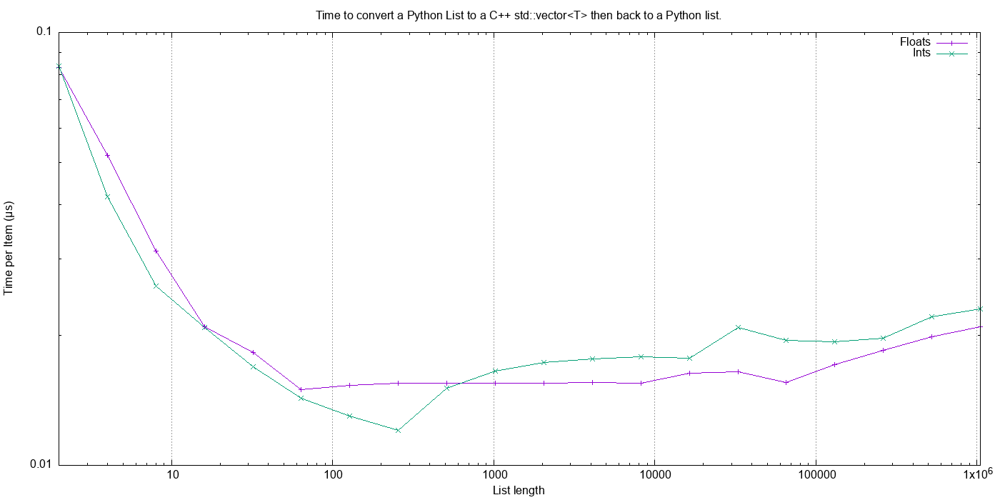
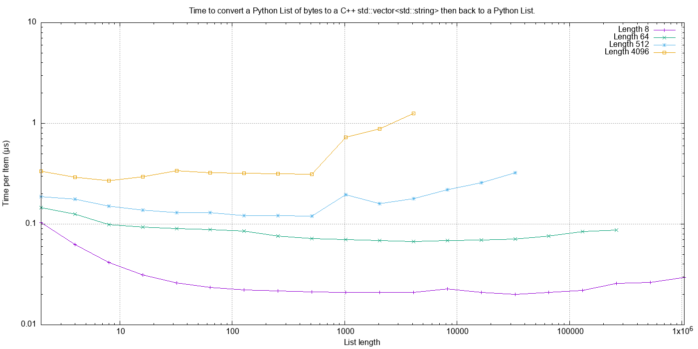
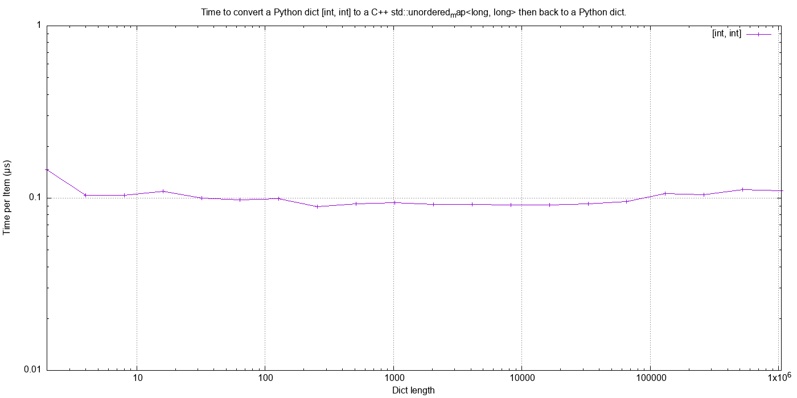
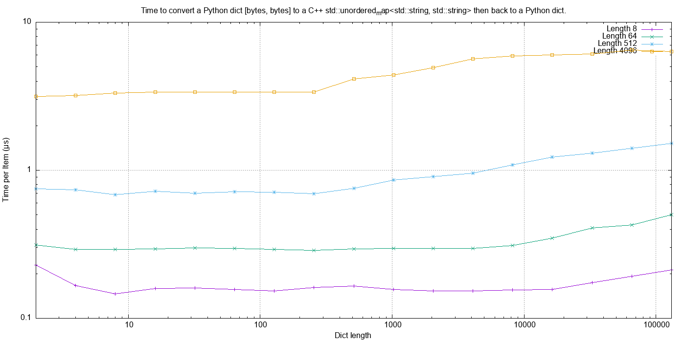

Performance
===================

Here are some benchmarks for converting Python containers to and from their C++ equivalents.

The C++ code was compiled with ``-O3`` and run on the following hardware:

.. code-block:: none

    Model Name:	                MacBook Pro
    Model Identifier:           MacBookPro15,2
    Processor Name:             Intel Core i7
    Processor Speed:            2.7 GHz
    Number of Processors:       1
    Total Number of Cores:      4
    L2 Cache (per Core):        256 KB
    L3 Cache:                   8 MB
    Hyper-Threading Technology: Enabled
    Memory:                     16 GB

    System Version:             macOS 10.14.6 (18G9323)
    Kernel Version:             Darwin 18.7.0

Summary
-----------------

* Sequences of fundamental types are converted at around 100m objects/sec.
* Sequences of strings are converted at a memory rate of around 4000 Mb/sec.
* Dicts are about 5-10x slower than lists and tuples. 2x of this can be explained a both the key and the value must be converted.
  The rest of the discrepancy can be explained by, whilst both list and dict operations are O(1), the list insert is much faster as an insert into a dict involves hashing.

Fundamental Types
^^^^^^^^^^^^^^^^^^^^^

Converting and copying of ``int``/``long`` and ``float``/``double`` takes about 0.01 µs per object (100m objects per second) for large containers.
This corresponds to around 800 Mb/s.
``boolean``/``bool`` is around 2x to 5x faster.

Strings of Different Lengths
^^^^^^^^^^^^^^^^^^^^^^^^^^^^^^^^^^

With ``bytes``/``std::string`` converting and conversion takes about the following.
The performance appears appears linear (with some latency for small strings):

=============== ======================= =========================== ===================
String size     ~Time per object (µs)   ~Rate, million per second   ~Rate x Size Mb/s
=============== ======================= =========================== ===================
8               0.02                    50                          400
64              0.03                    30                          2000
512             0.1                     10                          5000
4096            1.0                     1                           4000
=============== ======================= =========================== ===================

Python Tuple to a C++ ``std::vector``
-----------------------------------------------

Here is an example of converting a Python tuple to a C++ ``std::vector<T>`` for up to 1m ``bool``, ``long`` and ``double`` types.
Time is per-object in µs.
So 1m float/long conversion takes about 10 to 20 ms.

.. image:: plots/test_py_tuple_to_vector.svg.png
    :height: 300px
    :align: center

C++ ``std::vector`` to a Python Tuple
-----------------------------------------------

This is the reverse of the above, the time to convert a C++ ``std::vector<T>`` to a Python  ``tuple`` for up to 1m ``bool``, ``long`` and ``double`` types.

.. image:: plots/test_vector_to_py_tuple.svg.png
    :height: 300px
    :align: center

Python Tuple of ``bytes`` to a C++ ``std::vector<std::string>>``
-----------------------------------------------------------------

This shows the conversion cost of various length strings.

.. image:: plots/test_vector_string_to_py_tuple.svg.png
    :height: 300px
    :align: center

C++ ``std::vector<std::string>>`` to a Python Tuple of ``bytes``
-----------------------------------------------------------------

This is the reverse of the above.

.. image:: plots/test_py_tuple_string_to_vector.svg.png
    :height: 300px
    :align: center

Python Dict of [float, float] to a C++ ``std::unordered_map<double, double>``
----------------------------------------------------------------------------------------------

This shows the conversion rate of a dict of floats to and from Python.
At 0.1 µs per item (10m objects/s) this rate is about one-tenth of the rate of converting a sequence.

.. image:: plots/test_dict_double.svg.png
    :height: 300px
    :align: center

Python Dict of [bytes, bytes] to a C++ ``std::unordered_map<std::string, std::string>``
------------------------------------------------------------------------------------------------------------

Similarly for dicts of bytes.
This corresponds, roughly, to a data rate of around 500 Mb/s.

.. image:: plots/test_dict_string.svg.png
    :height: 300px
    :align: center

Round-trip Python to C++ and back to Python
------------------------------------------------

This uses some methods in the ``cPyCppContainers`` module that takes a Python container, converts it to a new C++
container and then converts that to a new Python container.

For example to convert a list the following template code is used:

.. code-block:: cpp

    template<typename T>
    static PyObject *
    new_list(PyObject *arg) {
        std::vector<T> vec;
        if (!py_list_to_cpp_std_vector(arg, vec)) {
            return cpp_std_vector_to_py_list(vec);
        }
        return NULL;
    }

Then the extension has the following instantiations:

.. code-block:: cpp

    static PyObject *
    new_list_float(PyObject *Py_UNUSED(module), PyObject *arg) {
        return new_list<double>(arg);
    }

    static PyObject *
    new_list_int(PyObject *Py_UNUSED(module), PyObject *arg) {
        return new_list<long>(arg);
    }

    static PyObject *
    new_list_bytes(PyObject *Py_UNUSED(module), PyObject *arg) {
        return new_list<std::string>(arg);
    }

Similar code exists for Python dicts of specific types.

Python Lists
^^^^^^^^^^^^^^^^^^^^

Here is the **round trip** performance of a Python list of floats and a Python list of ints:

These are typically **round trip** converted at 0.015 µs per object, say 70m objects a second or around 600 Mb/s.

And Python lists of bytes of different lengths:

This **round trip** time for lists can be summarised as:

=============== ======================= =========================== ===================
Object          ~Time per object (µs)   Rate Mb/s                   Notes
=============== ======================= =========================== ===================
float or int    0.015                   600                         Multiply these rates by 2 to get individual conversion rate.
bytes[8]        0.025                   300
bytes[64]       0.09                    700
bytes[512]      0.2                     2500
bytes[4096]     0.6                     6800
=============== ======================= =========================== ===================

Python dicts
^^^^^^^^^^^^^^^^^^^^

Here is the round trip time for a Python dict [int, int] to and from a C++ ``std::unordered_map<long, long>``.
This plots the **round trip** cost *per key/value pair* against dict size.

Here is the **round trip** time for a Python dict [bytes, bytes] to and from a C++ ``std::unordered_map<std::string, std::string>`` for different length bytes objects.
The key and the value are the same length.
This plots the **round trip** cost *per key/value pair* against dict size.

This **round trip** time for both keys and values for dicts can be summarised as:

=============== ======================= =========================== ===================
Object          ~Time per object (µs)   Rate Mb/s                   Notes
=============== ======================= =========================== ===================
int             0.1                     80                          Multiply these rates by 4 to get individual conversion rate.
bytes[8]        0.15                    50
bytes[64]       0.4                     150
bytes[512]      1.0                     1000
bytes[4096]     5.0                     1600
=============== ======================= =========================== ===================

