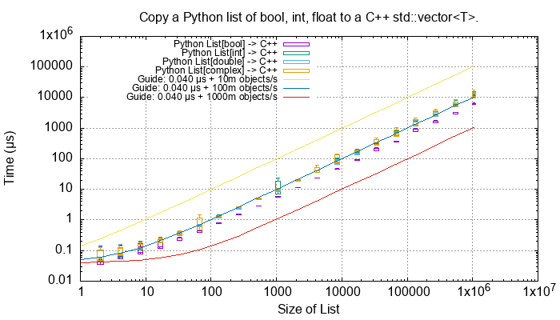
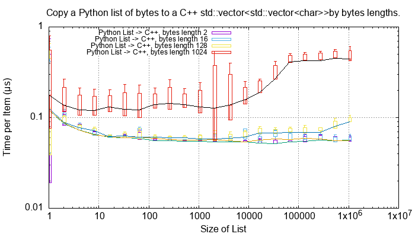
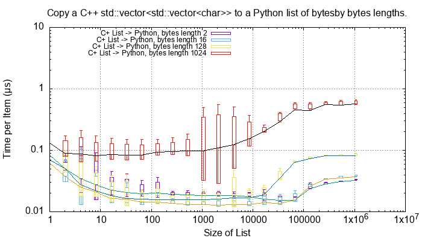

.. moduleauthor:: Paul Ross <apaulross@gmail.com>
.. sectionauthor:: Paul Ross <apaulross@gmail.com>

.. C++ performance

.. _PythonCppContainers.Performance.Cpp:

C++ Performance Tests
==============================

Test Procedure
--------------------------

The main entry point to the ``PyCppContainers`` project is in ``src/main.cpp`` and runs the functional, performance and
memory tests.

The performance tests are in ``src/cpy/tests/test_performance.h`` and ``src/cpy/tests/test_performance.cpp``.
There are a number of macros ``TEST_PERFORMANCE_*`` there that control which tests are run.
Running all tests takes about 20 minutes.

The tests can be run by building and running the C++ binary from the project root:

.. code-block:: shell

    cmake --build cmake-build-release --target clean -- -j 6
    cmake --build cmake-build-release --target PyCppContainers -- -j 6
    cmake-build-release/PyCppContainers

The output is large and looks like this:

.. code-block:: shell

    cmake-build-release/PyCppContainers
    Hello, World!
    Python version: 3.12.1
    test_functional_all START
    RSS(Mb): was:     29.047 now:     29.062 diff:     +0.016 Peak was:     29.047 now:     29.062 diff:     +0.016 test_vector_to_py_tuple<bool>
    RSS(Mb): was:     29.062 now:     29.074 diff:     +0.012 Peak was:     29.062 now:     29.074 diff:     +0.012 test_vector_to_py_tuple<long>
    RSS(Mb): was:     29.074 now:     29.098 diff:     +0.023 Peak was:     29.074 now:     29.098 diff:     +0.023 test_vector_to_py_tuple<double>
    8<---- Snip ---->8

The complete output can be captured to ``perf_notes/cpp_test_results.txt`` with this command:

.. code-block:: shell

    caffeinate time cmake-build-release/PyCppContainers > perf_notes/cpp_test_results.txt

Then there is a Python script ``perf_notes/write_dat_files_for_cpp_test_results.py`` that will extract all the
performance data into ``perf_notes/dat`` suitable for gnuplot.
Copy those ``*.dat`` files into ``docs/sphinx/source/plots/dat`` then ``cd`` into ``docs/sphinx/source/plots`` and run
``gnuplot -p *.plt`` to update all the performance plots referenced in the documentation.

.. note::

    See :ref:`PythonCppContainers.Performance.Round_trip` for the Python plots which can be built by gnuplot at the
    same time.

Conversion of Fundamental Types
------------------------------------

These C++ functions test the cost of converting ints, floats and bytes objects between Python and C++.
These test are executed if the macro ``TEST_PERFORMANCE_FUNDAMENTAL_TYPES`` is defined.

.. list-table:: Fundamental Type Conversion Time. Times in nanoseconds.
   :widths: 30 20 20 20 60
   :header-rows: 1

   * - Type C++/Py
     - C++ to Py
     - Py to C++
     - Ratio
     - Notes
   * - ``bool``/``bool``
     - 2.7
     - 1.6
     - 1.7x
     - The mean is around 450m/s
   * - ``long``/``int``
     - 14.6
     - 4.6
     - 3.2x
     - The mean is around 100m/s.
   * - ``double``/``float``
     - 8.6
     - 2.7
     - 3.2x
     - The mean is around 180m/s.
   * - ``complex<double>``/``complex``
     - 12.2
     - 4.9
     - 2.5x
     - The mean is around 120m/s.

Converting from C++ to Python is always slower than from Python to C++.

For a single C++ ``std::vector<char>`` to and from Python ``bytes`` of different lengths:

.. list-table:: Fundamental Type Conversion Time. Times in nanoseconds.
   :widths: 30 20 20 20 60
   :header-rows: 1

   * - Length
     - C++ to Py
     - Py to C++
     - Ratio
     - Notes
   * - 2
     - 17.3
     - 4.7
     - 3.7x
     -
   * - 16
     - 16.9
     - 4.0
     - 4.2x
     -
   * - 128
     - 20.1
     - 64.1
     - 0.31x
     -
   * - 1024
     - 80.7
     - 67.1
     - 1.2x
     - Corresponds to about 14 Gb/s
   * - 8192
     - 131.7
     - 119.7
     - 1.1x
     - Corresponds to about 64 Gb/s
   * - 65536
     - 1,567
     - 1,551
     - 1.0x
     - Corresponds to about 41 Gb/s

Bytes conversion time from C++ to Python or the reverse takes asymptotically and roughly:

.. code-block:: text

    t (ns) = 1200 * length / 50,000

For a single C++ ``std::string`` to and from Python ``str`` of different lengths:

.. list-table:: String Conversion Time. Times in nanoseconds.
   :widths: 30 20 20 20 60
   :header-rows: 1

   * - Length
     - C++ to Py
     - Py to C++
     - Ratio
     - Notes
   * - 2
     - 30.9
     - 5.2
     - 5.9x
     -
   * - 16
     - 33.7
     - 4.5
     - 7.5x
     -
   * - 128
     - 30.1
     - 63.4
     - 0.48x
     -
   * - 1024
     - 126
     - 66.7
     - 1.9x
     - Corresponds to about 8 to 15 Gb/s.
   * - 8192
     - 435
     - 122
     - 3.6x
     - Corresponds to about 20 to 65 Gb/s.
   * - 65536
     - 3,460
     - 1,530
     - 2.3x
     - Corresponds to about 20 to 40 Gb/s.

String conversion time from C++ to Python or the reverse takes asymptotically and roughly:

.. code-block:: text

    t (ns) = 900 * length / 24,000

This is about twice the time for ``bytes`` to an from ``std::vector<char>``.
Presumably this is because of the complexities of the Unicode implementation.

Python List to and from a C++ ``std::vector<T>``
----------------------------------------------------------

This as an extensive example of the methodology used for performance tests.
Each container test is repeated 5 times and the min/mean/max/std. dev. is recorded.
The min value is regarded as the most consistent one as other results may be affected by arbitrary context switching.
The tests are run on containers of lengths up to 1m items.

For example here is the total time to convert a list of ``bool``, ``int``, ``float`` and ``complex`` Python values to
C++ for various list lengths:

This time plot is not that informative apart from showing linear behaviour.
More useful are *rate* plots that show the total time for the test divided by the container length.
These rate plots have the following design features:

* For consistency a rate scale of µs/item is used.
* The extreme whiskers show the minimum and maximum test values.
* The box shows the mean time ±the standard deviation, this is asymmetric as it is plotted on a log scale.
* The box will often extend beyond a minimum value where the minimum is close to the mean and the maximum large.
* The line shows the minimum time per object in µs.

Here is the same data plotted as a *rate of conversion* of a list of ``bool``, ``int``, ``float`` and ``complex``
Python values to C++ for various list lengths:

.. image:: ../plots/images/cpp_py_list_bool_int_float_vector_bool_long_double_rate.png
    :height: 300px
    :align: center

These rate plots are used for the rest of this section.

Lists of ``bool``, ``int``, ``float`` and ``complex``
^^^^^^^^^^^^^^^^^^^^^^^^^^^^^^^^^^^^^^^^^^^^^^^^^^^^^^^^^^^

The rate plot is shown above, it shows that:

* ``int``, ``float`` and ``complex`` take 0.01 µs per object to convert.
* ``bool`` objects take around 0.006 µs per object, roughly twice as fast.

And the reverse converting a list of ``bool``, ``int``, ``float`` and ``complex`` from C++ to Python:

.. image:: ../plots/images/cpp_vector_bool_long_double_py_list_bool_int_float_rate.png
    :height: 300px
    :align: center

This is broadly symmetric with the Python to C++ performance except that ``bool`` values are twice as quick.

Lists of ``bytes``
^^^^^^^^^^^^^^^^^^^^^^^^^^^^^^^^^^^^^^^^^^^^^^^^^^^^^^^^^^^

Another area of interest is the conversion of a list of ``bytes`` or ``str`` between Python and C++.
In these tests a list of of ``bytes`` or ``str`` objects of lengths 2, 16, 128 and 1024 are used to  convert from Python to C++.

This graph shows a characteristic rise in rate for larger list lengths of larger objects.
This is most likely because of memory contention issues with the larger, up to 1GB, containers.
This characteristic is observed on most of the following plots, particularly with containers of ``bytes`` and ``str``.

In summary:

=============== ======================= =========================== ===================
Object          ~Time per object (µs)   Rate Mb/s                   Notes
=============== ======================= =========================== ===================
bytes[2]        0.06                    30
bytes[16]       0.06                    270
bytes[128]      0.06                    2,000
bytes[1024]     0.15 to 0.4             2,500 to 6,800
=============== ======================= =========================== ===================

This is the inverse, converting a C++ ``std::vector<std::vector<char>>`` to a Python list of ``bytes``:

=============== ======================= =========================== ===================
Object          ~Time per object (µs)   Rate Mb/s                   Notes
=============== ======================= =========================== ===================
bytes[2]        0.015 to 0.03           67 to 133
bytes[16]       0.015 to 0.04           400 to 133
bytes[128]      0.02 to 0.09            1,400 to 6,400
bytes[1024]     0.1 to 0.6              1,600 to 10,000
=============== ======================= =========================== ===================

This shows that converting C++ to Python is about twice as fast as the other way around.
This is in line with the performance of conversion of fundamental types described above.

Lists of ``str``
^^^^^^^^^^^^^^^^^^^^^^^^^^^^^^^^^^^^^^^^^^^^^^^^^^^^^^^^^^^

Similarly for converting a a Python list of ``str`` to and from a C++ ``std::vector<std::string>``.
First Python -> C++:

.. image:: ../plots/images/cpp_py_list_str_vector_string_rate.png
    :height: 300px
    :align: center

Notably with small strings (2 and 16 long) are about eight times faster that for bytes.
For larger strings this perfformance is very similar to Python ``bytes`` to a C++ ``std::vector<std::vector<char>>``:

=============== ======================= =========================== ===================
Object          ~Time per object (µs)   Rate Mb/s                   Notes
=============== ======================= =========================== ===================
str[2]          0.01                    200
str[16]         0.01                    1600
str[128]        0.07                    1,800
str[1024]       0.1 to 0.6              1,600 to 10,000
=============== ======================= =========================== ===================

And C++ -> Python:

.. image:: ../plots/images/cpp_vector_string_py_list_str_rate.png
    :height: 300px
    :align: center

=============== ======================= =========================== ===================
Object          ~Time per object (µs)   Rate Mb/s                   Notes
=============== ======================= =========================== ===================
str[2]          0.03                    70
str[16]         0.03                    500
str[128]        0.03 to 0.1             1,300 to 4,000
str[1024]       0.15 to 0.6             1,700 to 6,800
=============== ======================= =========================== ===================

Slightly slower than the twice the time for converting ``bytes`` especially for small strings
this is abut twice the time for converting ``bytes`` but otherwise very similar to Python ``bytes``
to a C++ ``std::vector<std::vector<char>>``:

Python Tuple to and from a C++ ``std::vector<T>``
----------------------------------------------------------

This is near identical to the performance of a list for:

* The conversion of  ``bool``, ``int``, ``float`` and ``complex`` for Python to C++ and C++ to Python.
* The conversion of  ``bytes`` for Python to C++ and C++ to Python.
* The conversion of  ``str`` for Python to C++ and C++ to Python.

Python Set to and from a C++ ``std::unordered_set<T>``
----------------------------------------------------------

Set of ``int``, ``float`` and ``complex``
^^^^^^^^^^^^^^^^^^^^^^^^^^^^^^^^^^^^^^^^^^^^^^^^^^^^^^^^^^^

Here is the rate graph for converting a Python ``set`` to C++ ``std::unordered_set<T>`` for Python
``int``, ``float`` and ``complex`` objects:

.. image:: ../plots/images/cpp_py_set_int_float_unordered_set_long_double_rate.png
    :height: 300px
    :align: center

Here is the time per object compared with a list:

=============== =================================== =================================== =========== ===================
Object          set (µs)                            list (µs)                           Ratio       Notes
=============== =================================== =================================== =========== ===================
int             0.09                                0.01                                x9
double          0.1                                 0.01                                x10
complex         0.1                                 0.01                                x10
=============== =================================== =================================== =========== ===================

The cost of insertion is O(N) for both list and set but due to the hashing heeded for the set it is about 10x slower.

And the reverse, converting a C++ ``std::unordered_set<T>`` to a Python ``set`` to for Python
``int``, ``float`` and ``complex`` objects:

.. image:: ../plots/images/cpp_unordered_set_long_double_py_set_int_float_rate.png
    :height: 300px
    :align: center

The conversion and insertion of C++ to Python is significantly faster that from Python to C++.
Here is the time per object compared with a list:

=============== =================================== =================================== =========== ===================
Object          set (µs)                            list (µs)                           Ratio       Notes
=============== =================================== =================================== =========== ===================
int             0.02                                0.01                                x2
double          0.025                               0.01                                x2.5
complex         0.04                                0.01                                x4
=============== =================================== =================================== =========== ===================

Set of ``bytes``
^^^^^^^^^^^^^^^^^^^^^^^^^^^^^^^^^^^^^^^^^^^^^^^^^^^^^^^^^^^

Here is the rate graph for converting a Python ``set`` of ``bytes`` to C++ ``std::unordered_set<std::vector<char>>``:

.. image:: ../plots/images/cpp_py_set_bytes_unordered_set_vector_char_rate.png
    :height: 300px
    :align: center

=============== ======================= =========================== ===================
Object          ~Time per object (µs)   Rate Mb/s                   Notes
=============== ======================= =========================== ===================
bytes[16]       0.4                     40
bytes[128]      0.5                     250
bytes[1024]     1.0                     1,000
=============== ======================= =========================== ===================

Here is the time per object compared with a list:

=============== =================================== =================================== =========== ===================
Object          set (µs)                            list (µs)                           Ratio       Notes
=============== =================================== =================================== =========== ===================
bytes[16]       0.4                                 0.06                                x7
bytes[128]      0.5                                 0.06                                x8
bytes[1024]     1.0                                 0.15 to 0.4                         x2.5 to x7
=============== =================================== =================================== =========== ===================

And the reverse, converting a C++ ``std::unordered_set<std::vector<char>>`` to a Python ``set`` of ``bytes``:

.. image:: ../plots/images/cpp_unordered_set_vector_char_to_py_set_multiple_std_vector_char_rate.png
    :height: 300px
    :align: center

=============== ======================= =========================== ===================
Object          ~Time per object (µs)   Rate Mb/s                   Notes
=============== ======================= =========================== ===================
bytes[16]       0.05                    320
bytes[128]      0.1                     1,280
bytes[1024]     0.6                     1,600
=============== ======================= =========================== ===================

Here is the time per object compared with a list:

=============== =================================== =================================== =========== ===================
Object          set (µs)                            list (µs)                           Ratio       Notes
=============== =================================== =================================== =========== ===================
bytes[16]       0.05                                0.015 to 0.04                       x3 to x1.25
bytes[128]      0.1                                 0.02 to 0.09                        x1 to x5
bytes[1024]     0.6                                 0.1 to 0.6                          x1 to x6
=============== =================================== =================================== =========== ===================

Set of ``str``
^^^^^^^^^^^^^^^^^^^^^^^^^^^^^^^^^^^^^^^^^^^^^^^^^^^^^^^^^^^

Here is the rate graph for converting a Python ``set`` of ``str`` to C++ ``std::unordered_set<std::string>``:

.. image:: ../plots/images/cpp_py_set_str_unordered_set_string_rate.png
    :height: 300px
    :align: center

=============== ======================= =========================== ===================
Object          ~Time per object (µs)   Rate Mb/s                   Notes
=============== ======================= =========================== ===================
bytes[16]       0.2                     80
bytes[128]      0.4                     3000
bytes[1024]     0.5 to 2.0              500 to 2,000
=============== ======================= =========================== ===================

Here is the time per object compared with a list:

=============== =================================== =================================== =========== ===================
Object          set (µs)                            list (µs)                           Ratio       Notes
=============== =================================== =================================== =========== ===================
bytes[16]       0.2                                 0.01                                x20
bytes[128]      0.4                                 0.07                                x6
bytes[1024]     0.5 to 2.0                          0.1 to 0.6                          ~x5
=============== =================================== =================================== =========== ===================

And the reverse, converting a C++ ``std::unordered_set<std::string>`` to a Python ``set`` of ``str``:

.. image:: ../plots/images/cpp_unordered_set_string_to_py_set_multiple_std_string_rate.png
    :height: 300px
    :align: center

=============== ======================= =========================== ===================
Object          ~Time per object (µs)   Rate Mb/s                   Notes
=============== ======================= =========================== ===================
bytes[16]       0.08                    200
bytes[128]      0.15                    850
bytes[1024]     0.8                     1,300
=============== ======================= =========================== ===================

Here is the time per object compared with a list:

=============== =================================== =================================== =========== ===================
Object          set (µs)                            list (µs)                           Ratio       Notes
=============== =================================== =================================== =========== ===================
bytes[16]       0.08                                0.03                                x3
bytes[128]      0.15                                0.03                                x5
bytes[1024]     0.8                                 0.15                                x5
=============== =================================== =================================== =========== ===================

Python Dict to and from a C++ ``std::unordered_map<K, V>``
-------------------------------------------------------------

Since dictionaries operate in much the same way as sets the performance is rather similar.
For brevity the full results of dictionaries are not reproduced here, instead here is a summary of the performance of a
dictionary compared to a set.

=============================== =================================== =================================== ===========
Object                          Python to C++                       C++ to Python                       Notes
=============================== =================================== =================================== ===========
``int``, ``float``, ``complex`` Same as a set                       Twice that of a set
``bytes``                       Slightly slower than a set          Twice that of a set
``str``                         Same as a set                       Twice that of a set
=============================== =================================== =================================== ===========

Summary
------------------

Converting Individual Objects
^^^^^^^^^^^^^^^^^^^^^^^^^^^^^^^^^^^

* ``bool``, ``int``, ``float``, ``complex`` from C++ to Python is around two to three times faster than from Python to C++.
* Converting ``bytes`` from C++ to Python is the same as from Python to C++. This is memory bound at around 50 Gb/s.
* With ``str`` then Python to C++ is about twice as fast as C++ to Python. With the former performance is twice as fast
  as ``bytes``, for the latter it is broadly similar to ``bytes`` conversion.

Converting Containers of Objects
^^^^^^^^^^^^^^^^^^^^^^^^^^^^^^^^^^^

* The performance of Python ``lists`` and ``tuple`` is the same.
* For Python ``list`` containers converting C++ to Python may be 2x faster in some cases compared to Python to C++.
* For Python ``list`` containing ``bytes`` and ``str`` objects are converted at a rate of 2 to 5 Gib/s, with some latency.
* Python ``set`` <-> C++ ``std::unordered_set`` and Python ``dict`` <-> C++ ``std::unordered_map`` conversion is
  typically x3 to x10 times slower than for lists and tuples.
