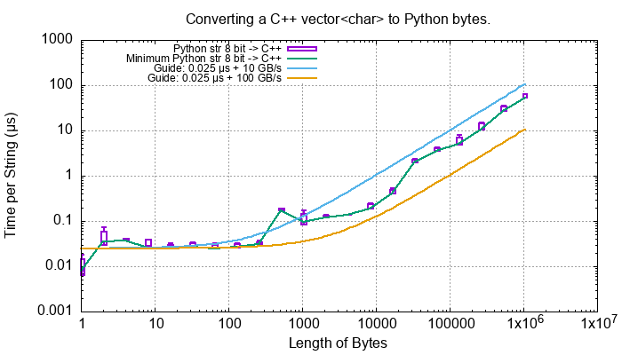
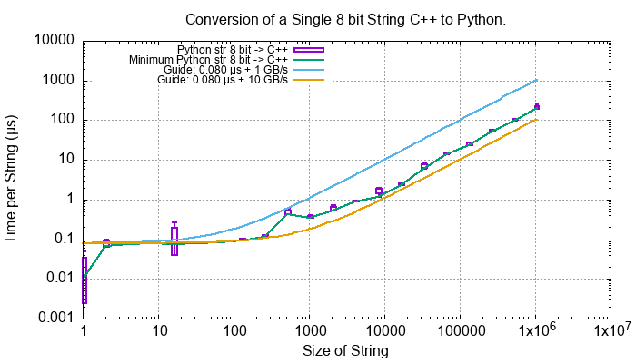
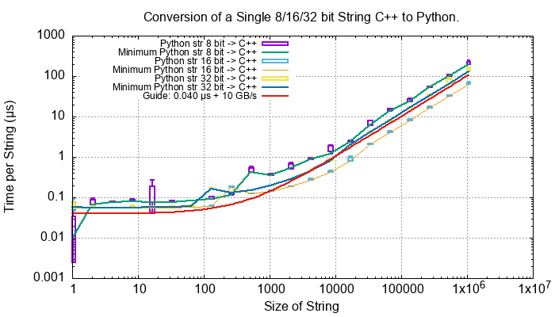
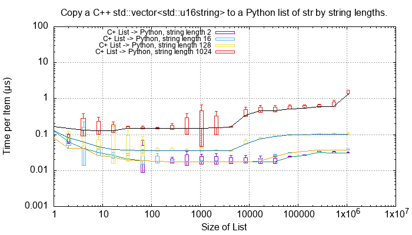
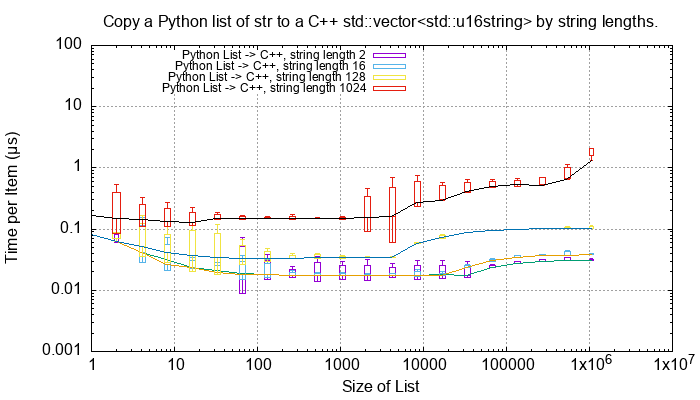
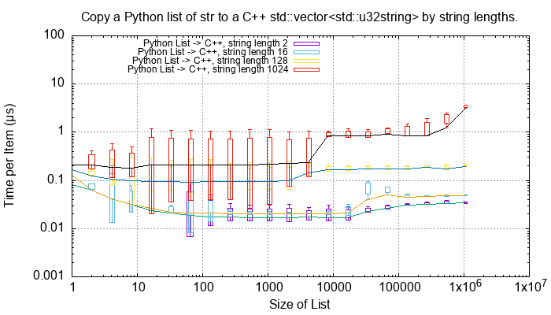
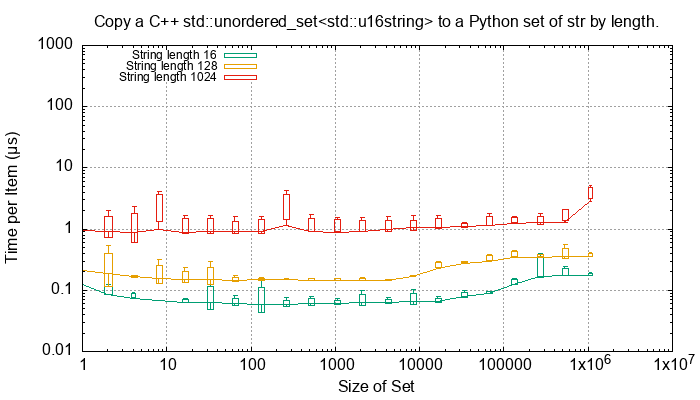
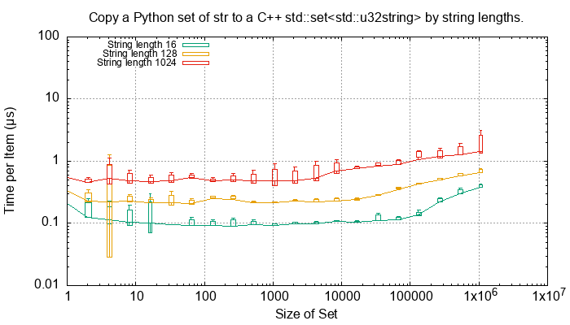

.. moduleauthor:: Paul Ross <apaulross@gmail.com>
.. sectionauthor:: Paul Ross <apaulross@gmail.com>

.. C++ performance

.. _PyCppContainers.Performance.Cpp:

C++ Performance Tests
==============================

Test Procedure
--------------------------

The main entry point to the ``PyCppContainers`` project is in ``src/main.cpp`` and runs the functional, performance and
memory tests.

The performance tests are in ``src/cpy/tests/test_performance.h`` and ``src/cpy/tests/test_performance.cpp``.
There are a number of macros ``TEST_PERFORMANCE_*`` there that control which tests are run.
Running all tests takes about 6.5 hours.

The tests can be run by building and running the C++ binary from the project root:

.. code-block:: shell

    cmake --build cmake-build-release --target clean -- -j 6
    cmake --build cmake-build-release --target PyCppContainers -- -j 6
    cmake-build-release/PyCppContainers

.. note::

    The debug build includes more exhaustive internal tests (using ``assert()``) but excludes the performance tests as
    they take a *very* long time for a debug build.

The output is large and looks like this:

.. raw:: latex

    \begin{landscape}

.. code-block:: shell

    $ cmake-build-release/PyCppContainers
    ---> C++ release tests
    Hello, World!
    Python version: 3.12.1
    test_functional_all START
    RSS(Mb): was:     16.523 now:     16.531 diff:     +0.008 Peak was:     16.523 now:     16.531 diff:     +0.008 test_vector_to_py_tuple<bool>
    RSS(Mb): was:     16.531 now:     16.535 diff:     +0.004 Peak was:     16.531 now:     16.535 diff:     +0.004 test_vector_to_py_tuple<long>
    RSS(Mb): was:     16.535 now:     16.539 diff:     +0.004 Peak was:     16.535 now:     16.539 diff:     +0.004 test_vector_to_py_tuple<double>

    8<---- Snip ---->8

    TEST:    0    4096       1     0.002047584             N/A             N/A             N/A         1         488.4 test_py_tuple_str32_to_vector std::string[2048]>():[4096]
    TEST:    0    8192       1     0.004002917             N/A             N/A             N/A         1         249.8 test_py_tuple_str32_to_vector std::string[2048]>():[8192]
    TEST:    0   16384       1     0.008183250             N/A             N/A             N/A         1         122.2 test_py_tuple_str32_to_vector std::string[2048]>():[16384]
    TEST:    0   32768       1     0.039068668             N/A             N/A             N/A         1          25.6 test_py_tuple_str32_to_vector std::string[2048]>():[32768]
    TEST:    0   65536       1     0.044092626             N/A             N/A             N/A         1          22.7 test_py_tuple_str32_to_vector std::string[2048]>():[65536]
    TEST:    0    4096       1     4.745317500             N/A             N/A             N/A         1           0.2 test_unordered_set_bytes_to_py_set std::string[1048576]>():[4096]
    TAIL: Passed=24192/24192 Failed=0/24192
    All tests pass.

    ====RSS(Mb): was:      9.262 now:    844.883 diff:   +835.621 Peak was:      9.262 now:   3593.207 diff:  +3583.945 main.cpp
    Total execution time:    23880.011 (s)
    Count of unique strings created: 131724750
    Bye, bye! Returning 0

.. raw:: latex

    \end{landscape}

The complete output can be captured to ``perf_notes/cpp_test_results.txt`` with this command:

.. code-block:: shell

    $ time cmake-build-release/PyCppContainers > perf_notes/cpp_test_results.txt

Then there is a Python script ``perf_notes/write_dat_files_for_cpp_test_results.py`` that will extract all the
performance data into ``perf_notes/dat`` suitable for gnuplot.
Copy those ``*.dat`` files into ``docs/sphinx/source/plots/dat`` then ``cd`` into ``docs/sphinx/source/plots`` and run
``gnuplot -p *.plt`` to update all the performance plots referenced in the documentation.

.. note::

    See :ref:`PyCppContainers.Performance.Round_trip` for the Python plots which can be built by gnuplot at the
    same time.

Fundamental Types
------------------------------------

These C++ functions test the cost of converting ints, floats and bytes objects between Python and C++.
These test are executed if the macro ``TEST_PERFORMANCE_FUNDAMENTAL_TYPES`` is defined.

Numeric Types
^^^^^^^^^^^^^^^^^

..
    From perf_notes/cpp_test_results.txt
    HEAD: Fail   Scale  Repeat         Mean(s)     Std.Dev.(s)         Min.(s)         Max.(s)     Count      Rate(/s) Name
    TEST:    0 1000000      20     0.001561753     0.000001978     0.001560542     0.001567459        20       12806.1 test_bool_to_py_bool_multiple[1000000]
    TEST:    0 1000000      20     0.001468528     0.000027571     0.001455168     0.001562000        20       13619.1 test_py_bool_to_cpp_bool_multiple[1000000]
    TEST:    0 1000000      20     0.020391246     0.002205520     0.018449710     0.024430667        20         980.8 test_long_to_py_int_multiple[1000000]
    TEST:    0 1000000      20     0.004190838     0.000008678     0.004167083     0.004201125        20        4772.3 test_py_int_to_cpp_long_multiple[1000000]
    TEST:    0 1000000      20     0.015347088     0.000493604     0.014248792     0.015617834        20        1303.2 test_double_to_py_float_multiple[1000000]
    TEST:    0 1000000      20     0.005575696     0.000007624     0.005568000     0.005591876        20        3587.0 test_py_float_to_cpp_double_multiple[1000000]
    TEST:    0 1000000      20     0.022577623     0.000916127     0.021249167     0.025298459        20         885.8 test_complex_to_py_complex_multiple[1000000]
    TEST:    0 1000000      20     0.006424378     0.000006946     0.006420126     0.006452625        20        3113.1 test_py_complex_to_cpp_complex_multiple[1000000]

    Example: test_bool_to_py_bool_multiple() C++ to Python. Min is 0.001560542 for 1e6 conversions. So 1e9 * 0.00156 / 1e6 = 1.56
    Example: test_py_bool_to_cpp_bool_multiple() Python to C++. Min is 0.001455168 for 1e6 conversions. So 1e9 * 0.00146 / 1e6 = 1.46

.. list-table:: Fundamental Type Conversion Time. Times in nanoseconds.
   :widths: 30 20 20 20 60
   :header-rows: 1

   * - Type C++/Py
     - C++ to Py
     - Py to C++
     - Ratio
     - Notes
   * - ``bool``, ``bool``
     - 1.56
     - 1.46
     - 1.07x
     - The mean is around 660 million/s
   * - ``long``, ``int``
     - 18.4
     - 4.16
     - 4.42x
     - The mean is around 88 million/s.
   * - ``double``, ``float``
     - 14.2
     - 5.56
     - 2.55x
     - The mean is around 100 million/s.
   * - ``complex<double>``, ``complex``
     - 21.2
     - 6.42
     - 3.30x
     - The mean is around 72 million/s.

Converting from C++ to Python is always slower than from Python to C++.
Presumably this reflects to cost of 'boxing' a Python object is higher that the cost of extracting ('unboxing')
the object

The actual tests in ``src/cpy/tests/test_performance.cpp`` are:

.. list-table:: Fundamental Type Conversion Time Test Code.
   :widths: 20 40 40
   :header-rows: 1

   * - Type C++/Py
     - C++ to Py Test
     - Py to C++ Test
   * - ``bool``, ``bool``
     - ``test_bool_to_py_bool_multiple()`` calls ``cpp_bool_to_py_bool()``.
     - ``test_py_bool_to_bool_multiple()`` calls ``py_bool_to_cpp_bool()``.
   * - ``long``, ``int``
     - ``test_long_to_py_int_multiple()`` calls ``cpp_long_to_py_long()``.
     - ``test_py_int_to_cpp_long_multiple()`` calls ``py_long_to_cpp_long()``.
   * - ``double``, ``float``
     - ``test_double_to_py_float_multiple()`` calls ``cpp_double_to_py_float()``.
     - ``test_py_float_to_cpp_double_multiple()`` calls ``cpp_double_to_py_float()``.
   * - ``complex<double>``, ``complex``
     - ``test_complex_to_py_complex_multiple()`` calls ``cpp_complex_to_py_complex()``.
     - ``test_py_complex_to_cpp_complex_multiple()`` calls ``py_complex_to_cpp_complex()``.

``bytes``
^^^^^^^^^^^^^^^^^^^^^^^^^^^

For a single C++ ``std::vector<char>`` to and from Python ``bytes`` of different lengths:

..
    From perf_notes/cpp_test_results.txt
    HEAD: Fail   Scale  Repeat         Mean(s)     Std.Dev.(s)         Min.(s)         Max.(s)     Count      Rate(/s) Name
    TEST:    0 1000000      20     0.057439107     0.006509894     0.052396208     0.075423792        20         348.2 test_cpp_vector_char_to_py_bytes_multiple_2[1000000]
    TEST:    0 1000000      20     0.053159580     0.000777435     0.052021209     0.054217417        20         376.2 test_cpp_vector_char_to_py_bytes_multiple_16[1000000]
    TEST:    0 1000000      20     0.054709067     0.000891610     0.053596959     0.056247709        20         365.6 test_cpp_vector_char_to_py_bytes_multiple_128[1000000]
    TEST:    0 1000000      20     0.119114457     0.009596428     0.107581917     0.139490666        20         167.9 test_cpp_vector_char_to_py_bytes_multiple_1024[1000000]
    TEST:    0 1000000      20     0.300614207     0.017573230     0.271704084     0.328277376        20          66.5 test_cpp_vector_char_to_py_bytes_multiple_8192[1000000]
    TEST:    0 1000000      20     2.420889067     0.030892970     2.374831875     2.488255167        20           8.3 test_cpp_vector_char_to_py_bytes_multiple_65536[1000000]
    TEST:    0 1000000      20     0.056535515     0.003379383     0.051730335     0.062494459        20         353.8 test_py_bytes_to_cpp_vector_char_multiple_2[1000000]
    TEST:    0 1000000      20     0.054382388     0.002028227     0.052218167     0.059590500        20         367.8 test_py_bytes_to_cpp_vector_char_multiple_16[1000000]
    TEST:    0 1000000      20     0.072021513     0.002964195     0.068870083     0.078325250        20         277.7 test_py_bytes_to_cpp_vector_char_multiple_128[1000000]
    TEST:    0 1000000      20     0.091097832     0.005092673     0.083415293     0.101530751        20         219.5 test_py_bytes_to_cpp_vector_char_multiple_1024[1000000]
    TEST:    0 1000000      20     0.263217424     0.015400919     0.240177208     0.287619668        20          76.0 test_py_bytes_to_cpp_vector_char_multiple_8192[1000000]
    TEST:    0 1000000      20     2.124635850     0.017340990     2.084605542     2.158811208        20           9.4 test_py_bytes_to_cpp_vector_char_multiple_65536[1000000]

    Example: test_cpp_vector_char_to_py_bytes_multiple_2() C++ to Python. Min is 0.052396208 for 1e6 conversions. So 1e9 * 0.0524 / 1e6 = 52.4
    Example: test_py_bytes_to_cpp_vector_char_multiple_2() Python to C++. Min is 0.051730335 for 1e6 conversions. So 1e9 * 0.0517 / 1e6 = 51.7

..
    gnuplot file docs/sphinx/source/plots/fundamental_bytes.plt

This shows a linear rate asymptotic to around 30 GB/s.

This is symmetric with the performance of Python to C++.

The tests are in ``src/cpy/tests/test_performance.cpp``:

.. list-table:: Bytes Conversion Time Test Code.
   :widths: 15 40 30
   :header-rows: 1

   * - Conversion
     - Test Function
     - Calls
   * - C++ to Python
     - ``test_cpp_vector_char_to_py_bytes_multiple()``
     - ``cpp_vector_char_to_py_bytes()``.
   * - Python to C++
     - ``test_py_bytes_to_cpp_vector_char_multiple()``
     - ``py_bytes_to_cpp_vector_char()``.

.. _PyCppContainers.Performance.Cpp.Fundamental.Strings:

Strings
^^^^^^^^^^^^^^^^^^^^^^

..
    From perf_notes/cpp_test_results.txt
    TEST:    0       1       5     0.000000825     0.000000713     0.000000458     0.000002250       500   605693519.1 test_cpp_string_to_py_str_multiple_1[100]
    TEST:    0       2       5     0.000005992     0.000000671     0.000005625     0.000007334       500    83440415.2 test_cpp_string_to_py_str_multiple_2[100]
    TEST:    0       4       5     0.000006034     0.000000116     0.000005917     0.000006208       500    82867892.0 test_cpp_string_to_py_str_multiple_4[100]
    TEST:    0       8       5     0.000006334     0.000000126     0.000006250     0.000006583       500    78945290.9 test_cpp_string_to_py_str_multiple_8[100]
    TEST:    0      16       5     0.000006434     0.000000078     0.000006376     0.000006585       500    77715777.9 test_cpp_string_to_py_str_multiple_16[100]
    TEST:    0      32       5     0.000006884     0.000001581     0.000006041     0.000010043       500    72633245.7 test_cpp_string_to_py_str_multiple_32[100]
    TEST:    0      64       5     0.000006409     0.000000089     0.000006333     0.000006585       500    78016508.3 test_cpp_string_to_py_str_multiple_64[100]
    TEST:    0     128       5     0.000006575     0.000000170     0.000006376     0.000006750       500    76039844.9 test_cpp_string_to_py_str_multiple_128[100]
    TEST:    0     256       5     0.000007326     0.000000163     0.000007208     0.000007626       500    68254726.6 test_cpp_string_to_py_str_multiple_256[100]
    TEST:    0     512       5     0.000022009     0.000000031     0.000021958     0.000022043       500    22718288.7 test_cpp_string_to_py_str_multiple_512[100]
    TEST:    0    1024       5     0.000019192     0.000001099     0.000018418     0.000021375       500    26052114.7 test_cpp_string_to_py_str_multiple_1024[100]
    TEST:    0    2048       5     0.000025092     0.000000140     0.000024917     0.000025334       500    19926749.3 test_cpp_string_to_py_str_multiple_2048[100]
    TEST:    0    4096       5     0.000038526     0.000001009     0.000038001     0.000040543       500    12978416.9 test_cpp_string_to_py_str_multiple_4096[100]
    TEST:    0    8192       5     0.000070676     0.000012702     0.000063459     0.000096042       500     7074587.4 test_cpp_string_to_py_str_multiple_8192[100]
    TEST:    0   16384       5     0.000113050     0.000000327     0.000112667     0.000113584       500     4422802.2 test_cpp_string_to_py_str_multiple_16384[100]
    TEST:    0   32768       5     0.000222467     0.000002329     0.000220293     0.000226501       500     2247523.3 test_cpp_string_to_py_str_multiple_32768[100]
    TEST:    0   65536       5     0.000443984     0.000003823     0.000440125     0.000449208       500     1126167.5 test_cpp_string_to_py_str_multiple_65536[100]
    TEST:    0  131072       5     0.000978834     0.000013382     0.000958543     0.000991584       500      510811.9 test_cpp_string_to_py_str_multiple_131072[100]
    TEST:    0  262144       5     0.001939942     0.000147498     0.001842710     0.002230668       500      257739.6 test_cpp_string_to_py_str_multiple_262144[100]
    TEST:    0  524288       5     0.003767250     0.000021094     0.003742916     0.003793001       500      132722.8 test_cpp_string_to_py_str_multiple_524288[100]
    TEST:    0 1048576       5     0.007558742     0.000023559     0.007531541     0.007594959       500       66148.6 test_cpp_string_to_py_str_multiple_1048576[100]
    TEST:    0       1       5     0.000000517     0.000000033     0.000000458     0.000000542       500   966930961.1 test_py_str_to_cpp_string_multiple_1[100]
    TEST:    0       2       5     0.000000550     0.000000017     0.000000542     0.000000584       500   908595311.6 test_py_str_to_cpp_string_multiple_2[100]
    TEST:    0       4       5     0.000000709     0.000000026     0.000000667     0.000000750       500   705517144.1 test_py_str_to_cpp_string_multiple_4[100]
    TEST:    0       8       5     0.000000551     0.000000016     0.000000542     0.000000584       500   907935355.0 test_py_str_to_cpp_string_multiple_8[100]
    TEST:    0      16       5     0.000000642     0.000000021     0.000000625     0.000000667       500   778452436.6 test_py_str_to_cpp_string_multiple_16[100]
    TEST:    0      32       5     0.000007017     0.000000057     0.000006959     0.000007125       500    71254506.8 test_py_str_to_cpp_string_multiple_32[100]
    TEST:    0      64       5     0.000007067     0.000000068     0.000007001     0.000007168       500    70748376.3 test_py_str_to_cpp_string_multiple_64[100]
    TEST:    0     128       5     0.000007009     0.000000041     0.000006960     0.000007084       500    71337870.4 test_py_str_to_cpp_string_multiple_128[100]
    TEST:    0     256       5     0.000013726     0.000000346     0.000013542     0.000014418       500    36428014.6 test_py_str_to_cpp_string_multiple_256[100]
    TEST:    0     512       5     0.000014576     0.000000546     0.000014293     0.000015667       500    34303669.8 test_py_str_to_cpp_string_multiple_512[100]
    TEST:    0    1024       5     0.000008084     0.000000271     0.000007918     0.000008626       500    61852864.4 test_py_str_to_cpp_string_multiple_1024[100]
    TEST:    0    2048       5     0.000010001     0.000000027     0.000009958     0.000010043       500    49997500.1 test_py_str_to_cpp_string_multiple_2048[100]
    TEST:    0    4096       5     0.000014417     0.000000105     0.000014333     0.000014626       500    34681038.5 test_py_str_to_cpp_string_multiple_4096[100]
    TEST:    0    8192       5     0.000022375     0.000000145     0.000022166     0.000022542       500    22345869.4 test_py_str_to_cpp_string_multiple_8192[100]
    TEST:    0   16384       5     0.000038501     0.000000124     0.000038334     0.000038708       500    12986776.9 test_py_str_to_cpp_string_multiple_16384[100]
    TEST:    0   32768       5     0.000072509     0.000001081     0.000071918     0.000074668       500     6895686.2 test_py_str_to_cpp_string_multiple_32768[100]
    TEST:    0   65536       5     0.000179126     0.000000603     0.000177960     0.000179584       500     2791339.0 test_py_str_to_cpp_string_multiple_65536[100]
    TEST:    0  131072       5     0.000390534     0.000002914     0.000386917     0.000394333       500     1280299.2 test_py_str_to_cpp_string_multiple_131072[100]
    TEST:    0  262144       5     0.000767200     0.000000210     0.000766917     0.000767459       500      651720.1 test_py_str_to_cpp_string_multiple_262144[100]
    TEST:    0  524288       5     0.001598442     0.000001516     0.001596791     0.001601000       500      312804.6 test_py_str_to_cpp_string_multiple_524288[100]
    TEST:    0 1048576       5     0.003206151     0.000006507     0.003198918     0.003216958       500      155950.3 test_py_str_to_cpp_string_multiple_1048576[100]
    TEST:    0       1       5     0.000005459     0.000000209     0.000005333     0.000005875       500    91593544.5 test_cpp_u16string_to_py_str16_multiple_1[100]
    TEST:    0       2       5     0.000005534     0.000000049     0.000005501     0.000005625       500    90352192.8 test_cpp_u16string_to_py_str16_multiple_2[100]
    TEST:    0       4       5     0.000005359     0.000000033     0.000005292     0.000005375       500    93302730.0 test_cpp_u16string_to_py_str16_multiple_4[100]
    TEST:    0       8       5     0.000005517     0.000000033     0.000005501     0.000005583       500    90627322.3 test_cpp_u16string_to_py_str16_multiple_8[100]
    TEST:    0      16       5     0.000005992     0.000000775     0.000005583     0.000007541       500    83445985.4 test_cpp_u16string_to_py_str16_multiple_16[100]
    TEST:    0      32       5     0.000005792     0.000000563     0.000005501     0.000006918       500    86324476.4 test_cpp_u16string_to_py_str16_multiple_32[100]
    TEST:    0      64       5     0.000005925     0.000000600     0.000005625     0.000007125       500    84381064.9 test_cpp_u16string_to_py_str16_multiple_64[100]
    TEST:    0     128       5     0.000006159     0.000000546     0.000005875     0.000007251       500    81185964.6 test_cpp_u16string_to_py_str16_multiple_128[100]
    TEST:    0     256       5     0.000018142     0.000000097     0.000018084     0.000018334       500    27559901.4 test_cpp_u16string_to_py_str16_multiple_256[100]
    TEST:    0     512       5     0.000012617     0.000000093     0.000012543     0.000012792       500    39628129.6 test_cpp_u16string_to_py_str16_multiple_512[100]
    TEST:    0    1024       5     0.000014601     0.000000063     0.000014541     0.000014710       500    34244933.5 test_cpp_u16string_to_py_str16_multiple_1024[100]
    TEST:    0    2048       5     0.000019567     0.000000676     0.000019167     0.000020918       500    25552835.6 test_cpp_u16string_to_py_str16_multiple_2048[100]
    TEST:    0    4096       5     0.000027001     0.000000037     0.000026958     0.000027043       500    18518038.4 test_cpp_u16string_to_py_str16_multiple_4096[100]
    TEST:    0    8192       5     0.000042984     0.000000043     0.000042917     0.000043042       500    11632316.4 test_cpp_u16string_to_py_str16_multiple_8192[100]
    TEST:    0   16384       5     0.000076617     0.000000378     0.000076209     0.000077333       500     6525924.2 test_cpp_u16string_to_py_str16_multiple_16384[100]
    TEST:    0   32768       5     0.000191709     0.000000286     0.000191209     0.000192001       500     2608121.0 test_cpp_u16string_to_py_str16_multiple_32768[100]
    TEST:    0   65536       5     0.000405501     0.000001863     0.000403543     0.000408834       500     1233044.1 test_cpp_u16string_to_py_str16_multiple_65536[100]
    TEST:    0  131072       5     0.000779467     0.000002159     0.000777625     0.000782334       500      641464.1 test_cpp_u16string_to_py_str16_multiple_131072[100]
    TEST:    0  262144       5     0.001599725     0.000001883     0.001597708     0.001602626       500      312553.7 test_cpp_u16string_to_py_str16_multiple_262144[100]
    TEST:    0  524288       5     0.003191584     0.000012781     0.003181042     0.003214001       500      156662.0 test_cpp_u16string_to_py_str16_multiple_524288[100]
    TEST:    0 1048576       5     0.006447292     0.000078934     0.006402042     0.006604833       500       77551.9 test_cpp_u16string_to_py_str16_multiple_1048576[100]
    TEST:    0       1       5     0.000000551     0.000000031     0.000000501     0.000000584       500   907935355.0 test_py_str16_to_cpp_u16string_multiple_1[100]
    TEST:    0       2       5     0.000000708     0.000000000     0.000000708     0.000000708       500   705716302.0 test_py_str16_to_cpp_u16string_multiple_2[100]
    TEST:    0       4       5     0.000000551     0.000000017     0.000000542     0.000000584       500   907935355.0 test_py_str16_to_cpp_u16string_multiple_4[100]
    TEST:    0       8       5     0.000000625     0.000000026     0.000000584     0.000000666       500   799616184.2 test_py_str16_to_cpp_u16string_multiple_8[100]
    TEST:    0      16       5     0.000007042     0.000000026     0.000007001     0.000007084       500    71001547.8 test_py_str16_to_cpp_u16string_multiple_16[100]
    TEST:    0      32       5     0.000007034     0.000000049     0.000007001     0.000007125       500    71084320.2 test_py_str16_to_cpp_u16string_multiple_32[100]
    TEST:    0      64       5     0.000007009     0.000000016     0.000007001     0.000007042       500    71339906.1 test_py_str16_to_cpp_u16string_multiple_64[100]
    TEST:    0     128       5     0.000013626     0.000000070     0.000013542     0.000013750       500    36695362.4 test_py_str16_to_cpp_u16string_multiple_128[100]
    TEST:    0     256       5     0.000014201     0.000000072     0.000014126     0.000014334       500    35209036.0 test_py_str16_to_cpp_u16string_multiple_256[100]
    TEST:    0     512       5     0.000007900     0.000000050     0.000007875     0.000008001       500    63287133.7 test_py_str16_to_cpp_u16string_multiple_512[100]
    TEST:    0    1024       5     0.000009959     0.000000064     0.000009917     0.000010083       500    50206348.1 test_py_str16_to_cpp_u16string_multiple_1024[100]
    TEST:    0    2048       5     0.000014350     0.000000043     0.000014293     0.000014418       500    34841991.6 test_py_str16_to_cpp_u16string_multiple_2048[100]
    TEST:    0    4096       5     0.000022284     0.000000017     0.000022250     0.000022293       500    22437724.1 test_py_str16_to_cpp_u16string_multiple_4096[100]
    TEST:    0    8192       5     0.000038342     0.000000085     0.000038251     0.000038501       500    13040427.9 test_py_str16_to_cpp_u16string_multiple_8192[100]
    TEST:    0   16384       5     0.000072275     0.000000334     0.000072042     0.000072916       500     6918011.9 test_py_str16_to_cpp_u16string_multiple_16384[100]
    TEST:    0   32768       5     0.000178742     0.000001099     0.000177958     0.000180875       500     2797329.6 test_py_str16_to_cpp_u16string_multiple_32768[100]
    TEST:    0   65536       5     0.000388750     0.000000169     0.000388542     0.000388959       500     1286172.6 test_py_str16_to_cpp_u16string_multiple_65536[100]
    TEST:    0  131072       5     0.000768358     0.000001254     0.000767083     0.000770416       500      650737.9 test_py_str16_to_cpp_u16string_multiple_131072[100]
    TEST:    0  262144       5     0.001594251     0.000001115     0.001592876     0.001595960       500      313627.0 test_py_str16_to_cpp_u16string_multiple_262144[100]
    TEST:    0  524288       5     0.003240167     0.000073959     0.003191501     0.003385001       500      154313.0 test_py_str16_to_cpp_u16string_multiple_524288[100]
    TEST:    0 1048576       5     0.006464342     0.000159860     0.006356708     0.006770875       500       77347.4 test_py_str16_to_cpp_u16string_multiple_1048576[100]
    TEST:    0       1       5     0.000005909     0.000000630     0.000005583     0.000007168       500    84618118.4 test_cpp_u32string_to_py_str32_multiple_1[100]
    TEST:    0       2       5     0.000005517     0.000000120     0.000005418     0.000005751       500    90627322.3 test_cpp_u32string_to_py_str32_multiple_2[100]
    TEST:    0       4       5     0.000005559     0.000000020     0.000005542     0.000005583       500    89945852.6 test_cpp_u32string_to_py_str32_multiple_4[100]
    TEST:    0       8       5     0.000005667     0.000000046     0.000005625     0.000005751       500    88228547.2 test_cpp_u32string_to_py_str32_multiple_8[100]
    TEST:    0      16       5     0.000005567     0.000000114     0.000005501     0.000005793       500    89810141.4 test_cpp_u32string_to_py_str32_multiple_16[100]
    TEST:    0      32       5     0.000005651     0.000000094     0.000005583     0.000005834       500    88484612.5 test_cpp_u32string_to_py_str32_multiple_32[100]
    TEST:    0      64       5     0.000005976     0.000000097     0.000005917     0.000006167       500    83672205.8 test_cpp_u32string_to_py_str32_multiple_64[100]
    TEST:    0     128       5     0.000017075     0.000001400     0.000016375     0.000019875       500    29281719.4 test_cpp_u32string_to_py_str32_multiple_128[100]
    TEST:    0     256       5     0.000012817     0.000000198     0.000012668     0.000013209       500    39010384.6 test_cpp_u32string_to_py_str32_multiple_256[100]
    TEST:    0     512       5     0.000014884     0.000000350     0.000014708     0.000015584       500    33593797.2 test_cpp_u32string_to_py_str32_multiple_512[100]
    TEST:    0    1024       5     0.000019576     0.000000568     0.000019251     0.000020709       500    25541870.8 test_cpp_u32string_to_py_str32_multiple_1024[100]
    TEST:    0    2048       5     0.000028392     0.000000432     0.000028083     0.000029251       500    17610532.5 test_cpp_u32string_to_py_str32_multiple_2048[100]
    TEST:    0    4096       5     0.000045992     0.000001470     0.000044583     0.000048583       500    10871432.3 test_cpp_u32string_to_py_str32_multiple_4096[100]
    TEST:    0    8192       5     0.000080825     0.000002673     0.000079292     0.000086166       500     6186181.8 test_cpp_u32string_to_py_str32_multiple_8192[100]
    TEST:    0   16384       5     0.000193401     0.000003490     0.000191250     0.000200334       500     2585306.1 test_cpp_u32string_to_py_str32_multiple_16384[100]
    TEST:    0   32768       5     0.000408067     0.000010493     0.000398500     0.000424293       500     1225288.1 test_cpp_u32string_to_py_str32_multiple_32768[100]
    TEST:    0   65536       5     0.000792234     0.000008657     0.000784043     0.000805793       500      631126.6 test_cpp_u32string_to_py_str32_multiple_65536[100]
    TEST:    0  131072       5     0.001775650     0.000035680     0.001733042     0.001832626       500      281587.0 test_cpp_u32string_to_py_str32_multiple_131072[100]
    TEST:    0  262144       5     0.003592500     0.000289659     0.003189709     0.003948084       500      139178.8 test_cpp_u32string_to_py_str32_multiple_262144[100]
    TEST:    0  524288       5     0.006444426     0.000010620     0.006431918     0.006461667       500       77586.4 test_cpp_u32string_to_py_str32_multiple_524288[100]
    TEST:    0 1048576       5     0.013857950     0.000388258     0.013567708     0.014610293       500       36080.4 test_cpp_u32string_to_py_str32_multiple_1048576[100]

    See also:
    C++ to Python: fundamental_string_8_16_32.plt
    Python to C++: fundamental_py_to_cpp_string_8_16_32.plt

For a single C++ ``std::string``, ``std::u32string`` and ``std::u32string`` to and from Python ``str`` of different
lengths and different word sizes.

.. list-table:: String Conversion Time Test Code, C++ to Python.
   :widths: 20 40 40
   :header-rows: 1

   * - Type C++
     - Test Function
     - Calls
   * - ``std::string``
     - ``test_cpp_string_to_py_str_multiple()``
     - ``cpp_string_to_py_unicode8()``.
   * - ``std::u16string``
     - ``test_cpp_u16string_to_py_str16_multiple()``
     - ``cpp_u16string_to_py_unicode16()``.
   * - ``std::u32string``
     - ``test_cpp_u32string_to_py_str32_multiple()``
     - ``cpp_u32string_to_py_unicode32()``.

Firstly the 8 bit Unicode converts consistently at a rate of around 10 GB/s.
This compares with the conversion of ``std::vector<char>`` to ``bytes`` objects at 30 GB/s (above).
The threefold increase can be possibly explained by having more internal checks on unicode objects.

Intermezzo: Creating Python 16/32 bit Unicode strings
^^^^^^^^^^^^^^^^^^^^^^^^^^^^^^^^^^^^^^^^^^^^^^^^^^^^^^^^^^^^^^^^^

Initially this code was 100x slower than for 8 bit string and this section describes why.
An explanation might be the way the Python Unicode `C-API <https://docs.python.org/3/c-api/index.html>`_ works.
There are several ways of
`creating <https://docs.python.org/3/c-api/unicode.html#creating-and-accessing-unicode-strings>`_
`Unicode <https://docs.python.org/3/c-api/unicode.html>`_ strings which are UCS1, UCS2 or UCS4 in CPython.
The function `PyUnicode_FromKindAndData() <https://docs.python.org/3/c-api/unicode.html#c.PyUnicode_FromKindAndData>`_ is
the recommended way.
However if a `PyUnicode_2BYTE_KIND <https://docs.python.org/3/c-api/unicode.html#c.PyUnicode_2BYTE_KIND>`_
or  a `PyUnicode_4BYTE_KIND <https://docs.python.org/3/c-api/unicode.html#c.PyUnicode_4BYTE_KIND>`_
this function inspects the multibyte data and if there are no code points above 0xFF then a
`PyUnicode_1BYTE_KIND <https://docs.python.org/3/c-api/unicode.html#c.PyUnicode_1BYTE_KIND>`_ is created which is not
what we want.

Instead we use `PyUnicode_New <https://docs.python.org/3/c-api/unicode.html#c.PyUnicode_New>`_ with a suitable
``maxchar`` to ensure that we get the correct word size.
Then we copy each character into the Unicode string in a loop.

Here is an example from this library using 16 bit unicode characters:

.. code-block:: cpp

    PyObject *cpp_u16string_to_py_unicode16(const std::u16string &s) {
        assert(! PyErr_Occurred());
        PyObject *ret = PyUnicode_New(s.size(), 65535);
        assert(py_unicode16_check(ret));
        for (std::u16string::size_type i = 0; i < s.size(); ++i) {
            int result = PyUnicode_WriteChar(ret, i, s[i]);
            if (result) {
                PyErr_Format(
                    PyExc_SystemError,
                    "PyUnicode_WriteChar() failed to write at [%ld] returning %d.",
                    i, result
                );
                Py_DECREF(ret);
                return NULL;
            }
        }
        assert(py_unicode16_check(ret));
        assert(! PyErr_Occurred());
        return ret;
    }

This code make the conversion of ``std::u16string`` and ``std::u32string`` to Python ``str`` around 100 times slower
than for 8 bit strings. This loop, the type conversions and the
`PyUnicode_WriteChar <https://docs.python.org/3/c-api/unicode.html#c.PyUnicode_WriteChar>`_ internal checks is probably
what is causing the slowdown.

To overcome this the memory was copied directly:

.. code-block:: cpp

    PyObject *cpp_u16string_to_py_unicode16(const std::u16string &s) {
        assert(! PyErr_Occurred());
        PyObject *ret = PyUnicode_New(s.size(), 65535);
        assert(py_unicode16_check(ret));
        void *dest = PyUnicode_DATA(ret);
        const void *src = s.c_str();
        rsize_t size = s.size() * sizeof(std::u16string::value_type);
        if (memcpy(dest, src, size) != dest) {
            // memcpy failure
            Py_DECREF(ret);
            return NULL;
        }
        assert(! PyErr_Occurred());
        return ret;
    }

This gives 16/32 bit conversion the same performance as 8 bit conversion.

See the notes on ``cpp_u16string_to_py_unicode16()`` and ``cpp_u32string_to_py_unicode32()`` in
``src/cpy/python_object_convert.cpp`` for more information.

Back to 8/16/32 bit C++ to Python Strings
^^^^^^^^^^^^^^^^^^^^^^^^^^^^^^^^^^^^^^^^^

So now the 16/32 bit word strings are the same speed as 8 bit strings:

Or all three 8/16/32 bit plotted together:

Python to C++:

.. list-table:: String Conversion Time Test Code, Python to C++.
   :widths: 20 40 40
   :header-rows: 1

   * - Type C++
     - Test Function
     - Calls
   * - ``std::string``
     - ``test_py_str_to_cpp_string_multiple()``
     - ``py_unicode8_to_cpp_string()``.
   * - ``std::u16string``
     - ``test_py_str16_to_cpp_u16string_multiple()``
     - ``py_unicode16_to_cpp_u16string()``.
   * - ``std::u32string``
     - ``test_py_str32_to_cpp_u32string_multiple()``
     - ``py_unicode32_to_cpp_u32string()``.

And the plot of Python ``str`` to C++ ``std::string``, ``std::u16string`` and ``std::u32string``:

.. image:: ../plots/images/fundamental_py_to_cpp_string_8_16_32.png
    :height: 400px
    :align: center

..
    Not used as they are pretty much the same and covered by the above graph.

    .. image:: ../plots/images/fundamental_py_to_cpp_string_8.png
        :height: 400px
        :align: center

    .. image:: ../plots/images/fundamental_py_to_cpp_string_16.png
        :height: 400px
        :align: center

    .. image:: ../plots/images/fundamental_py_to_cpp_string_32.png
        :height: 400px
        :align: center

This is much more consistent, typically asymptotic to 10 GB/s.
The conversion code does involve ``memcpy()`` (presumably).
Here is an example from this library using 16 bit unicode characters:

.. code-block:: cpp

    std::u16string py_unicode16_to_cpp_u16string(PyObject *op) {
        assert(! PyErr_Occurred());
        assert(op);
        assert(py_unicode16_check(op));
        std::u16string ret(
            (const char16_t *)PyUnicode_2BYTE_DATA(op), PyUnicode_GET_LENGTH(op)
        );
        return ret;
    }

The conversion time of 10 GB/s is about thrice the time for ``bytes`` to an from a ``std::vector<char>``.
Presumably this is because of the complexities of the Unicode implementation.

Python List to and from a C++ ``std::vector<T>``
----------------------------------------------------------

This as an extensive example of the methodology used for performance tests.
Each container test is repeated 5 times and the min/mean/max/std. dev. is recorded.
The min value is regarded as the most consistent one as other results may be affected by arbitrary context switching.
The tests are run on containers of lengths up to 1m items.

For example here is the total time to convert a list of ``bool``, ``int``, ``float`` and ``complex`` Python values to
C++ for various list lengths:

.. image:: ../plots/images/cpp_py_list_bool_int_float_vector_bool_long_double_time.png
    :height: 400px
    :align: center

This time plot is not that informative apart from showing linear behaviour.
More useful are *rate* plots that show the total time for the test divided by the container length.
These rate plots have the following design features:

* For consistency a rate scale of µs/item is used.
* The extreme whiskers show the minimum and maximum test values.
* The box shows the mean time ±the standard deviation, this is asymmetric as it is plotted on a log scale.
* The box will often extend beyond a minimum value where the minimum is close to the mean and the maximum large.
* The line shows the minimum time per object in µs.

Here is the same data plotted as a *rate of conversion* of a list of ``bool``, ``int``, ``float`` and ``complex``
Python values to C++ for various list lengths:

.. image:: ../plots/images/cpp_py_list_bool_int_float_vector_bool_long_double_rate.png
    :height: 400px
    :align: center

These rate plots are used for the rest of this section.

Lists of ``bool``, ``int``, ``float`` and ``complex``
^^^^^^^^^^^^^^^^^^^^^^^^^^^^^^^^^^^^^^^^^^^^^^^^^^^^^^^^^^^

The rate plot is shown above, it shows that:

* ``int``, ``float`` and ``complex`` take 0.01 µs per object to convert from C++ to Python.
* ``bool`` objects take around 0.007 µs per object.

And the reverse converting a list of ``bool``, ``int``, ``float`` and ``complex`` from C++ to Python:

.. image:: ../plots/images/cpp_vector_bool_long_double_py_list_bool_int_float_rate.png
    :height: 400px
    :align: center

This is broadly symmetric with the Python to C++ performance except that ``bool`` values are twice as quick (typically
0.003 µs per  object) compared with Python to C++.

Lists of ``bytes``
^^^^^^^^^^^^^^^^^^^^^^^^^^^^^^^^^^^^^^^^^^^^^^^^^^^^^^^^^^^

Another area of interest is the conversion of a list of ``bytes`` or ``str`` between Python and C++.
In these tests a list of of ``bytes`` or ``str`` objects of lengths 2, 16, 128 and 1024 are used to  convert from Python to C++.

.. image:: ../plots/images/cpp_py_list_bytes_vector_vector_char_rate.png
    :height: 400px
    :align: center

This graph shows a characteristic rise in rate for larger list lengths of larger objects.
This is most likely because of memory contention issues with the larger, up to 1GB, containers.
This characteristic is observed on most of the following plots, particularly with containers of ``bytes`` and ``str``.

In summary:

=============== ======================= =========================== ===================
Object          ~Time per object (µs)   Rate Mb/s                   Notes
=============== ======================= =========================== ===================
bytes[2]        0.06                    30
bytes[16]       0.06                    270
bytes[128]      0.06                    2,000
bytes[1024]     0.15 to 0.4             2,500 to 6,800
=============== ======================= =========================== ===================

This is the inverse, converting a C++ ``std::vector<std::vector<char>>`` to a Python list of ``bytes``:

.. image:: ../plots/images/cpp_vector_vector_char_py_list_bytes_rate.png
    :height: 400px
    :align: center

=============== ======================= =========================== ===================
Object          ~Time per object (µs)   Rate Mb/s                   Notes
=============== ======================= =========================== ===================
bytes[2]        0.015 to 0.03           67 to 133
bytes[16]       0.015 to 0.04           400 to 133
bytes[128]      0.02 to 0.09            1,400 to 6,400
bytes[1024]     0.1 to 0.6              1,600 to 10,000
=============== ======================= =========================== ===================

This shows that converting C++ to Python is about twice as fast as the other way around.
This is in line with the performance of conversion of fundamental types described above.

Lists of ``str`` [8 bit]
^^^^^^^^^^^^^^^^^^^^^^^^^^^^^^^^^^^^^^^^^^^^^^^^^^^^^^^^^^^

Similarly for converting a a Python list of ``str`` to and from a C++ ``std::vector<std::string>``.
First Python -> C++:

.. image:: ../plots/images/cpp_py_list_str_vector_string_rate.png
    :height: 400px
    :align: center

Notably with small strings (2 and 16 long) are about eight times faster that for bytes.
For larger strings this perfformance is very similar to Python ``bytes`` to a C++ ``std::vector<std::vector<char>>``:

=============== ======================= =========================== ===================
Object          ~Time per object (µs)   Rate Mb/s                   Notes
=============== ======================= =========================== ===================
str[2]          0.01                    200
str[16]         0.01                    1600
str[128]        0.08                    1,600
str[1024]       0.1 to 0.8              1,300 to 10,000
=============== ======================= =========================== ===================

And C++ -> Python:

.. image:: ../plots/images/cpp_vector_string_py_list_str_rate.png
    :height: 400px
    :align: center

=============== ======================= =========================== ===================
Object          ~Time per object (µs)   Rate Mb/s                   Notes
=============== ======================= =========================== ===================
str[2]          0.03                    70
str[16]         0.03                    500
str[128]        0.03 to 0.1             1,300 to 4,000
str[1024]       0.15 to 0.8             1,300 to 6,800
=============== ======================= =========================== ===================

Slightly slower than the twice the time for converting ``bytes`` especially for small strings
this is abut twice the time for converting ``bytes`` but otherwise very similar to Python ``bytes``
to a C++ ``std::vector<std::vector<char>>``

Lists of ``str`` [16 bit]
^^^^^^^^^^^^^^^^^^^^^^^^^^^^^^^^^^^^^^^^^^^^^^^^^^^^^^^^^^^

..
    cpp_py_list_str16_vector_u16string.plt
    images/cpp_py_list_str16_vector_u16string_rate.png
    images/cpp_py_list_str16_vector_u16string_rate.svg
    images/cpp_py_list_str16_vector_u16string_time.png
    images/cpp_py_list_str16_vector_u16string_time.svg
    images/cpp_vector_u16string_py_list_str16_rate.png
    images/cpp_vector_u16string_py_list_str16_rate.svg
    images/cpp_vector_u16string_py_list_str16_time.png
    images/cpp_vector_u16string_py_list_str16_time.svg

C++ to Python:

=============== ======================= =========================== ===================
Object          ~Time per object (µs)   Rate Mb/s                   Notes
=============== ======================= =========================== ===================
str[2]          0.03                    70
str[16]         0.1                     160
str[128]        0.9                     140
str[1024]       7                       145
=============== ======================= =========================== ===================

This is about 100x slower than that for 8 bit strings which is aligned with the performance of
:ref:`PyCppContainers.Performance.Cpp.Fundamental.Strings`.

Python to C++:

=============== ======================= =========================== ===================
Object          ~Time per object (µs)   Rate Mb/s                   Notes
=============== ======================= =========================== ===================
str[2]          0.03                    70
str[16]         0.1                     160
str[128]        0.9                     140
str[1024]       7                       145
=============== ======================= =========================== ===================

This is symmetric performance with the C++ to Python conversion code.

Lists of ``str`` [32 bit]
^^^^^^^^^^^^^^^^^^^^^^^^^^^^^^^^^^^^^^^^^^^^^^^^^^^^^^^^^^^

The performance is very close to that of 16 bit strings:

..
    cpp_py_list_str32_vector_u32string.plt
    images/cpp_py_list_str32_vector_u32string_rate.png
    images/cpp_py_list_str32_vector_u32string_rate.svg
    images/cpp_py_list_str32_vector_u32string_time.png
    images/cpp_py_list_str32_vector_u32string_time.svg
    images/cpp_vector_u32string_py_list_str32_rate.png
    images/cpp_vector_u32string_py_list_str32_rate.svg
    images/cpp_vector_u32string_py_list_str32_time.png
    images/cpp_vector_u32string_py_list_str32_time.svg

C++ to Python:

Python to C++:

Python Tuple to and from a C++ ``std::vector<T>``
----------------------------------------------------------

This is near identical to the performance of a list for:

* The conversion of  ``bool``, ``int``, ``float`` and ``complex`` for Python to C++ and C++ to Python.
* The conversion of  ``bytes`` for Python to C++ and C++ to Python.
* The conversion of  ``str`` for Python to C++ and C++ to Python.

Python Set to and from a C++ ``std::unordered_set<T>``
----------------------------------------------------------

Set of ``int``, ``float`` and ``complex``
^^^^^^^^^^^^^^^^^^^^^^^^^^^^^^^^^^^^^^^^^^^^^^^^^^^^^^^^^^^

Here is the rate graph for converting a Python ``set`` to C++ ``std::unordered_set<T>`` for Python
``int``, ``float`` and ``complex`` objects:

.. image:: ../plots/images/cpp_py_set_int_float_unordered_set_long_double_rate.png
    :height: 400px
    :align: center

=============== =================================== =================================== =========== ===================
Object          set (µs)                            list (µs)                           Ratio       Notes
=============== =================================== =================================== =========== ===================
int             0.03                                0.01                                3x
double          0.05                                0.01                                5x
complex         0.05                                0.01                                5x
=============== =================================== =================================== =========== ===================

The cost of insertion is O(N) for both list and set but due to the hashing heeded for the set it is about 3x to 5x
slower.

And the reverse, converting a C++ ``std::unordered_set<T>`` to a Python ``set`` to for Python
``int``, ``float`` and ``complex`` objects:

.. image:: ../plots/images/cpp_unordered_set_long_double_py_set_int_float_rate.png
    :height: 400px
    :align: center

The conversion and insertion of C++ to Python is significantly faster that from Python to C++.
Here is the time per object compared with a list:

=============== =================================== =================================== =========== ===================
Object          set (µs)                            list (µs)                           Ratio       Notes
=============== =================================== =================================== =========== ===================
int             0.02                                0.01                                2x
double          0.06                                0.01                                6x
complex         0.04                                0.01                                4x
=============== =================================== =================================== =========== ===================

Set of ``bytes``
^^^^^^^^^^^^^^^^^^^^^^^^^^^^^^^^^^^^^^^^^^^^^^^^^^^^^^^^^^^

Here is the rate graph for converting a Python ``set`` of ``bytes`` to C++ ``std::unordered_set<std::vector<char>>``:

.. image:: ../plots/images/cpp_py_set_bytes_unordered_set_vector_char_rate.png
    :height: 400px
    :align: center

=============== ======================= =========================== ===================
Object          ~Time per object (µs)   Rate Mb/s                   Notes
=============== ======================= =========================== ===================
bytes[16]       0.2                     80
bytes[128]      0.3                     400
bytes[1024]     1.0                     1,000
=============== ======================= =========================== ===================

Here is the time per object compared with a list:

=============== =================================== =================================== =========== ===================
Object          set (µs)                            list (µs)                           Ratio       Notes
=============== =================================== =================================== =========== ===================
bytes[16]       0.2                                 0.06                                3x
bytes[128]      0.3                                 0.06                                5x
bytes[1024]     1.0                                 0.15 to 0.4                         x2.5 to 6x
=============== =================================== =================================== =========== ===================

And the reverse, converting a C++ ``std::unordered_set<std::vector<char>>`` to a Python ``set`` of ``bytes``:

.. image:: ../plots/images/cpp_unordered_set_vector_char_to_py_set_multiple_std_vector_char_rate.png
    :height: 400px
    :align: center

=============== ======================= =========================== ===================
Object          ~Time per object (µs)   Rate Mb/s                   Notes
=============== ======================= =========================== ===================
bytes[16]       0.05                    320
bytes[128]      0.1                     1,280
bytes[1024]     0.8                     1,300
=============== ======================= =========================== ===================

Here is the time per object compared with a list:

=============== =================================== =================================== =========== ===================
Object          set (µs)                            list (µs)                           Ratio       Notes
=============== =================================== =================================== =========== ===================
bytes[16]       0.05                                0.015 to 0.04                       1x to 3x
bytes[128]      0.1                                 0.02 to 0.09                        1x to 5x
bytes[1024]     0.8                                 0.1 to 0.6                          1.25x to x8
=============== =================================== =================================== =========== ===================

Set of ``str`` (8 bit)
^^^^^^^^^^^^^^^^^^^^^^^^^^^^^^^^^^^^^^^^^^^^^^^^^^^^^^^^^^^

Here is the rate graph for converting a Python ``set`` of ``str`` to C++ ``std::unordered_set<std::string>``:

.. image:: ../plots/images/cpp_py_set_str_unordered_set_string_rate.png
    :height: 400px
    :align: center

=============== ======================= =========================== ===================
Object          ~Time per object (µs)   Rate Mb/s                   Notes
=============== ======================= =========================== ===================
string[16]      0.1                     160
string[128]     0.2                     640
string[1024]    0.7 to 1.0              1,000 to 1,500
=============== ======================= =========================== ===================

Here is the time per object compared with a list:

=============== =================================== =================================== =========== ===================
Object          set (µs)                            list (µs)                           Ratio       Notes
=============== =================================== =================================== =========== ===================
string[16]      0.1                                 0.01                                10x
string[128]     0.2                                 0.08                                2.5x
string[1024]    0.7 to 1.0                          0.1 to 0.8                          ~8x
=============== =================================== =================================== =========== ===================

And the reverse, converting a C++ ``std::unordered_set<std::string>`` to a Python ``set`` of ``str``:

.. image:: ../plots/images/cpp_unordered_set_string_to_py_set_multiple_std_string_rate.png
    :height: 400px
    :align: center

=============== ======================= =========================== ===================
Object          ~Time per object (µs)   Rate Mb/s                   Notes
=============== ======================= =========================== ===================
string[16]      0.08                    200
string[128]     0.1                     1,300
string[1024     0.8                     1,300
=============== ======================= =========================== ===================

Here is the time per object compared with a list:

=============== =================================== =================================== =========== ===================
Object          set (µs)                            list (µs)                           Ratio       Notes
=============== =================================== =================================== =========== ===================
string[16]      0.08                                0.03                                3x
string[128]     0.1                                 0.03 to 0.1                         1x to 3x
string[1024]    0.8                                 0.15 to 0.8                         1x to 5x
=============== =================================== =================================== =========== ===================

Set of ``str`` (16 bit)
^^^^^^^^^^^^^^^^^^^^^^^^^^^^^^^^^^^^^^^^^^^^^^^^^^^^^^^^^^^

Here is the rate graph for converting a Python ``set`` of ``str`` to C++ ``std::unordered_set<std::u16string>``:

Python to C++:

This is pretty much comparable with the 8 bit string conversion from Python to C++.

And the reverse, from C++ to Python:

Because of the issues identified in :ref:`PyCppContainers.Performance.Cpp.Fundamental.Strings` string16 conversion of
``std::u16string`` and ``std::u32string`` to Python ``str`` is around 100 times slower than
for 8 bit strings.

Here is the comparison with 8 bit strings:

=============== =================================== =================================== =========== ===================
Object          8 bit (µs)                          16 bit (µs)                         Ratio       Notes
=============== =================================== =================================== =========== ===================
string[16]      0.08                                0.15                                2x
string[128]     0.1                                 1                                   10x
string[1024]    0.8                                 8                                   10x
=============== =================================== =================================== =========== ===================

Set of ``str`` (32 bit)
^^^^^^^^^^^^^^^^^^^^^^^^^^^^^^^^^^^^^^^^^^^^^^^^^^^^^^^^^^^

Here is the rate graph for converting a Python ``set`` of ``str`` to C++ ``std::unordered_set<std::u32string>``:

Python to C++:

This is pretty much comparable with the 8 and 16 bit string conversion from Python to C++.

And the reverse, from C++ to Python:

C++ to Python:

This is essentially the same as for 16 bit strings.

Python Dict to and from a C++ ``std::unordered_map<K, V>``
-------------------------------------------------------------

Since dictionaries operate in much the same way as sets the performance is rather similar.
For brevity the full results of dictionaries are not reproduced here, instead here is a summary of the performance of a
dictionary compared to a set.

=============================== =================================== =================================== ===========
Object                          Python to C++                       C++ to Python                       Notes
=============================== =================================== =================================== ===========
``int``, ``float``, ``complex`` Same as a set                       Twice that of a set
``bytes``                       Slightly slower than a set          Twice that of a set
``str``                         Same as a set                       Twice that of a set
=============================== =================================== =================================== ===========

Summary
------------------

Converting Individual Objects
^^^^^^^^^^^^^^^^^^^^^^^^^^^^^^^^^^^

* ``bool``, ``int``, ``float``, ``complex`` from C++ to Python is around two to three times faster than from Python to C++.
* Converting ``bytes`` from C++ to Python is the same as from Python to C++. This is memory bound at around 50 Gb/s.
* With ``str`` then Python to C++ is about twice as fast as C++ to Python. With the former performance is twice as fast
  as ``bytes``, for the latter it is broadly similar to ``bytes`` conversion.
* Converting C++ to Python strings with word sizes of 16 and 32 bits is typically 10x to 100x than for 8 bits because of
  the Python C-API. Conversion from Python to C++ is pretty much identical for all string word sizes of 8/16/32 bits.

Converting Containers of Objects
^^^^^^^^^^^^^^^^^^^^^^^^^^^^^^^^^^^

* The performance of Python ``lists`` and ``tuple`` is the same.
* For Python ``list`` containers converting C++ to Python may be 2x faster in some cases compared to Python to C++.
* For Python ``list`` containing ``bytes`` and ``str`` objects are converted at a rate of 2 to 5 Gib/s, with some latency.
* Python ``set`` <-> C++ ``std::unordered_set`` and Python ``dict`` <-> C++ ``std::unordered_map`` conversion is
  typically x3 to x10 times slower than for lists and tuples.
