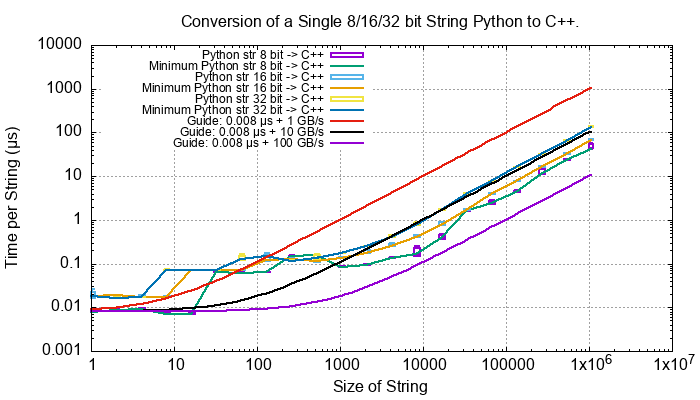
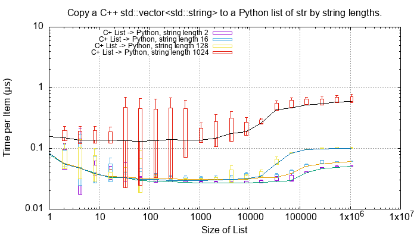
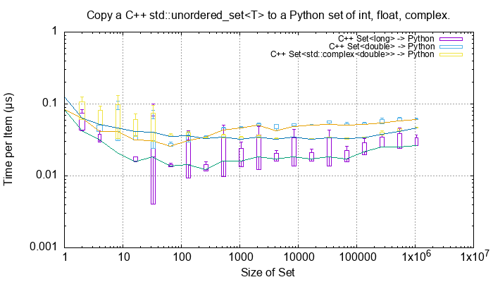
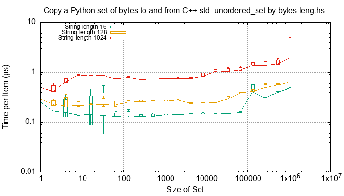
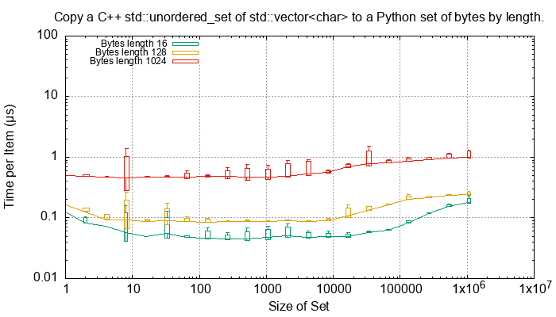
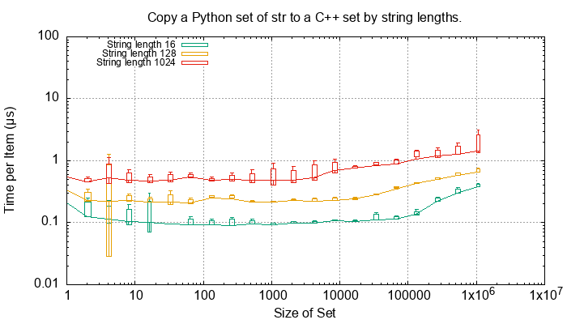

.. moduleauthor:: Paul Ross <apaulross@gmail.com>
.. sectionauthor:: Paul Ross <apaulross@gmail.com>

.. C++ performance

.. _PythonCppContainers.Performance.Cpp:

C++ Performance Tests
==============================

Test Procedure
--------------------------

The main entry point to the ``PyCppContainers`` project is in ``src/main.cpp`` and runs the functional, performance and
memory tests.

The performance tests are in ``src/cpy/tests/test_performance.h`` and ``src/cpy/tests/test_performance.cpp``.
There are a number of macros ``TEST_PERFORMANCE_*`` there that control which tests are run.
Running all tests takes about 6.5 hours.

The tests can be run by building and running the C++ binary from the project root:

.. code-block:: shell

    cmake --build cmake-build-release --target clean -- -j 6
    cmake --build cmake-build-release --target PyCppContainers -- -j 6
    cmake-build-release/PyCppContainers

.. note::

    The debug build includes more exhaustive internal tests (using ``assert()``) but excludes the performance tests as
    they take a *very* long time for a debug build.

The output is large and looks like this:

.. raw:: latex

    \begin{landscape}

.. code-block:: shell

    $ cmake-build-release/PyCppContainers
    ---> C++ release tests
    Hello, World!
    Python version: 3.12.1
    test_functional_all START
    RSS(Mb): was:     16.523 now:     16.531 diff:     +0.008 Peak was:     16.523 now:     16.531 diff:     +0.008 test_vector_to_py_tuple<bool>
    RSS(Mb): was:     16.531 now:     16.535 diff:     +0.004 Peak was:     16.531 now:     16.535 diff:     +0.004 test_vector_to_py_tuple<long>
    RSS(Mb): was:     16.535 now:     16.539 diff:     +0.004 Peak was:     16.535 now:     16.539 diff:     +0.004 test_vector_to_py_tuple<double>

    8<---- Snip ---->8

    TEST:    0    4096       1     0.002047584             N/A             N/A             N/A         1         488.4 test_py_tuple_str32_to_vector std::string[2048]>():[4096]
    TEST:    0    8192       1     0.004002917             N/A             N/A             N/A         1         249.8 test_py_tuple_str32_to_vector std::string[2048]>():[8192]
    TEST:    0   16384       1     0.008183250             N/A             N/A             N/A         1         122.2 test_py_tuple_str32_to_vector std::string[2048]>():[16384]
    TEST:    0   32768       1     0.039068668             N/A             N/A             N/A         1          25.6 test_py_tuple_str32_to_vector std::string[2048]>():[32768]
    TEST:    0   65536       1     0.044092626             N/A             N/A             N/A         1          22.7 test_py_tuple_str32_to_vector std::string[2048]>():[65536]
    TEST:    0    4096       1     4.745317500             N/A             N/A             N/A         1           0.2 test_unordered_set_bytes_to_py_set std::string[1048576]>():[4096]
    TAIL: Passed=24192/24192 Failed=0/24192
    All tests pass.

    ====RSS(Mb): was:      9.262 now:    844.883 diff:   +835.621 Peak was:      9.262 now:   3593.207 diff:  +3583.945 main.cpp
    Total execution time:    23880.011 (s)
    Count of unique strings created: 131724750
    Bye, bye! Returning 0

.. raw:: latex

    \end{landscape}

The complete output can be captured to ``perf_notes/cpp_test_results.txt`` with this command:

.. code-block:: shell

    $ time cmake-build-release/PyCppContainers > perf_notes/cpp_test_results.txt

Then there is a Python script ``perf_notes/write_dat_files_for_cpp_test_results.py`` that will extract all the
performance data into ``perf_notes/dat`` suitable for gnuplot.
Copy those ``*.dat`` files into ``docs/sphinx/source/plots/dat`` then ``cd`` into ``docs/sphinx/source/plots`` and run
``gnuplot -p *.plt`` to update all the performance plots referenced in the documentation.

.. note::

    See :ref:`PythonCppContainers.Performance.Round_trip` for the Python plots which can be built by gnuplot at the
    same time.

Conversion of Fundamental Types
------------------------------------

These C++ functions test the cost of converting ints, floats and bytes objects between Python and C++.
These test are executed if the macro ``TEST_PERFORMANCE_FUNDAMENTAL_TYPES`` is defined.

Numeric Types
^^^^^^^^^^^^^^^^^

..
    From perf_notes/cpp_test_results.txt
    HEAD: Fail   Scale  Repeat         Mean(s)     Std.Dev.(s)         Min.(s)         Max.(s)     Count      Rate(/s) Name
    TEST:    0 1000000      20     0.001561753     0.000001978     0.001560542     0.001567459        20       12806.1 test_bool_to_py_bool_multiple[1000000]
    TEST:    0 1000000      20     0.001468528     0.000027571     0.001455168     0.001562000        20       13619.1 test_py_bool_to_cpp_bool_multiple[1000000]
    TEST:    0 1000000      20     0.020391246     0.002205520     0.018449710     0.024430667        20         980.8 test_long_to_py_int_multiple[1000000]
    TEST:    0 1000000      20     0.004190838     0.000008678     0.004167083     0.004201125        20        4772.3 test_py_int_to_cpp_long_multiple[1000000]
    TEST:    0 1000000      20     0.015347088     0.000493604     0.014248792     0.015617834        20        1303.2 test_double_to_py_float_multiple[1000000]
    TEST:    0 1000000      20     0.005575696     0.000007624     0.005568000     0.005591876        20        3587.0 test_py_float_to_cpp_double_multiple[1000000]
    TEST:    0 1000000      20     0.022577623     0.000916127     0.021249167     0.025298459        20         885.8 test_complex_to_py_complex_multiple[1000000]
    TEST:    0 1000000      20     0.006424378     0.000006946     0.006420126     0.006452625        20        3113.1 test_py_complex_to_cpp_complex_multiple[1000000]

    Example: test_bool_to_py_bool_multiple() C++ to Python. Min is 0.001560542 for 1e6 conversions. So 1e9 * 0.00156 / 1e6 = 1.56
    Example: test_py_bool_to_cpp_bool_multiple() Python to C++. Min is 0.001455168 for 1e6 conversions. So 1e9 * 0.00146 / 1e6 = 1.46

.. list-table:: Fundamental Type Conversion Time. Times in nanoseconds.
   :widths: 30 20 20 20 60
   :header-rows: 1

   * - Type C++/Py
     - C++ to Py
     - Py to C++
     - Ratio
     - Notes
   * - ``bool``/``bool``
     - 1.56
     - 1.46
     - 1.07x
     - The mean is around 660 million/s
   * - ``long``/``int``
     - 18.4
     - 4.16
     - 4.42x
     - The mean is around 88 million/s.
   * - ``double``/``float``
     - 14.2
     - 5.56
     - 2.55x
     - The mean is around 100 million/s.
   * - ``complex<double>``/``complex``
     - 21.2
     - 6.42
     - 3.30x
     - The mean is around 72 million/s.

Converting from C++ to Python is always slower than from Python to C++.

``bytes``
^^^^^^^^^^^^^^^^^^^^^^^^^^^

For a single C++ ``std::vector<char>`` to and from Python ``bytes`` of different lengths:

..
    From perf_notes/cpp_test_results.txt
    HEAD: Fail   Scale  Repeat         Mean(s)     Std.Dev.(s)         Min.(s)         Max.(s)     Count      Rate(/s) Name
    TEST:    0 1000000      20     0.057439107     0.006509894     0.052396208     0.075423792        20         348.2 test_cpp_vector_char_to_py_bytes_multiple_2[1000000]
    TEST:    0 1000000      20     0.053159580     0.000777435     0.052021209     0.054217417        20         376.2 test_cpp_vector_char_to_py_bytes_multiple_16[1000000]
    TEST:    0 1000000      20     0.054709067     0.000891610     0.053596959     0.056247709        20         365.6 test_cpp_vector_char_to_py_bytes_multiple_128[1000000]
    TEST:    0 1000000      20     0.119114457     0.009596428     0.107581917     0.139490666        20         167.9 test_cpp_vector_char_to_py_bytes_multiple_1024[1000000]
    TEST:    0 1000000      20     0.300614207     0.017573230     0.271704084     0.328277376        20          66.5 test_cpp_vector_char_to_py_bytes_multiple_8192[1000000]
    TEST:    0 1000000      20     2.420889067     0.030892970     2.374831875     2.488255167        20           8.3 test_cpp_vector_char_to_py_bytes_multiple_65536[1000000]
    TEST:    0 1000000      20     0.056535515     0.003379383     0.051730335     0.062494459        20         353.8 test_py_bytes_to_cpp_vector_char_multiple_2[1000000]
    TEST:    0 1000000      20     0.054382388     0.002028227     0.052218167     0.059590500        20         367.8 test_py_bytes_to_cpp_vector_char_multiple_16[1000000]
    TEST:    0 1000000      20     0.072021513     0.002964195     0.068870083     0.078325250        20         277.7 test_py_bytes_to_cpp_vector_char_multiple_128[1000000]
    TEST:    0 1000000      20     0.091097832     0.005092673     0.083415293     0.101530751        20         219.5 test_py_bytes_to_cpp_vector_char_multiple_1024[1000000]
    TEST:    0 1000000      20     0.263217424     0.015400919     0.240177208     0.287619668        20          76.0 test_py_bytes_to_cpp_vector_char_multiple_8192[1000000]
    TEST:    0 1000000      20     2.124635850     0.017340990     2.084605542     2.158811208        20           9.4 test_py_bytes_to_cpp_vector_char_multiple_65536[1000000]

    Example: test_cpp_vector_char_to_py_bytes_multiple_2() C++ to Python. Min is 0.052396208 for 1e6 conversions. So 1e9 * 0.0524 / 1e6 = 52.4
    Example: test_py_bytes_to_cpp_vector_char_multiple_2() Python to C++. Min is 0.051730335 for 1e6 conversions. So 1e9 * 0.0517 / 1e6 = 51.7

From C++ to Python:

.. image:: ../plots/images/test_cpp_vector_char_to_py_bytes.png
    :height: 400px
    :align: center

.. todo::

    Commentary.

.. image:: ../plots/images/test_py_bytes_to_cpp_vector_char_multiple.dat.png
    :height: 400px
    :align: center

.. todo::

    Commentary.

.. list-table:: ``bytes`` Conversion Time. Times in nanoseconds.
   :widths: 30 20 20 20 60
   :header-rows: 1

   * - Length
     - C++ to Py
     - Py to C++
     - Ratio
     - Notes
   * - 2
     - 52.4
     - 51.7
     - 1.01x
     -
   * - 16
     - 52.0
     - 52.2
     - 0.996x
     -
   * - 128
     - 53.6
     - 68.9
     - 0.778x
     -
   * - 1024
     - 108
     - 83.4
     - 1.30x
     - Corresponds to about 11 Gb/s
   * - 8192
     - 272
     - 240
     - 1.13x
     - Corresponds to about 32 Gb/s
   * - 65536
     - 2,375
     - 2,085
     - 1.14x
     - Corresponds to about 29 Gb/s

For a single C++ ``std::string`` to and from Python ``str`` of different lengths:

Strings
^^^^^^^^^^^^^^^^^^^^^^

..
    From perf_notes/cpp_test_results.txt
    HEAD: Fail   Scale  Repeat         Mean(s)     Std.Dev.(s)         Min.(s)         Max.(s)     Count      Rate(/s) Name
    TEST:    0 1000000      20     0.058759109     0.003645734     0.053923376     0.066701584        20         340.4 test_cpp_string_to_py_str_multiple_2[1000000]
    TEST:    0 1000000      20     0.060736565     0.001276392     0.058984251     0.063327876        20         329.3 test_cpp_string_to_py_str_multiple_16[1000000]
    TEST:    0 1000000      20     0.064648476     0.001873584     0.061841501     0.069060916        20         309.4 test_cpp_string_to_py_str_multiple_128[1000000]
    TEST:    0 1000000      20     0.197420682     0.011602980     0.185850333     0.219071125        20         101.3 test_cpp_string_to_py_str_multiple_1024[1000000]
    TEST:    0 1000000      20     0.720809661     0.017942847     0.686475625     0.746969209        20          27.7 test_cpp_string_to_py_str_multiple_8192[1000000]
    TEST:    0 1000000      20     5.359504186     0.024684586     5.327452417     5.432398459        20           3.7 test_cpp_string_to_py_str_multiple_65536[1000000]
    TEST:    0 1000000      20     0.006176815     0.000003319     0.006173209     0.006182918        20        3237.9 test_py_str_to_cpp_string_multiple_2[1000000]
    TEST:    0 1000000      20     0.007333573     0.000004223     0.007330334     0.007346251        20        2727.2 test_py_str_to_cpp_string_multiple_16[1000000]
    TEST:    0 1000000      20     0.077593984     0.005359461     0.070420583     0.085804625        20         257.8 test_py_str_to_cpp_string_multiple_128[1000000]
    TEST:    0 1000000      20     0.089523303     0.005118394     0.083854375     0.100696042        20         223.4 test_py_str_to_cpp_string_multiple_1024[1000000]
    TEST:    0 1000000      20     0.266933671     0.015144741     0.243118751     0.292431167        20          74.9 test_py_str_to_cpp_string_multiple_8192[1000000]
    TEST:    0 1000000      20     2.123572144     0.033200797     2.094082043     2.250884334        20           9.4 test_py_str_to_cpp_string_multiple_65536[1000000]
    TEST:    0 1000000      20     0.042588886     0.001377939     0.040422959     0.043991375        20         469.6 test_cpp_u16string_to_py_str16_multiple_2[1000000]
    TEST:    0 1000000      20     0.147994407     0.009139400     0.138898917     0.164160334        20         135.1 test_cpp_u16string_to_py_str16_multiple_16[1000000]
    TEST:    0 1000000      20     0.873698398     0.009309133     0.854021875     0.887453251        20          22.9 test_cpp_u16string_to_py_str16_multiple_128[1000000]
    TEST:    0 1000000      20     6.716434430     0.026116913     6.675454917     6.768655084        20           3.0 test_cpp_u16string_to_py_str16_multiple_1024[1000000]
    TEST:    0 1000000      20    63.329128475     7.383649449    53.119942417    82.049977584        20           0.3 test_cpp_u16string_to_py_str16_multiple_8192[1000000]
    TEST:    0 1000000      20   434.770099001    15.165859601   423.448348083   486.720068750        20           0.0 test_cpp_u16string_to_py_str16_multiple_65536[1000000]
    TEST:    0 1000000      20     0.008109303     0.000006100     0.008102167     0.008129042        20        2466.3 test_py_str16_to_cpp_u16string_multiple_2[1000000]
    TEST:    0 1000000      20     0.078421778     0.005190042     0.071888541     0.088546043        20         255.0 test_py_str16_to_cpp_u16string_multiple_16[1000000]
    TEST:    0 1000000      20     0.135103696     0.009849180     0.123247876     0.161659084        20         148.0 test_py_str16_to_cpp_u16string_multiple_128[1000000]
    TEST:    0 1000000      20     0.115050209     0.007282402     0.105869334     0.128821043        20         173.8 test_py_str16_to_cpp_u16string_multiple_1024[1000000]
    TEST:    0 1000000      20     0.458368734     0.017611174     0.432019208     0.486256001        20          43.6 test_py_str16_to_cpp_u16string_multiple_8192[1000000]
    TEST:    0 1000000      20     5.448628694     0.024358348     5.403639833     5.521592875        20           3.7 test_py_str16_to_cpp_u16string_multiple_65536[1000000]
    TEST:    0 1000000      20     0.044683823     0.002890114     0.040840209     0.048879126        20         447.6 test_cpp_u32string_to_py_str32_multiple_2[1000000]
    TEST:    0 1000000      20     0.249225642     0.011375113     0.233679833     0.271066042        20          80.2 test_cpp_u32string_to_py_str32_multiple_32[1000000]
    TEST:    0 1000000      20     1.023829955     0.009710184     1.005457626     1.044050126        20          19.5 test_cpp_u32string_to_py_str32_multiple_128[1000000]
    TEST:    0 1000000      20     6.735237898     0.031750375     6.680839667     6.832778668        20           3.0 test_cpp_u32string_to_py_str32_multiple_1024[1000000]
    TEST:    0 1000000      20    53.187598769     0.114578230    53.028910543    53.416468667        20           0.4 test_cpp_u32string_to_py_str32_multiple_8192[1000000]
    TEST:    0 1000000      20   429.282977688     1.372580931   427.808455626   434.008575291        20           0.0 test_cpp_u32string_to_py_str32_multiple_65536[1000000]
    TEST:    0 1000000      20     0.007344234     0.000049091     0.007326501     0.007543208        20        2723.2 test_py_str32_to_cpp_u32string_multiple_2[1000000]
    TEST:    0 1000000      20     0.077141528     0.006414912     0.071097542     0.095550751        20         259.3 test_py_str32_to_cpp_u32string_multiple_32[1000000]
    TEST:    0 1000000      20     0.144473686     0.012002486     0.127959959     0.168075458        20         138.4 test_py_str32_to_cpp_u32string_multiple_128[1000000]
    TEST:    0 1000000      20     0.165254003     0.011043742     0.152708750     0.185491626        20         121.0 test_py_str32_to_cpp_u32string_multiple_1024[1000000]
    TEST:    0 1000000      20     0.853880155     0.014881503     0.822144209     0.878523792        20          23.4 test_py_str32_to_cpp_u32string_multiple_8192[1000000]
    TEST:    0 1000000      20    10.891868471     0.187687075    10.764805500    11.638142875        20           1.8 test_py_str32_to_cpp_u32string_multiple_65536[1000000]

    See also:
    C++ to Python: fundamental_string_8_16_32.plt
    Python to C++: fundamental_py_to_cpp_string_8_16_32.plt

C++ to Python:

.. image:: ../plots/images/fundamental_string_8_16_32.png
    :height: 400px
    :align: center

Python to C++:

.. list-table:: String Conversion Time. Times in nanoseconds.
   :widths: 30 20 20 20 60
   :header-rows: 1

   * - Length
     - C++ to Py
     - Py to C++
     - Ratio
     - Notes
   * - 2
     - 30.9
     - 5.2
     - 5.9x
     -
   * - 16
     - 33.7
     - 4.5
     - 7.5x
     -
   * - 128
     - 30.1
     - 63.4
     - 0.48x
     -
   * - 1024
     - 126
     - 66.7
     - 1.9x
     - Corresponds to about 8 to 15 Gb/s.
   * - 8192
     - 435
     - 122
     - 3.6x
     - Corresponds to about 20 to 65 Gb/s.
   * - 65536
     - 3,460
     - 1,530
     - 2.3x
     - Corresponds to about 20 to 40 Gb/s.

String conversion time from C++ to Python or the reverse takes asymptotically and roughly:

.. code-block:: text

    t (ns) = 900 * length / 24,000

This is about twice the time for ``bytes`` to an from ``std::vector<char>``.
Presumably this is because of the complexities of the Unicode implementation.

Python List to and from a C++ ``std::vector<T>``
----------------------------------------------------------

This as an extensive example of the methodology used for performance tests.
Each container test is repeated 5 times and the min/mean/max/std. dev. is recorded.
The min value is regarded as the most consistent one as other results may be affected by arbitrary context switching.
The tests are run on containers of lengths up to 1m items.

For example here is the total time to convert a list of ``bool``, ``int``, ``float`` and ``complex`` Python values to
C++ for various list lengths:

.. image:: ../plots/images/cpp_py_list_bool_int_float_vector_bool_long_double_time.png
    :height: 400px
    :align: center

This time plot is not that informative apart from showing linear behaviour.
More useful are *rate* plots that show the total time for the test divided by the container length.
These rate plots have the following design features:

* For consistency a rate scale of µs/item is used.
* The extreme whiskers show the minimum and maximum test values.
* The box shows the mean time ±the standard deviation, this is asymmetric as it is plotted on a log scale.
* The box will often extend beyond a minimum value where the minimum is close to the mean and the maximum large.
* The line shows the minimum time per object in µs.

Here is the same data plotted as a *rate of conversion* of a list of ``bool``, ``int``, ``float`` and ``complex``
Python values to C++ for various list lengths:

.. image:: ../plots/images/cpp_py_list_bool_int_float_vector_bool_long_double_rate.png
    :height: 400px
    :align: center

These rate plots are used for the rest of this section.

Lists of ``bool``, ``int``, ``float`` and ``complex``
^^^^^^^^^^^^^^^^^^^^^^^^^^^^^^^^^^^^^^^^^^^^^^^^^^^^^^^^^^^

The rate plot is shown above, it shows that:

* ``int``, ``float`` and ``complex`` take 0.01 µs per object to convert.
* ``bool`` objects take around 0.006 µs per object, roughly twice as fast.

And the reverse converting a list of ``bool``, ``int``, ``float`` and ``complex`` from C++ to Python:

.. image:: ../plots/images/cpp_vector_bool_long_double_py_list_bool_int_float_rate.png
    :height: 400px
    :align: center

This is broadly symmetric with the Python to C++ performance except that ``bool`` values are twice as quick.

Lists of ``bytes``
^^^^^^^^^^^^^^^^^^^^^^^^^^^^^^^^^^^^^^^^^^^^^^^^^^^^^^^^^^^

Another area of interest is the conversion of a list of ``bytes`` or ``str`` between Python and C++.
In these tests a list of of ``bytes`` or ``str`` objects of lengths 2, 16, 128 and 1024 are used to  convert from Python to C++.

.. image:: ../plots/images/cpp_py_list_bytes_vector_vector_char_rate.png
    :height: 400px
    :align: center

This graph shows a characteristic rise in rate for larger list lengths of larger objects.
This is most likely because of memory contention issues with the larger, up to 1GB, containers.
This characteristic is observed on most of the following plots, particularly with containers of ``bytes`` and ``str``.

In summary:

=============== ======================= =========================== ===================
Object          ~Time per object (µs)   Rate Mb/s                   Notes
=============== ======================= =========================== ===================
bytes[2]        0.06                    30
bytes[16]       0.06                    270
bytes[128]      0.06                    2,000
bytes[1024]     0.15 to 0.4             2,500 to 6,800
=============== ======================= =========================== ===================

This is the inverse, converting a C++ ``std::vector<std::vector<char>>`` to a Python list of ``bytes``:

.. image:: ../plots/images/cpp_vector_vector_char_py_list_bytes_rate.png
    :height: 400px
    :align: center

=============== ======================= =========================== ===================
Object          ~Time per object (µs)   Rate Mb/s                   Notes
=============== ======================= =========================== ===================
bytes[2]        0.015 to 0.03           67 to 133
bytes[16]       0.015 to 0.04           400 to 133
bytes[128]      0.02 to 0.09            1,400 to 6,400
bytes[1024]     0.1 to 0.6              1,600 to 10,000
=============== ======================= =========================== ===================

This shows that converting C++ to Python is about twice as fast as the other way around.
This is in line with the performance of conversion of fundamental types described above.

Lists of ``str``
^^^^^^^^^^^^^^^^^^^^^^^^^^^^^^^^^^^^^^^^^^^^^^^^^^^^^^^^^^^

Similarly for converting a a Python list of ``str`` to and from a C++ ``std::vector<std::string>``.
First Python -> C++:

.. image:: ../plots/images/cpp_py_list_str_vector_string_rate.png
    :height: 400px
    :align: center

Notably with small strings (2 and 16 long) are about eight times faster that for bytes.
For larger strings this perfformance is very similar to Python ``bytes`` to a C++ ``std::vector<std::vector<char>>``:

=============== ======================= =========================== ===================
Object          ~Time per object (µs)   Rate Mb/s                   Notes
=============== ======================= =========================== ===================
str[2]          0.01                    200
str[16]         0.01                    1600
str[128]        0.07                    1,800
str[1024]       0.1 to 0.6              1,600 to 10,000
=============== ======================= =========================== ===================

And C++ -> Python:

=============== ======================= =========================== ===================
Object          ~Time per object (µs)   Rate Mb/s                   Notes
=============== ======================= =========================== ===================
str[2]          0.03                    70
str[16]         0.03                    500
str[128]        0.03 to 0.1             1,300 to 4,000
str[1024]       0.15 to 0.6             1,700 to 6,800
=============== ======================= =========================== ===================

Slightly slower than the twice the time for converting ``bytes`` especially for small strings
this is abut twice the time for converting ``bytes`` but otherwise very similar to Python ``bytes``
to a C++ ``std::vector<std::vector<char>>``:

Python Tuple to and from a C++ ``std::vector<T>``
----------------------------------------------------------

This is near identical to the performance of a list for:

* The conversion of  ``bool``, ``int``, ``float`` and ``complex`` for Python to C++ and C++ to Python.
* The conversion of  ``bytes`` for Python to C++ and C++ to Python.
* The conversion of  ``str`` for Python to C++ and C++ to Python.

Python Set to and from a C++ ``std::unordered_set<T>``
----------------------------------------------------------

Set of ``int``, ``float`` and ``complex``
^^^^^^^^^^^^^^^^^^^^^^^^^^^^^^^^^^^^^^^^^^^^^^^^^^^^^^^^^^^

Here is the rate graph for converting a Python ``set`` to C++ ``std::unordered_set<T>`` for Python
``int``, ``float`` and ``complex`` objects:

.. image:: ../plots/images/cpp_py_set_int_float_unordered_set_long_double_rate.png
    :height: 400px
    :align: center

Here is the time per object compared with a list:

=============== =================================== =================================== =========== ===================
Object          set (µs)                            list (µs)                           Ratio       Notes
=============== =================================== =================================== =========== ===================
int             0.09                                0.01                                x9
double          0.1                                 0.01                                x10
complex         0.1                                 0.01                                x10
=============== =================================== =================================== =========== ===================

The cost of insertion is O(N) for both list and set but due to the hashing heeded for the set it is about 10x slower.

And the reverse, converting a C++ ``std::unordered_set<T>`` to a Python ``set`` to for Python
``int``, ``float`` and ``complex`` objects:

The conversion and insertion of C++ to Python is significantly faster that from Python to C++.
Here is the time per object compared with a list:

=============== =================================== =================================== =========== ===================
Object          set (µs)                            list (µs)                           Ratio       Notes
=============== =================================== =================================== =========== ===================
int             0.02                                0.01                                x2
double          0.025                               0.01                                x2.5
complex         0.04                                0.01                                x4
=============== =================================== =================================== =========== ===================

Set of ``bytes``
^^^^^^^^^^^^^^^^^^^^^^^^^^^^^^^^^^^^^^^^^^^^^^^^^^^^^^^^^^^

Here is the rate graph for converting a Python ``set`` of ``bytes`` to C++ ``std::unordered_set<std::vector<char>>``:

=============== ======================= =========================== ===================
Object          ~Time per object (µs)   Rate Mb/s                   Notes
=============== ======================= =========================== ===================
bytes[16]       0.4                     40
bytes[128]      0.5                     250
bytes[1024]     1.0                     1,000
=============== ======================= =========================== ===================

Here is the time per object compared with a list:

=============== =================================== =================================== =========== ===================
Object          set (µs)                            list (µs)                           Ratio       Notes
=============== =================================== =================================== =========== ===================
bytes[16]       0.4                                 0.06                                x7
bytes[128]      0.5                                 0.06                                x8
bytes[1024]     1.0                                 0.15 to 0.4                         x2.5 to x7
=============== =================================== =================================== =========== ===================

And the reverse, converting a C++ ``std::unordered_set<std::vector<char>>`` to a Python ``set`` of ``bytes``:

=============== ======================= =========================== ===================
Object          ~Time per object (µs)   Rate Mb/s                   Notes
=============== ======================= =========================== ===================
bytes[16]       0.05                    320
bytes[128]      0.1                     1,280
bytes[1024]     0.6                     1,600
=============== ======================= =========================== ===================

Here is the time per object compared with a list:

=============== =================================== =================================== =========== ===================
Object          set (µs)                            list (µs)                           Ratio       Notes
=============== =================================== =================================== =========== ===================
bytes[16]       0.05                                0.015 to 0.04                       x3 to x1.25
bytes[128]      0.1                                 0.02 to 0.09                        x1 to x5
bytes[1024]     0.6                                 0.1 to 0.6                          x1 to x6
=============== =================================== =================================== =========== ===================

Set of ``str``
^^^^^^^^^^^^^^^^^^^^^^^^^^^^^^^^^^^^^^^^^^^^^^^^^^^^^^^^^^^

Here is the rate graph for converting a Python ``set`` of ``str`` to C++ ``std::unordered_set<std::string>``:

=============== ======================= =========================== ===================
Object          ~Time per object (µs)   Rate Mb/s                   Notes
=============== ======================= =========================== ===================
bytes[16]       0.2                     80
bytes[128]      0.4                     3000
bytes[1024]     0.5 to 2.0              500 to 2,000
=============== ======================= =========================== ===================

Here is the time per object compared with a list:

=============== =================================== =================================== =========== ===================
Object          set (µs)                            list (µs)                           Ratio       Notes
=============== =================================== =================================== =========== ===================
bytes[16]       0.2                                 0.01                                x20
bytes[128]      0.4                                 0.07                                x6
bytes[1024]     0.5 to 2.0                          0.1 to 0.6                          ~x5
=============== =================================== =================================== =========== ===================

And the reverse, converting a C++ ``std::unordered_set<std::string>`` to a Python ``set`` of ``str``:

.. image:: ../plots/images/cpp_unordered_set_string_to_py_set_multiple_std_string_rate.png
    :height: 400px
    :align: center

=============== ======================= =========================== ===================
Object          ~Time per object (µs)   Rate Mb/s                   Notes
=============== ======================= =========================== ===================
bytes[16]       0.08                    200
bytes[128]      0.15                    850
bytes[1024]     0.8                     1,300
=============== ======================= =========================== ===================

Here is the time per object compared with a list:

=============== =================================== =================================== =========== ===================
Object          set (µs)                            list (µs)                           Ratio       Notes
=============== =================================== =================================== =========== ===================
bytes[16]       0.08                                0.03                                x3
bytes[128]      0.15                                0.03                                x5
bytes[1024]     0.8                                 0.15                                x5
=============== =================================== =================================== =========== ===================

Python Dict to and from a C++ ``std::unordered_map<K, V>``
-------------------------------------------------------------

Since dictionaries operate in much the same way as sets the performance is rather similar.
For brevity the full results of dictionaries are not reproduced here, instead here is a summary of the performance of a
dictionary compared to a set.

=============================== =================================== =================================== ===========
Object                          Python to C++                       C++ to Python                       Notes
=============================== =================================== =================================== ===========
``int``, ``float``, ``complex`` Same as a set                       Twice that of a set
``bytes``                       Slightly slower than a set          Twice that of a set
``str``                         Same as a set                       Twice that of a set
=============================== =================================== =================================== ===========

Summary
------------------

Converting Individual Objects
^^^^^^^^^^^^^^^^^^^^^^^^^^^^^^^^^^^

* ``bool``, ``int``, ``float``, ``complex`` from C++ to Python is around two to three times faster than from Python to C++.
* Converting ``bytes`` from C++ to Python is the same as from Python to C++. This is memory bound at around 50 Gb/s.
* With ``str`` then Python to C++ is about twice as fast as C++ to Python. With the former performance is twice as fast
  as ``bytes``, for the latter it is broadly similar to ``bytes`` conversion.

Converting Containers of Objects
^^^^^^^^^^^^^^^^^^^^^^^^^^^^^^^^^^^

* The performance of Python ``lists`` and ``tuple`` is the same.
* For Python ``list`` containers converting C++ to Python may be 2x faster in some cases compared to Python to C++.
* For Python ``list`` containing ``bytes`` and ``str`` objects are converted at a rate of 2 to 5 Gib/s, with some latency.
* Python ``set`` <-> C++ ``std::unordered_set`` and Python ``dict`` <-> C++ ``std::unordered_map`` conversion is
  typically x3 to x10 times slower than for lists and tuples.

TODO: test_list_like_u16string_to_py_list_multiple-std_list_std_u16string_2.dat
3 types of string. 4 sizes. list/list and list/vector so 24

TODO: test_py_list_str16_to_list_like_u16string_multiple-std_list_std_u16string_2.dat
3 types of string. 4 sizes. list/list and list/vector so 24

TODO: test_unordered_set_u16string_to_py_set_multiple_std_string_16.dat
6 files
