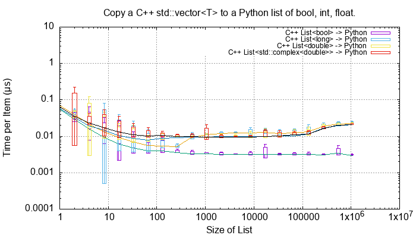
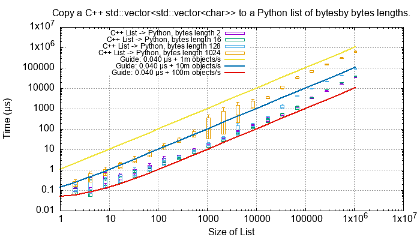
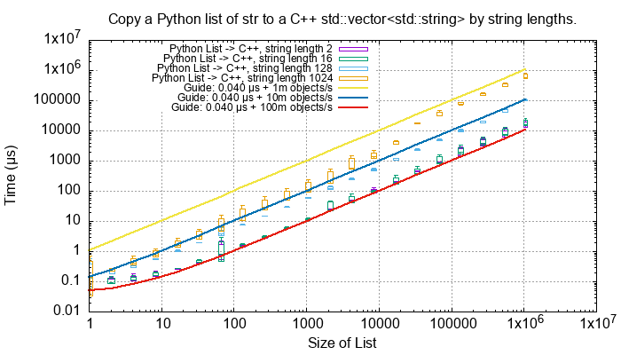
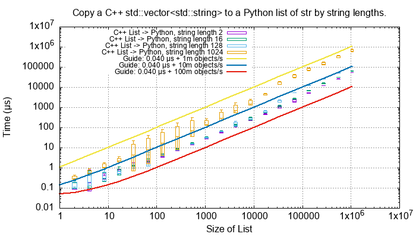

C++ Performance Tests
==============================

These tests are in ``src/cpy/tests/test_performance.h`` and ``src/cpy/tests/test_performance.cpp``.

Conversion of Fundamental Types
------------------------------------

These C++ functions test the cost of converting ints, floats and bytes objects between Python and C++.
These test are executed if the macro ``TEST_PERFORMANCE_FUNDAMENTAL_TYPES`` is defined.

.. list-table::
   :widths: 40 25 25 30
   :header-rows: 1

   * - Operation
     - C++ to Python (µs)
     - Python to C++ (µs)
     - Notes
   * - C++ ``bool`` <-> Python ``bool``
     - 0.0027
     - 0.0016
     -
   * - C++ ``long`` <-> Python ``int``
     - 0.0146
     - 0.0046
     - Converting C++ to Python is around x3 times the reverse.
   * - C++ ``double`` <-> Python ``float``
     - 0.0086
     - 0.0027
     - Converting C++ to Python is around x3 times the reverse.
   * - C++ ``std::complex<double>`` <-> Python ``complex``
     - 0.0122
     - 0.0049
     - Converting C++ to Python is around x2.5 times the reverse.

For a single C++ ``std::vector<char>`` to and from Python ``bytes`` of different lengths:

.. list-table::
   :widths: 20 25 25 50
   :header-rows: 1

   * - Length
     - C++ to Python (µs)
     - Python to C++ (µs)
     - Notes
   * - 2
     - 0.0173
     - 0.0047
     -
   * - 16
     - 0.0169
     - 0.0040
     -
   * - 128
     - 0.0201
     - 0.0641
     -
   * - 1024
     - 0.0807
     - 0.0671
     - Corresponds to about 14 Gb/s
   * - 8192
     - 0.1317
     - 0.1197
     - Corresponds to about 64 Gb/s
   * - 65536
     - 1.567
     - 1.551
     - Corresponds to about 41 Gb/s

Bytes conversion time from C++ to Python or the reverse takes asymptotically and roughly: t (µs) = 0.017 * length / 50,000

For a single C++ ``std::string`` to and from Python ``str`` of different lengths:

.. list-table::
   :widths: 20 25 25 50
   :header-rows: 1

   * - Length
     - C++ to Python (µs)
     - Python to C++ (µs)
     - Notes
   * - 2
     - 0.0309
     - 0.0052
     -
   * - 16
     - 0.0337
     - 0.0045
     -
   * - 128
     - 0.0301
     - 0.0634
     -
   * - 1024
     - 0.126
     - 0.0667
     - Corresponds to about 8 to 15 Gb/s, Python to C++ being about twice as fast.
   * - 8192
     - 0.435
     - 0.122
     - Corresponds to about 20 to 65 Gb/s, Python to C++ being about thrice as fast.
   * - 65536
     - 3.46
     - 1.53
     - Corresponds to about 20 to 40 Gb/s, Python to C++ being about twice as fast.

String conversion time from C++ to Python or the reverse takes asymptotically and roughly: t (µs) = 0.015 * length / 24,000.
This is about twice the time for ``bytes`` and ``std::vector<char>``.

Python List to and from a C++ ``std::vector<T>``
----------------------------------------------------------

TODO: Use this as an extensive example of the methodology.

TODO: Use this as an example of the methodology, this shows RATE, the rest show time.

This shows the conversion cost of various length strings from a Python tuple to a C++ vector.
Each test was repeated 5 times.
The line shows the mean time per object in µs.
The extreme whiskers show the minimum and maximum test values.
The box shows the mean time ±the standard deviation, this is asymmetric as it is plotted on a log scale.
The box will often extend beyond a minimum value where the minimum is close to the mean and the maximum large.

TODO:
Rate line shows minimum.

Lists of ``bool``, ``int``, ``float`` and ``complex``
^^^^^^^^^^^^^^^^^^^^^^^^^^^^^^^^^^^^^^^^^^^^^^^^^^^^^^^^^^^

Here is the total time to convert a list of ``bool``, ``int``, ``float`` and ``complex`` Python values to C++ for various list lengths:

.. image:: ../plots/images/cpp_py_list_bool_int_float_vector_bool_long_double_time.png
    :height: 300px
    :align: center

More useful is the *rate* of conversion, that is the total time divided by the list size:

.. image:: ../plots/images/cpp_py_list_bool_int_float_vector_bool_long_double_rate.png
    :height: 300px
    :align: center

``int``, ``float`` and ``complex`` take 0.01 µs per object to convert.
``bool`` objects take around 0.006 µs per object, roughly twice as fast.

And the reverse converting a list of ``bool``, ``int``, ``float`` and ``complex`` from C++ to Python:

This is broadly symmetric with the Python to C++ performance except that ``bool`` values are twice as quick.

Lists of ``bytes``
^^^^^^^^^^^^^^^^^^^^^^^^^^^^^^^^^^^^^^^^^^^^^^^^^^^^^^^^^^^

Another area of interest is the conversion of a list of ``bytes`` or ``str`` between Python and C++.
In these tests a list of of ``bytes`` or ``str`` objects
TODO:

.. image:: ../plots/images/cpp_py_list_bytes_vector_vector_char_rate.png
    :height: 300px
    :align: center

TODO:

=============== ======================= =========================== ===================
Object          ~Time per object (µs)   Rate Mb/s                   Notes
=============== ======================= =========================== ===================
bytes[2]        0.01                    200
bytes[16]       0.01                    1600
bytes[128]      0.07                    1,800
bytes[1024]     0.15 to 0.6             1,600 to 6,800
=============== ======================= =========================== ===================

TODO: bytes C++ -> Python
TODO:

TODO:

.. image:: ../plots/images/cpp_vector_vector_char_py_list_bytes_rate.png
    :height: 300px
    :align: center

TODO:

=============== ======================= =========================== ===================
Object          ~Time per object (µs)   Rate Mb/s                   Notes
=============== ======================= =========================== ===================
bytes[2]        0.015 to 0.03           67 to 133
bytes[16]       0.015 to 0.04           400 to 133
bytes[128]      0.02 to 0.09            1,400 to 6,400
bytes[1024]     0.1 to 0.6              1,600 to 10,000
=============== ======================= =========================== ===================

Lists of ``str``
^^^^^^^^^^^^^^^^^^^^^^^^^^^^^^^^^^^^^^^^^^^^^^^^^^^^^^^^^^^

TODO: Describe str
TODO: Python -> C++

TODO:

.. image:: ../plots/images/cpp_py_list_str_vector_string_rate.png
    :height: 300px
    :align: center

TODO:

=============== ======================= =========================== ===================
Object          ~Time per object (µs)   Rate Mb/s                   Notes
=============== ======================= =========================== ===================
bytes[2]        0.01                    200
bytes[16]       0.01                    1600
bytes[128]      0.07                    1,800
bytes[1024]     0.15 to 0.6             1,600 to 6,800
=============== ======================= =========================== ===================

TODO: str C++ -> Python
TODO:

TODO:

.. image:: ../plots/images/cpp_vector_string_py_list_str_rate.png
    :height: 300px
    :align: center

TODO:

=============== ======================= =========================== ===================
Object          ~Time per object (µs)   Rate Mb/s                   Notes
=============== ======================= =========================== ===================
bytes[2]        0.015 to 0.03           67 to 133
bytes[16]       0.015 to 0.04           400 to 133
bytes[128]      0.02 to 0.09            1,400 to 6,400
bytes[1024]     0.1 to 0.6              1,600 to 10,000
=============== ======================= =========================== ===================

Python Tuple to and from a C++ ``std::vector<T>``
----------------------------------------------------------

TODO:

Python Set to and from a C++ ``std::unordered_set<T>``
----------------------------------------------------------

TODO:

Python Dict to and from a C++ ``std::unordered_map<K, V>``
-------------------------------------------------------------

TODO:
