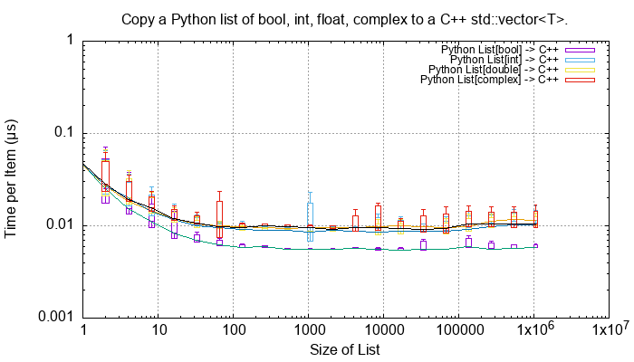
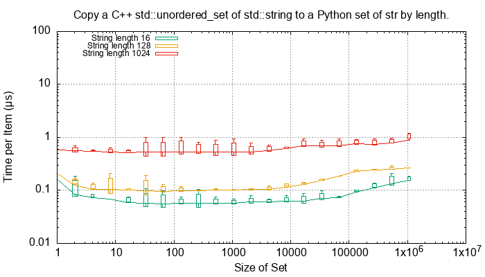
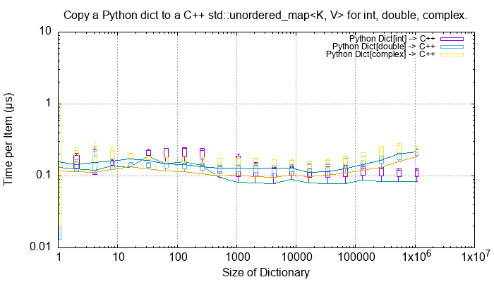
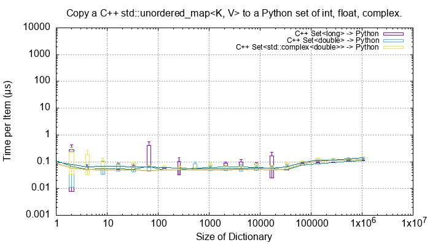
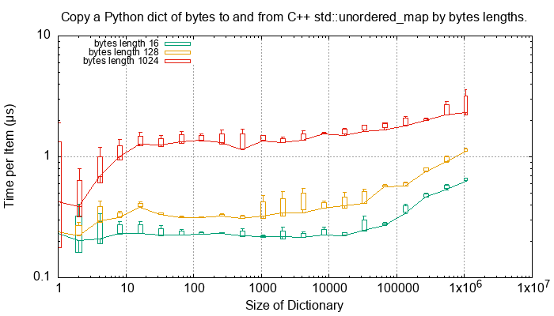
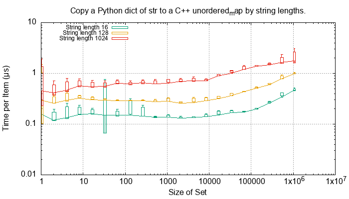
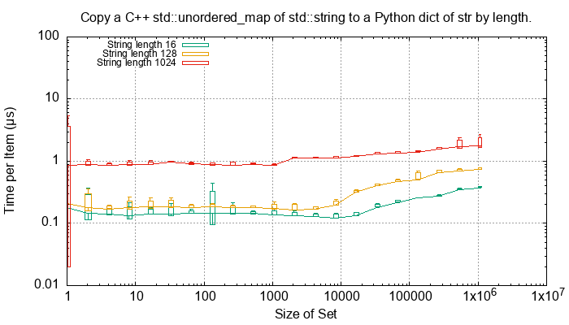

.. moduleauthor:: Paul Ross <apaulross@gmail.com>
.. sectionauthor:: Paul Ross <apaulross@gmail.com>

.. C++ performance

C++ Performance Tests
==============================

These tests are in ``src/cpy/tests/test_performance.h`` and ``src/cpy/tests/test_performance.cpp``.
There are a number of macros ``TEST_PERFORMANCE_*`` there that control which tests are run.
Running all tests takes about 900 seconds.

Conversion of Fundamental Types
------------------------------------

These C++ functions test the cost of converting ints, floats and bytes objects between Python and C++.
These test are executed if the macro ``TEST_PERFORMANCE_FUNDAMENTAL_TYPES`` is defined.

.. list-table::
   :widths: 40 25 25 30
   :header-rows: 1

   * - Operation
     - C++ to Python (µs)
     - Python to C++ (µs)
     - Notes
   * - C++ ``bool`` <-> Python ``bool``
     - 0.0027
     - 0.0016
     -
   * - C++ ``long`` <-> Python ``int``
     - 0.0146
     - 0.0046
     - Converting C++ to Python is around x3 times the reverse.
   * - C++ ``double`` <-> Python ``float``
     - 0.0086
     - 0.0027
     - Converting C++ to Python is around x3 times the reverse.
   * - C++ ``std::complex<double>`` <-> Python ``complex``
     - 0.0122
     - 0.0049
     - Converting C++ to Python is around x2.5 times the reverse.

For a single C++ ``std::vector<char>`` to and from Python ``bytes`` of different lengths:

.. list-table::
   :widths: 20 25 25 50
   :header-rows: 1

   * - Length
     - C++ to Python (µs)
     - Python to C++ (µs)
     - Notes
   * - 2
     - 0.0173
     - 0.0047
     -
   * - 16
     - 0.0169
     - 0.0040
     -
   * - 128
     - 0.0201
     - 0.0641
     -
   * - 1024
     - 0.0807
     - 0.0671
     - Corresponds to about 14 Gb/s
   * - 8192
     - 0.1317
     - 0.1197
     - Corresponds to about 64 Gb/s
   * - 65536
     - 1.567
     - 1.551
     - Corresponds to about 41 Gb/s

Bytes conversion time from C++ to Python or the reverse takes asymptotically and roughly: t (µs) = 0.017 * length / 50,000

For a single C++ ``std::string`` to and from Python ``str`` of different lengths:

.. list-table::
   :widths: 20 25 25 50
   :header-rows: 1

   * - Length
     - C++ to Python (µs)
     - Python to C++ (µs)
     - Notes
   * - 2
     - 0.0309
     - 0.0052
     -
   * - 16
     - 0.0337
     - 0.0045
     -
   * - 128
     - 0.0301
     - 0.0634
     -
   * - 1024
     - 0.126
     - 0.0667
     - Corresponds to about 8 to 15 Gb/s, Python to C++ being about twice as fast.
   * - 8192
     - 0.435
     - 0.122
     - Corresponds to about 20 to 65 Gb/s, Python to C++ being about thrice as fast.
   * - 65536
     - 3.46
     - 1.53
     - Corresponds to about 20 to 40 Gb/s, Python to C++ being about twice as fast.

String conversion time from C++ to Python or the reverse takes asymptotically and roughly: t (µs) = 0.015 * length / 24,000.
This is about twice the time for ``bytes`` and ``std::vector<char>``.

Python List to and from a C++ ``std::vector<T>``
----------------------------------------------------------

This as an extensive example of the methodology used for performance tests.
Each container test is repeated 5 times and the min/mean/max/std. dev. is recorded.
The min value is regarded as the most consistent one as other results may be affected by arbitrary context switching.
The tests are run on containers of lengths up to 1m items.

For example here is the total time to convert a list of ``bool``, ``int``, ``float`` and ``complex`` Python values to C++ for various list lengths:

.. image:: ../plots/images/cpp_py_list_bool_int_float_vector_bool_long_double_time.png
    :height: 300px
    :align: center

This time plot is not that informative apart from showing linear behaviour.
More useful are *rate* plots that show the total time for the test divided by the container length.
These rate plots have the following design features:

* For consistency a rate scale of µs/item is used.
* The extreme whiskers show the minimum and maximum test values.
* The box shows the mean time ±the standard deviation, this is asymmetric as it is plotted on a log scale.
* The box will often extend beyond a minimum value where the minimum is close to the mean and the maximum large.
* The line shows the minimum time per object in µs.

Here is the rate of converting a list of ``bool``, ``int``, ``float`` and ``complex`` Python values to C++ for various list lengths:

These rate plots are used for the rest of this section.

Lists of ``bool``, ``int``, ``float`` and ``complex``
^^^^^^^^^^^^^^^^^^^^^^^^^^^^^^^^^^^^^^^^^^^^^^^^^^^^^^^^^^^

The rate plot is shown above, it shows that:

* ``int``, ``float`` and ``complex`` take 0.01 µs per object to convert.
* ``bool`` objects take around 0.006 µs per object, roughly twice as fast.

And the reverse converting a list of ``bool``, ``int``, ``float`` and ``complex`` from C++ to Python:

.. image:: ../plots/images/cpp_vector_bool_long_double_py_list_bool_int_float_rate.png
    :height: 300px
    :align: center

This is broadly symmetric with the Python to C++ performance except that ``bool`` values are twice as quick.

Lists of ``bytes``
^^^^^^^^^^^^^^^^^^^^^^^^^^^^^^^^^^^^^^^^^^^^^^^^^^^^^^^^^^^

Another area of interest is the conversion of a list of ``bytes`` or ``str`` between Python and C++.
In these tests a list of of ``bytes`` or ``str`` objects of lengths 2, 16, 128 and 1024 are used to  convert from Python to C++.

.. image:: ../plots/images/cpp_py_list_bytes_vector_vector_char_rate.png
    :height: 300px
    :align: center

This graph shows a characteristic rise in rate for larger list lengths of larger objects.
This is most likely because of memory contention issues with the larger, up to 1GB, containers.
This characteristic is observed on most of the following plots, particularly with containers of ``bytes`` and ``str``.

In summary:

=============== ======================= =========================== ===================
Object          ~Time per object (µs)   Rate Mb/s                   Notes
=============== ======================= =========================== ===================
bytes[2]        0.06                    30
bytes[16]       0.06                    270
bytes[128]      0.06                    2,000
bytes[1024]     0.15 to 0.4             2,500 to 6,800
=============== ======================= =========================== ===================

This is the inverse, converting a C++ ``std::vector<std::vector<char>>`` to a Python list of ``bytes``:

.. image:: ../plots/images/cpp_vector_vector_char_py_list_bytes_rate.png
    :height: 300px
    :align: center

=============== ======================= =========================== ===================
Object          ~Time per object (µs)   Rate Mb/s                   Notes
=============== ======================= =========================== ===================
bytes[2]        0.015 to 0.03           67 to 133
bytes[16]       0.015 to 0.04           400 to 133
bytes[128]      0.02 to 0.09            1,400 to 6,400
bytes[1024]     0.1 to 0.6              1,600 to 10,000
=============== ======================= =========================== ===================

This shows that converting C++ to Python is about twice as fast as the other way around.
This is in line with the performance of conversion of fundamental types described above.

Lists of ``str``
^^^^^^^^^^^^^^^^^^^^^^^^^^^^^^^^^^^^^^^^^^^^^^^^^^^^^^^^^^^

Similarly for converting a a Python list of ``str`` to and from a C++ ``std::vector<std::string>``.
First Python -> C++:

.. image:: ../plots/images/cpp_py_list_str_vector_string_rate.png
    :height: 300px
    :align: center

Notably with small strings (2 and 16 long) are about eight times faster that for bytes.
For larger strings this perfformance is very similar to Python ``bytes`` to a C++ ``std::vector<std::vector<char>>``:

=============== ======================= =========================== ===================
Object          ~Time per object (µs)   Rate Mb/s                   Notes
=============== ======================= =========================== ===================
str[2]          0.01                    200
str[16]         0.01                    1600
str[128]        0.07                    1,800
str[1024]       0.1 to 0.6              1,600 to 10,000
=============== ======================= =========================== ===================

And C++ -> Python:

.. image:: ../plots/images/cpp_vector_string_py_list_str_rate.png
    :height: 300px
    :align: center

=============== ======================= =========================== ===================
Object          ~Time per object (µs)   Rate Mb/s                   Notes
=============== ======================= =========================== ===================
str[2]          0.03                    70
str[16]         0.03                    500
str[128]        0.03 to 0.1             1,300 to 4,000
str[1024]       0.15 to 0.6             1,700 to 6,800
=============== ======================= =========================== ===================

Slightly slower than the twice the time for converting ``bytes`` especially for small strings
this is abut twice the time for converting ``bytes`` but otherwise very similar to Python ``bytes``
to a C++ ``std::vector<std::vector<char>>``:

Python Tuple to and from a C++ ``std::vector<T>``
----------------------------------------------------------

This is near identical to the performance of a list for:

* The conversion of  ``bool``, ``int``, ``float`` and ``complex`` for Python to C++ and C++ to Python.
* The conversion of  ``bytes`` for Python to C++ and C++ to Python.
* The conversion of  ``str`` for Python to C++ and C++ to Python.

Python Set to and from a C++ ``std::unordered_set<T>``
----------------------------------------------------------

Set of ``bool``, ``int``, ``float`` and ``complex``
^^^^^^^^^^^^^^^^^^^^^^^^^^^^^^^^^^^^^^^^^^^^^^^^^^^^^^^^^^^

Here is the rate graph for converting a Python ``set`` to C++ ``std::unordered_set<T>`` for Python
``int``, ``float`` and ``complex`` objects:

.. image:: ../plots/images/cpp_py_set_int_float_unordered_set_long_double_rate.png
    :height: 300px
    :align: center

Here is the time per object compared with a list:

=============== =================================== =================================== =========== ===================
Object          set (µs)                            list (µs)                           Ratio       Notes
=============== =================================== =================================== =========== ===================
int             0.09                                0.01                                x9
double          0.1                                 0.01                                x10
complex         0.1                                 0.01                                x10
=============== =================================== =================================== =========== ===================

The cost of insertion is O(N) for both list and set but due to the hashing heeded for the set it is about 10x slower.

And the reverse, converting a C++ ``std::unordered_set<T>`` to a Python ``set`` to for Python
``int``, ``float`` and ``complex`` objects:

.. image:: ../plots/images/cpp_unordered_set_long_double_py_set_int_float_rate.png
    :height: 300px
    :align: center

The conversion and insertion of C++ to Python is strikingly faster that from Python to C++.
Here is the time per object compared with a list:

=============== =================================== =================================== =========== ===================
Object          set (µs)                            list (µs)                           Ratio       Notes
=============== =================================== =================================== =========== ===================
int             0.02                                0.01                                x2
double          0.025                               0.01                                x2.5
complex         0.04                                0.01                                x4
=============== =================================== =================================== =========== ===================

Set of ``bytes``
^^^^^^^^^^^^^^^^^^^^^^^^^^^^^^^^^^^^^^^^^^^^^^^^^^^^^^^^^^^

TODO:

Here is the rate graph for converting a Python ``set`` of ``bytes`` to C++ ``std::unordered_set<std::vector<char>>``:

.. image:: ../plots/images/cpp_py_set_bytes_unordered_set_vector_char_rate.png
    :height: 300px
    :align: center

And the reverse, converting a C++ ``std::unordered_set<std::vector<char>>`` to a Python ``set`` of ``bytes``:

.. image:: ../plots/images/cpp_unordered_set_vector_char_to_py_set_multiple_std_vector_char_rate.png
    :height: 300px
    :align: center

Set of ``str``
^^^^^^^^^^^^^^^^^^^^^^^^^^^^^^^^^^^^^^^^^^^^^^^^^^^^^^^^^^^

Here is the rate graph for converting a Python ``set`` of ``str`` to C++ ``std::unordered_set<std::string>``:

.. image:: ../plots/images/cpp_py_set_str_unordered_set_string_rate.png
    :height: 300px
    :align: center

And the reverse, converting a C++ ``std::unordered_set<std::string>`` to a Python ``set`` of ``str``:

Python Dict to and from a C++ ``std::unordered_map<K, V>``
-------------------------------------------------------------

TODO:

Dictionary Python int to C++

Dictionary C++ int etc. to Python

Dictionary Python bytes to C++

Dictionary C++ bytes etc. to Python

Dictionary Python str to C++

Dictionary C++ str etc. to Python

