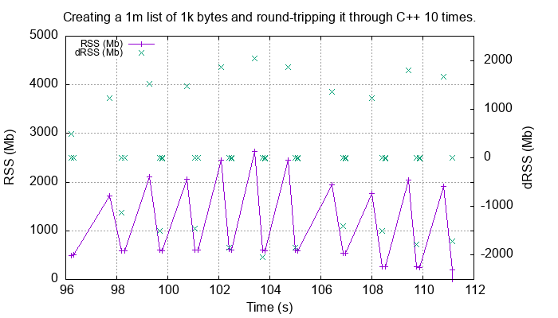
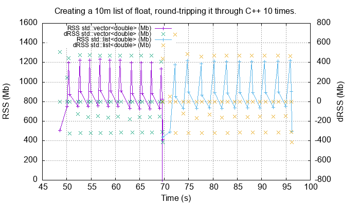
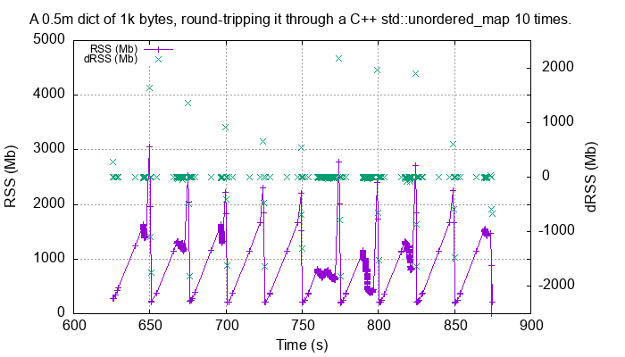
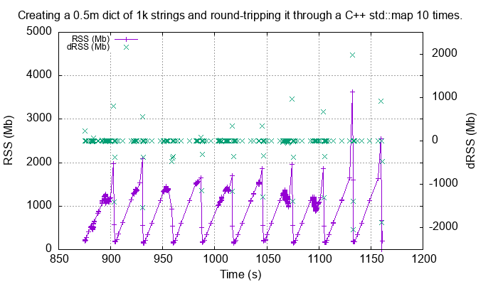
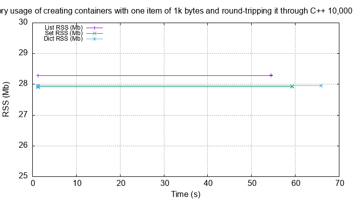

.. moduleauthor:: Paul Ross <apaulross@gmail.com>
.. sectionauthor:: Paul Ross <apaulross@gmail.com>

.. Memory usage

.. _PythonCppContainers.Performance.Memory:

Memory Use
=====================

To examine the typical memory use a round-trip was made between Python to C++ and back to Python with a container
(``list``, ``set`` or ``dict``) of ``bytes``.
The container was 1m long and each member was 1k bytes, so a total of 1Gb to convert to C++ and back to a new
Python container.

These tests were made using Python 3.12.

The creation/destruction was repeated 10 times and the memory profiled using
`pymemtrace <https://pypi.org/project/pymemtrace/>`_.

The code to do this for a ``list`` is something like:

.. code-block::

    from pymemtrace import cPyMemTrace

    import cPyCppContainers

    with cPyMemTrace.Profile():
        for _r in range(10):
            original = [b' ' * 1024 for _i in range(1024 * 1024)]
            new_list = cPyCppContainers.new_list_bytes(original)

`pymemtrace <https://pypi.org/project/pymemtrace/>`_ produces a log file of memory usage such as (not the actual data
that created the plot below):

.. raw:: latex

    \begin{landscape}

.. code-block:: text

          Event  dEvent  Clock        What     File                   #line Function                     RSS         dRSS
    NEXT: 0      +0      1.267233     CALL     test_with_pymemtrace.py#  15 _test_new_list_bytes    29384704     29384704
    PREV: 83     +83     1.267558     CALL     test_with_pymemtrace.py#  26 <listcomp>              29384704            0
    NEXT: 84     +84     1.268744     RETURN   test_with_pymemtrace.py#  26 <listcomp>              29544448       159744
    PREV: 87     +3      1.268755     C_CALL   test_with_pymemtrace.py#  28 new_list_bytes          29544448            0
    NEXT: 88     +4      2.523796     C_RETURN test_with_pymemtrace.py#  28 new_list_bytes        1175990272   1146445824
    NEXT: 89     +1      2.647460     C_CALL   test_with_pymemtrace.py#  29 perf_counter            34713600  -1141276672
    PREV: 93     +4      2.647496     CALL     test_with_pymemtrace.py#  26 <listcomp>              34713600            0
    NEXT: 94     +5      2.648859     RETURN   test_with_pymemtrace.py#  26 <listcomp>              34844672       131072
    NEXT: 95     +1      2.648920     C_CALL   test_with_pymemtrace.py#  27 perf_counter            34775040       -69632
    PREV: 97     +2      2.648929     C_CALL   test_with_pymemtrace.py#  28 new_list_bytes          34775040            0
    NEXT: 98     +3      3.906950     C_RETURN test_with_pymemtrace.py#  28 new_list_bytes        1176018944   1141243904
    NEXT: 99     +1      4.041886     C_CALL   test_with_pymemtrace.py#  29 perf_counter            34713600  -1141305344

.. raw:: latex

    \end{landscape}

Python List of bytes
------------------------------------------------

The following is a plot of RSS and change of RSS over time:

This result is unsurprising.
The maximum RSS should reflect that at some point the following are held in memory:

- Basic Python, say 30Mb
- The original Python list of bytes, 1024Mb.
- The C++ ``std::vector<std::string>``, 1024Mb.
- The new Python list of bytes, 1024Mb.

This would be a total of 3102Mb which is, broadly speaking the maximum RSS that we are seeing.

.. note::

    Earlier Python versions with different memory managers displayed significantly lower maximum RSS of around 2200 MB.

Python List of floats
------------------------------------------------

For comparison here is the time/memory plot of round-tripping a list of Python ``float`` as a C++ ``std::vector`` or ``std::list``:

The memory usage is not significantly different but using a ``std::list`` takes about twice as long.

Python Set of bytes
------------------------------------------------

A similar test was made of a gigabyte sized Python set of bytes.
Each key and value were 1024 bytes long and the set was 1m long.
The Python set was round-tripped to a C++ ``std::unordered_set<std::string>`` and back to a new Python set.

The code looks like this:

.. code-block::

    with cPyMemTrace.Profile(4096 * 16):
        total_bytes = 2**20 * 2**10
        byte_length = 1024
        set_length = total_bytes // byte_length // 2
        random_bytes = [random.randint(0, 255) for _i in range(byte_length)]
        for _r in range(10):
            original = set()
            for i in range(set_length):
                k = bytes(random_bytes)
                original.add(k)
                # Shuffle is quite expensive. Try something simpler:
                # chose a random value and increment it with roll over.
                index = random.randint(0, byte_length - 1)
                random_bytes[index] = (random_bytes[index] + 1) % 256
            cPyCppContainers.new_set_bytes(original)

The following is a plot of RSS and change of RSS over time:

.. image:: ../plots/images/pymemtrace_set_bytes.png
    :height: 400px
    :align: center

In the set case constructing the original set takes around 1500Mb.
So on entry to ``new_set_bytes`` the RSS is typically 1700Mb.
Constructing the ``std::unordered_set<std::string>`` and a new Python set takes an extra 1000Mb taking the total memory to around 2500MB.
On exit from ``new_set_bytes`` the RSS decreases back down to 200Mb.

In theory the maximum RSS use should be:

- Basic Python, say 30Mb
- The original Python set, 1024Mb.
- The C++ ``std::unordered_set<std::string>``, 1024Mb.
- The new Python dict, 1024Mb.

This would be a total of 3102Mb.

Python Dictionary of ``bytes`` or ``str``
------------------------------------------------

A similar test was made of a gigabyte sized Python dict of bytes.
Each key and value were 1024 bytes long and the dictionary was 0.5m long.
The Python dict was round-tripped to a C++ ``std::unordered_map<std::vector<char>, std::vector<char>>`` and back to a new Python dict.

The code looks like this:

.. code-block::

    with cPyMemTrace.Profile(4096 * 16):
        total_bytes = 2**20 * 2**10
        byte_length = 1024
        dict_length = total_bytes // byte_length // 2
        random_bytes = [random.randint(0, 255) for _i in range(byte_length)]
        for _r in range(10):
            original = {}
            for i in range(dict_length):
                k = bytes(random_bytes)
                original[k] = b' ' * byte_length
                # Shuffle is quite expensive. Try something simpler:
                # chose a random value and increment it with roll over.
                index = random.randint(0, byte_length - 1)
                random_bytes[index] = (random_bytes[index] + 1) % 256
            cPyCppContainers.new_dict_bytes_bytes(original)

The following is a plot of RSS and change of RSS over time:

In the dictionary case constructing the original dict takes around 1500Mb.
So on entry to ``new_dict_bytes_bytes`` the RSS is typically 1700Mb.
Constructing the ``std::unordered_map<std::vector<char>, std::vector<char>>`` and a new Python dict takes an extra 2500Mb taking the total memory to around 4200MB.
On exit from ``new_dict_bytes_bytes`` the RSS decreases in two stages, destroying the
``std::unordered_map<std::string, std::string>`` frees 2000Mb then freeing the original gives back another 2000Mb.
This brings the total RSS back down to 200Mb.

In theory the maximum RSS use should be:

- Basic Python, say 30Mb
- The original Python dict, 1024Mb.
- The C++ ``std::unordered_map<std::vector<char>, std::vector<char>>``, 1024Mb.
- The new Python dict, 1024Mb.

This would be a total of 3102Mb.
The fact that we are seeing around 4200Mb,  35% more, is probably due to over-allocation either any or all of the Python
dict or bytes allocators or the C++ ``std::unordered_map<T>`` or ``std::vector<char>`` allocators.

Similar results are obtained for a Python dict was round-tripped to a C++ ``std::map<std::string, std::string>`` and back to a new Python dict.

This is broadly similar to the results for ``std::unordered_map<std::vector<char>, std::vector<char>>``.

All these graphs show that there are no memory leaks.

Containers of Just One Object
------------------------------------------------

This test was to create a list, set or dict with one entry of 1024 bytes and then convert it 10,000,000 times to a C++
container and then back to Python.
The memory was monitiored with `pymemtrace <https://pypi.org/project/pymemtrace/>`_ set up to spot and changes in RSS of >=4096 bytes.

For example here is the code for a list:

.. code-block::

    original = [b' ' * 1024]
    with cPyMemTrace.Profile():
        for _r in range(10_000_000):
            cPyCppContainers.new_list_bytes(original)
        # Tends to force an event in pymemtrace.
        gc.collect()

The following is a plot of RSS and change of RSS over time for list, set, dict:

This graph shows that there are no memory leaks on container construction.
