.. moduleauthor:: Paul Ross <apaulross@gmail.com>
.. sectionauthor:: Paul Ross <apaulross@gmail.com>

.. Python to C++ to Python Round trip performance

.. _PythonCppContainers.Performance.Round_trip:

Round-trip Python to C++ and back to Python
=================================================

This uses some methods in the ``cPyCppContainers`` module that takes a Python container, converts it to a new C++
container and then converts that to a new Python container.
Timing is done in the Python interpreter.

This template converts a Python list to C++ and back:

.. code-block:: cpp

    #include "cpy/python_convert.h"

    using namespace Python_Cpp_Containers;

    template<typename T>
    static PyObject *
    new_list(PyObject *arg) {
        std::vector<T> vec;
        if (!py_list_to_cpp_std_vector(arg, vec)) {
            return cpp_std_vector_to_py_list(vec);
        }
        return NULL;
    }

Then the extension has the following instantiations for ``bool``, ``int``, ``float``, ``complex``, ``bytes`` and ``str``:

.. code-block:: cpp

    static PyObject *
    new_list_bool(PyObject *Py_UNUSED(module), PyObject *arg) {
        return new_list<bool>(arg);
    }

    static PyObject *
    new_list_float(PyObject *Py_UNUSED(module), PyObject *arg) {
        return new_list<double>(arg);
    }

    static PyObject *
    new_list_int(PyObject *Py_UNUSED(module), PyObject *arg) {
        return new_list<long>(arg);
    }

    static PyObject *
    new_list_complex(PyObject *Py_UNUSED(module), PyObject *arg) {
        return new_list<std::complex<double>>(arg);
    }

    static PyObject *
    new_list_bytes(PyObject *Py_UNUSED(module), PyObject *arg) {
        return new_list<std::vector<char>>(arg);
    }

    static PyObject *
    new_list_str(PyObject *Py_UNUSED(module), PyObject *arg) {
        return new_list<std::string>(arg);
    }

Similar code exists for Python sets and dicts of specific types.
Since the tuple conversion C++ code is essentially identical to the list conversion code no performance tests are done on tuples.
It might be that the Python C API for tuples is significantly different than for list but this is considered unlikely.

Python Lists
------------------------------------------------

Python List of ``bool``, ``int``, ``float`` and ``complex``
^^^^^^^^^^^^^^^^^^^^^^^^^^^^^^^^^^^^^^^^^^^^^^^^^^^^^^^^^^^^^^

Here is the *round trip* performance of a Python list of ``bool``, ``int``, ``float`` and ``complex`` numbers via a
C++ ``std::vector``:

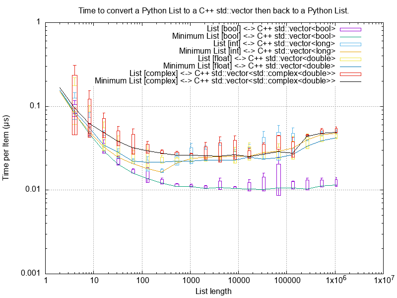

These are typically *round trip* converted at:

* 0.01 µs per object for booleans, say 100m objects a second.
* 0.025 µs per object for ``int``, ``float`` and ``complex``, say 40m objects a second.

And the *round trip* performance of a Python list of ``bool``, ``int``, ``float`` and ``complex`` numbers via a
C++ ``std::list``:

.. image:: ../plots/images/roundtrip_list_list_bool_int_float_complex_rate.png
    :height: 300px
    :align: center

These are typically *round trip* converted at:

* 0.1 µs per object for booleans, say 100m objects a second. This is about 10x the cost of using a ``std::vector``.

Python List of ``bytes``
^^^^^^^^^^^^^^^^^^^^^^^^^^^^^^^^^^^^^^^^^^^^^^^^^^^^^^^^^^^^^^

And a Python list of ``bytes`` for different lengths; 2, 16, 128 and 1024 bytes long via a C++ ``std::vector``:

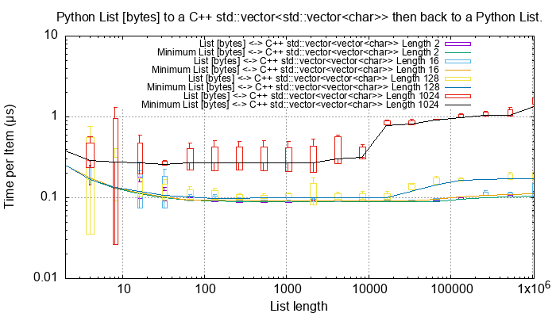

And a Python list of ``bytes`` for different lengths; 2, 16, 128 and 1024 bytes long via a C++ ``std::list``:

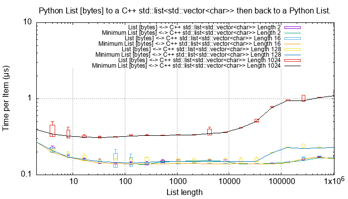

Given the size of each object this *round trip* time for lists can be summarised as:

=============== ======================= =========================== =========================== ===================
Object          Time per object (µs)    Rate (million/s)            Rate (Mb/s)                 Notes
=============== ======================= =========================== =========================== ===================
bytes[2]        0.1                     10                          20
bytes[16]       0.1                     10                          160
bytes[128]      0.1                     10                          1280
bytes[1024]     0.4 to 2.0              0.5 to 2.5                  500 to 2500
=============== ======================= =========================== =========================== ===================

Python List of ``str``
^^^^^^^^^^^^^^^^^^^^^^^^^^^^^^^^^^^^^^^^^^^^^^^^^^^^^^^^^^^^^^

And a Python list of ``str`` for different lengths; 2, 16, 128 and 1024 via a C++ ``std::vector``:

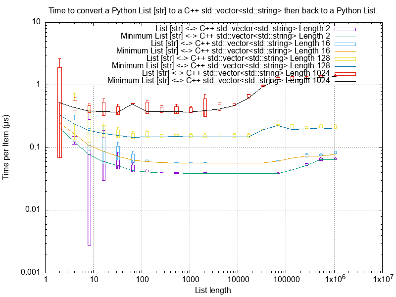

And via a C++ ``std::list``:

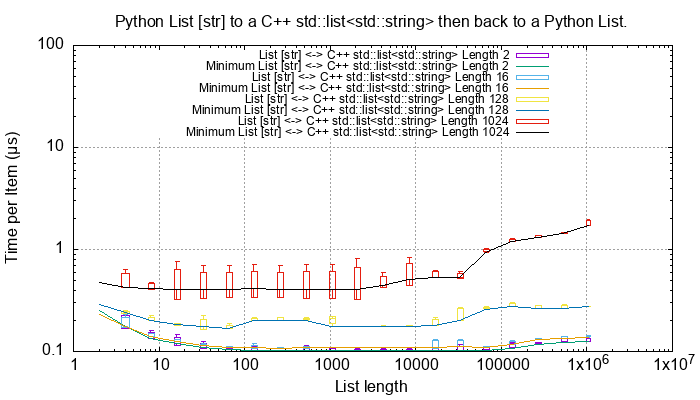

Given the size of each object this *round trip* time for lists can be summarised as:

=============== ======================= =========================== =========================== ===================
Object          Time per object (µs)    Rate (million/s)            Rate (Mb/s)                 Notes
=============== ======================= =========================== =========================== ===================
str[2]          0.05 to 0.1             10 to 20                    20 to 40
str[16]         0.05 to 0.1             10 to 20                    160 to 320
str[128]        0.2 to 0.4              2.5 to 5                    320 to 640
str[1024]       0.4 to 1.5              0.7 to 2.5                  700 to 2500
=============== ======================= =========================== =========================== ===================

Lists of ``str`` has, essentially, the same performance as a list of ``bytes``.

Python Sets
------------------------

Python Set of ``int``, ``float`` and ``complex``
^^^^^^^^^^^^^^^^^^^^^^^^^^^^^^^^^^^^^^^^^^^^^^^^^^^^^^^^^^^^^^

Here is the *round trip* performance of a Python set of ``int``, ``float`` and ``complex`` numbers:

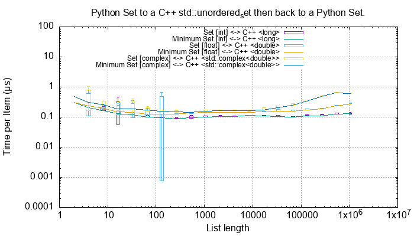

These are typically *round trip* converted at (for sets < 100,000 long):

* 0.15 µs per object for ``int``, say 6m objects a second.
* 0.2 µs per object for ``float``, say 5m objects a second.
* 0.3 µs per object for ``complex``, say 3m objects a second.

The *round trip* time for a list takes 0.025 µs for ``int``, ``float`` and ``complex`` so a set takes:

* 6x longer for an ``int``
* 8x longer for a ``float``.
* 12x longer for a ``complex`` number.

An explanation would be that the cost of hashing and insertion (and possible re-hashing the container) dominates the
performance compared to the cost of object conversion.

The rise in rate towards larger sets also suggests that re-hashing becomes dominant with larger sets.

Python Set of ``bytes``
^^^^^^^^^^^^^^^^^^^^^^^^^^^^^^^^^^^^^^^^^^^^^^^^^^^^^^^^^^^^^^

And a Python set of bytes for different lengths; 16, 128 and 1024 bytes long:

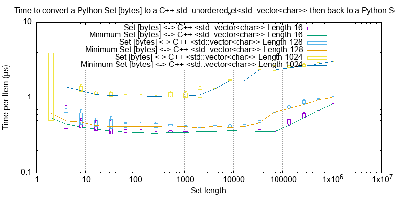

Here is the time per object compared with a list:

=============== =================================== =================================== =========== ===================
Object          set (µs)                            list (µs)                           Ratio       Notes
=============== =================================== =================================== =========== ===================
bytes[16]       ~0.6                                0.1                                 x6
bytes[128]      0.6 to 1.5                          0.1                                 x6 to x15
bytes[1024]     1.0 to 5.0                          0.4 to 2                            x2.5
=============== =================================== =================================== =========== ===================

Again, the cost of hashing and insertion explains the difference.

Given the size of each object this *round trip* time for sets can be summarised as:

=============== ======================= =========================== =========================== ===================
Object          Time per object (µs)    Rate (million/s)            Rate (Mb/s)                 Notes
=============== ======================= =========================== =========================== ===================
bytes[16]       ~0.6                    1.7                         27
bytes[128]      0.6 to 1.5              0.7 to 1.7                  90 to 220
bytes[1024]     1.0 to 5.0              0.2 to 1                    200 to 1000
=============== ======================= =========================== =========================== ===================

Python Set of ``str``
^^^^^^^^^^^^^^^^^^^^^^^^^^^^^^^^^^^^^^^^^^^^^^^^^^^^^^^^^^^^^^

TODO:

And a Python set of ``str`` for different lengths; 16, 128 and 1024 bytes long:

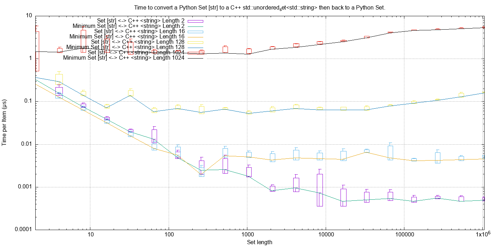

This is near identical with bytes with small strings having a slight edge.

Here is the time per object compared with a list:

=============== =================================== =================================== =========== ===================
Object          set (µs)                            list (µs)                           Ratio       Notes
=============== =================================== =================================== =========== ===================
str[16]         0.3                                 0.05 to 0.1                         x3 to x6
str[128]        0.8                                 0.2 to 0.4                          x2 to x4
str[1024]       1.0 to 5.0                          0.4 to 1.5                          x1 to x10
=============== =================================== =================================== =========== ===================

Again, the cost of hashing and insertion explains the difference.

Given the size of each object this *round trip* time for sets can be summarised as:

=============== ======================= =========================== =========================== ===================
Object          Time per object (µs)    Rate (million/s)            Rate (Mb/s)                 Notes
=============== ======================= =========================== =========================== ===================
bytes[16]       ~0.6                    1.7                         27
bytes[128]      0.6 to 1.5              0.7 to 1.7                  90 to 220
bytes[1024]     1.0 to 5.0              0.2 to 1                    200 to 1000
=============== ======================= =========================== =========================== ===================

Python Dictionaries
-----------------------------

Python Dict of ``int``, ``float`` and ``complex``
^^^^^^^^^^^^^^^^^^^^^^^^^^^^^^^^^^^^^^^^^^^^^^^^^^^^^^^^^^^^^^

Here is the round trip time for a Python dict to and from a C++ ``std::unordered_map<long, long>``.
This plots the *round trip* cost *per key/value pair* against dict size.

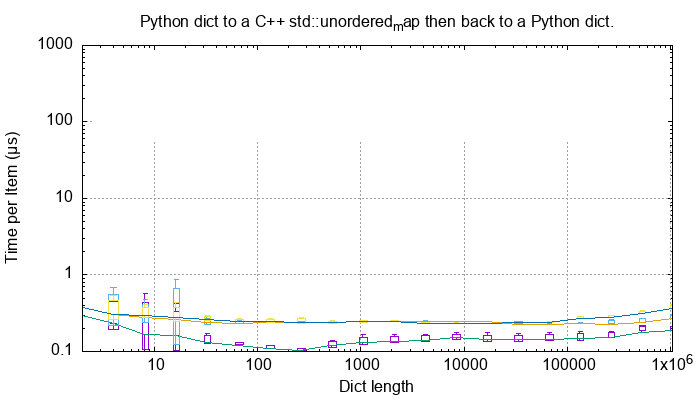

And for conversion via a C++ ``std::map``:

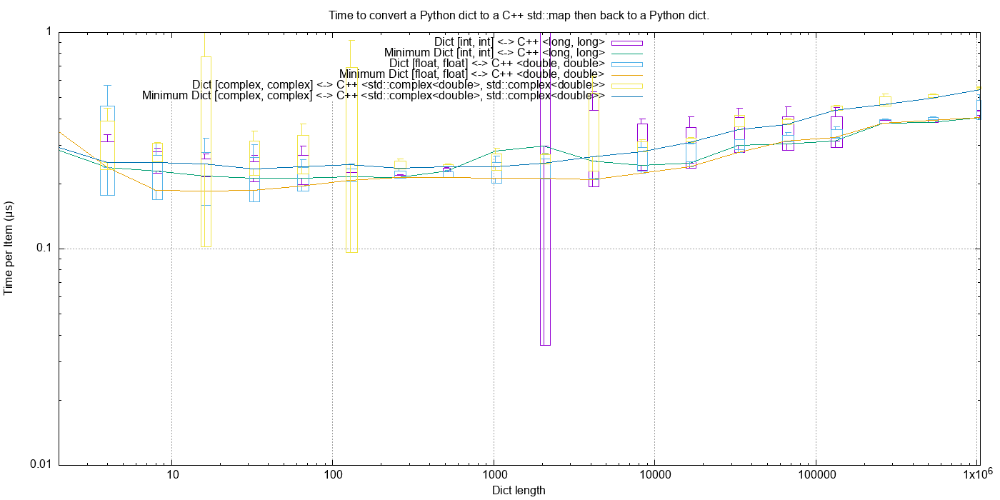

These are typically *round trip* converted at:

TODO:

* 0.2 µs per object for an int or float, say fm objects a second.
* 0.25 µs per object for a complex number, say 4m objects a second.

This is identical to the values for the set but includes the conversion time for both key and value.
The hashing, insertion and potential re-hashing dominate teh performance.

Python Dict of ``bytes``
^^^^^^^^^^^^^^^^^^^^^^^^^^^^^^^^^^^^^^^^^^^^^^^^^^^^^^^^^^^^^^

TODO:

Here is the *round trip* time for a Python dict [bytes, bytes] to and from a C++
``std::unordered_map<std::vector<char>, std::vector<char>>`` for different lengths; 16, 128 and 1024 bytes long.
The key and the value are the same length.

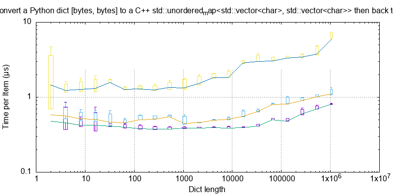

And via a C++ ``std::map``:

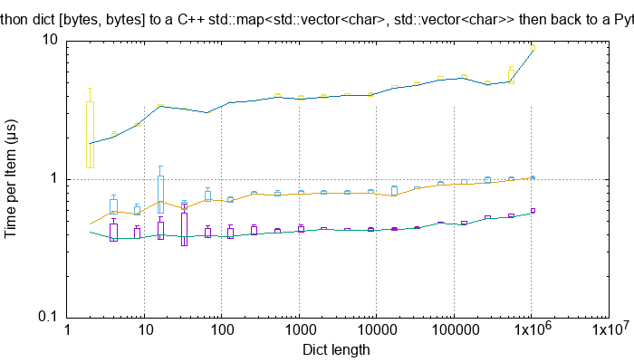

This *round trip* time for both keys and values for dicts can be summarised as:

=============== ======================= =========================== =========================== ===================
Object          Time per object (µs)    Rate (million/s)            Rate (Mb/s)                 Notes
=============== ======================= =========================== =========================== ===================
bytes[16]       0.5                     2                           32
bytes[128]      0.6 to 2                0.5 to 1.5                  64 to 256
bytes[1024]     2 to 6                  0.15 to 0.5                 150 to 512
=============== ======================= =========================== =========================== ===================

Python Dict of ``str``
^^^^^^^^^^^^^^^^^^^^^^^^^^^^^^^^^^^^^^^^^^^^^^^^^^^^^^^^^^^^^^

Here is the *round trip* time for a Python dict [str, str] to and from a C++
``std::unordered_map<std::string, std::string>`` for different lengths; 16, 128 and 1024 bytes long.
The key and the value are the same length.

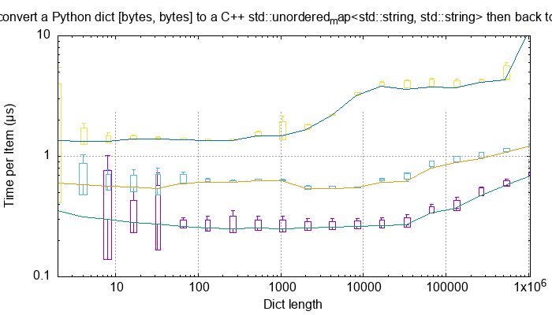

And via a C++ ``std::map``:

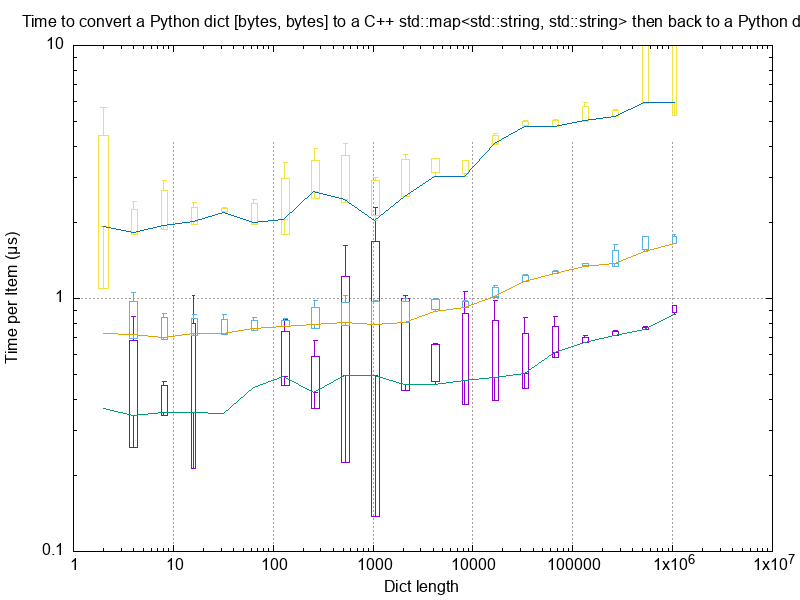

This *round trip* time for both keys and values for dicts can be summarised as:

=============== ======================= =========================== =========================== ===================
Object          Time per object (µs)    Rate (million/s)            Rate (Mb/s)                 Notes
=============== ======================= =========================== =========================== ===================
str[16]         0.4 to 1                1 to 2.5                    16 to 48
str[128]        0.6 to 2                0.5 to 1.7                  64 to 220
str[1024]       2 to 8                  0.125 to 0.5                125 to 500
=============== ======================= =========================== =========================== ===================

Summary
------------------

The fairly simple summary is that the round trip performance, as measured by the Python interpreter, agrees very
closely with the total cost Python -> C++ and C++ -> Python.
In some cases the performance is twice that figure but no more.
