.. moduleauthor:: Paul Ross <apaulross@gmail.com>
.. sectionauthor:: Paul Ross <apaulross@gmail.com>

.. Python to C++ to Python Round trip performance

.. _PyCppContainers.Performance.Round_trip:

Round-trip Python to C++ and back to Python
=================================================

Python Objects
------------------------------------------------

This shows the perfromance of converting a Python single object to its C++ equivalent and back again.

Python Bytes
^^^^^^^^^^^^^^

The Python test creates a Python bytes object of specified length(s), converts it to a C++ ``std::vector<char>`` and
then back to a Python bytes object all using this C++ library code.

The test code looks like this:

.. code-block:: python

    @pytest.mark.slow
    def test_new_bytes():
        results = []
        proc = psutil.Process()
        rss = proc.memory_info().rss
        for size in SIZE_DOUBLING:
            original = b' ' * size
            timer = TimedResults()
            for _r in range(REPEAT):
                time_start = time.perf_counter()
                cPyCppContainers.new_bytes(original)
                time_exec = time.perf_counter() - time_start
                timer.add(time_exec)
            results.append((size, timer))
        # pprint.pprint(results)
        print()
        print('test_new_bytes()')
        rss_new = proc.memory_info().rss
        print(f'RSS was {rss:,d} now {rss_new:,d} diff: {rss_new - rss:+,d}')
        print(f'{"Size":<8s} {results[0][1].str_header():s} {"Min/Size e9":>12s}')
        for s, t in results:
            print(f'{s:<8d} {t} {1e9 * t.min() / s:12.1f}')

And the output looks like this:

.. code-block:: text

    test_new_bytes()
    RSS was 55,828,480 now 58,531,840 diff: +2,703,360
    Size            Count              Min             Mean           Median         Std.Dev.              Max      Max/Min  Min/Size e9
    2                   5      0.000000235      0.000002002      0.000000322      0.000003841      0.000008873       37.757        117.5
    4                   5      0.000000253      0.000000381      0.000000277      0.000000168      0.000000614        2.427         63.3
    8                   5      0.000000253      0.000000276      0.000000258      0.000000044      0.000000355        1.403         31.6
    16                  5      0.000000251      0.000000269      0.000000255      0.000000028      0.000000317        1.263         15.7
    32                  5      0.000000254      0.000000267      0.000000256      0.000000024      0.000000310        1.220          7.9
    64                  5      0.000000255      0.000000314      0.000000258      0.000000128      0.000000544        2.133          4.0
    128                 5      0.000000253      0.000000359      0.000000270      0.000000199      0.000000714        2.822          2.0
    256                 5      0.000000257      0.000000385      0.000000271      0.000000255      0.000000839        3.265          1.0
    512                 5      0.000000260      0.000000421      0.000000264      0.000000344      0.000001035        3.981          0.5
    1024                5      0.000000462      0.000000788      0.000000492      0.000000563      0.000001774        3.840          0.5
    2048                5      0.000000365      0.000000803      0.000000455      0.000000783      0.000002197        6.019          0.2
    4096                5      0.000000407      0.000000593      0.000000569      0.000000225      0.000000957        2.351          0.1
    8192                5      0.000000528      0.000000708      0.000000620      0.000000267      0.000001180        2.235          0.1
    16384               5      0.000000729      0.000002129      0.000000794      0.000002982      0.000007462       10.236          0.0
    32768               5      0.000001100      0.000004238      0.000001217      0.000006875      0.000016537       15.034          0.0
    65536               5      0.000002512      0.000003666      0.000002617      0.000002208      0.000007598        3.025          0.0
    131072              5      0.000004827      0.000006307      0.000005193      0.000002674      0.000011073        2.294          0.0
    262144              5      0.000009739      0.000045346      0.000009934      0.000077901      0.000184683       18.963          0.0
    524288              5      0.000017699      0.000066024      0.000017893      0.000107562      0.000258436       14.602          0.0
    1048576             5      0.000034801      0.000130087      0.000035806      0.000207265      0.000500793       14.390          0.0

When plotted in time the performance looks like this:

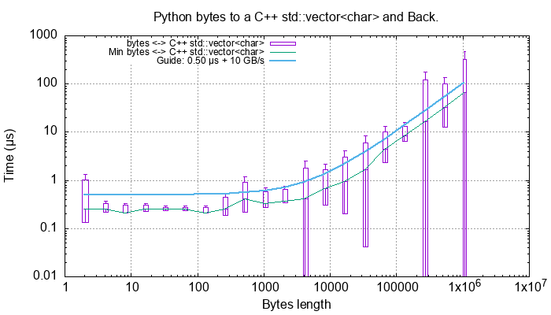

This is asymptotic to slightly over 10 GB/s round trip conversion time.

The rate plot, that is the time value divided by the length of the bytes is:

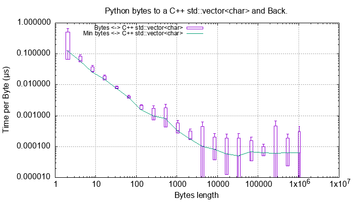

Python Strings
^^^^^^^^^^^^^^

For strings of 8/16/32 bit ord sizes the roundtrip time plot looks like this:

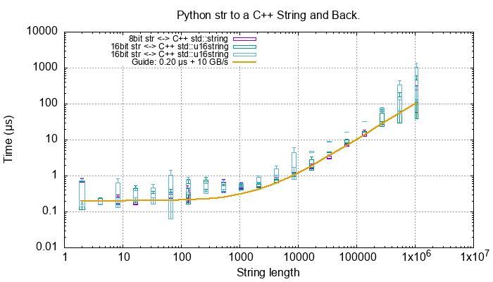

Again we are getting around 10 GB/s roundtrip conversion.
The rate plot is rather more revealing.

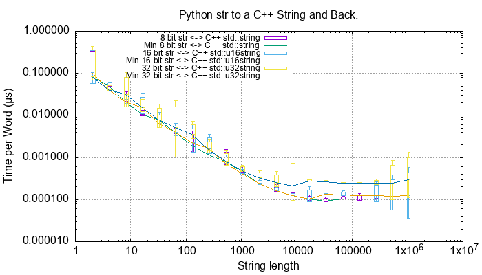

This shows the 16 bit word size takes about twice the 8 bit word size and the 32 bit word size takes about four time
the 8 bit word size which is exactly as expected.

Python Containers Code
------------------------------------------------

This uses some methods in the ``cPyCppContainers`` module that takes a Python container, converts it to a new C++
container and then converts that to a new Python container.
Timing is done in the Python interpreter.

This template converts a Python list to C++ and back:

.. code-block:: cpp

    #include "cpy/python_convert.h"

    using namespace Python_Cpp_Containers;

    template<typename T>
    static PyObject *
    new_list(PyObject *arg) {
        std::vector<T> vec;
        if (!py_list_to_cpp_std_vector(arg, vec)) {
            return cpp_std_vector_to_py_list(vec);
        }
        return NULL;
    }

Then the extension has the following instantiations for ``bool``, ``int``, ``float``, ``complex``, ``bytes`` and ``str``:

.. code-block:: cpp

    static PyObject *
    new_list_bool(PyObject *Py_UNUSED(module), PyObject *arg) {
        return new_list<bool>(arg);
    }

    static PyObject *
    new_list_float(PyObject *Py_UNUSED(module), PyObject *arg) {
        return new_list<double>(arg);
    }

    static PyObject *
    new_list_int(PyObject *Py_UNUSED(module), PyObject *arg) {
        return new_list<long>(arg);
    }

    static PyObject *
    new_list_complex(PyObject *Py_UNUSED(module), PyObject *arg) {
        return new_list<std::complex<double>>(arg);
    }

    static PyObject *
    new_list_bytes(PyObject *Py_UNUSED(module), PyObject *arg) {
        return new_list<std::vector<char>>(arg);
    }

    static PyObject *
    new_list_str(PyObject *Py_UNUSED(module), PyObject *arg) {
        return new_list<std::string>(arg);
    }

    static PyObject *
    new_list_str16(PyObject *Py_UNUSED(module), PyObject *arg) {
        return new_list<std::u16string>(arg);
    }

    static PyObject *
    new_list_str32(PyObject *Py_UNUSED(module), PyObject *arg) {
        return new_list<std::u32string>(arg);
    }

Similar code exists for Python sets and dicts of specific types.
Since the tuple conversion C++ code is essentially identical to the list conversion code no performance tests are done on tuples.
It might be that the Python C API for tuples is significantly different than for list but this is considered unlikely.

Python Lists
------------------------------------------------

Python List of ``bool``, ``int``, ``float`` and ``complex``
^^^^^^^^^^^^^^^^^^^^^^^^^^^^^^^^^^^^^^^^^^^^^^^^^^^^^^^^^^^^^^

Here is the *round trip* performance of a Python list of ``bool``, ``int``, ``float`` and ``complex`` numbers via a
C++ ``std::vector``:

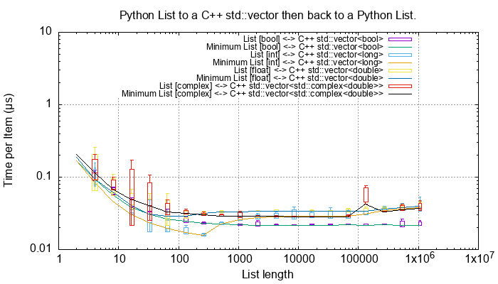

These are typically *round trip* converted at:

* 0.01 µs per object for booleans, say 100m objects a second.
* 0.025 µs per object for ``int``, ``float`` and ``complex``, say 40m objects a second.

And the *round trip* performance of a Python list of ``bool``, ``int``, ``float`` and ``complex`` numbers via a
C++ ``std::list``:

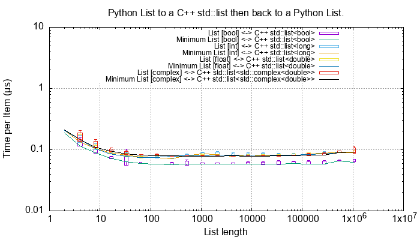

These are typically *round trip* converted at:

* 0.1 µs per object for booleans, say 100m objects a second. This is about 10x the cost of using a ``std::vector``.

Python List of ``bytes``
^^^^^^^^^^^^^^^^^^^^^^^^^^^^^^^^^^^^^^^^^^^^^^^^^^^^^^^^^^^^^^

And a Python list of ``bytes`` for different lengths; 2, 16, 128 and 1024 bytes long via a C++ ``std::vector``:

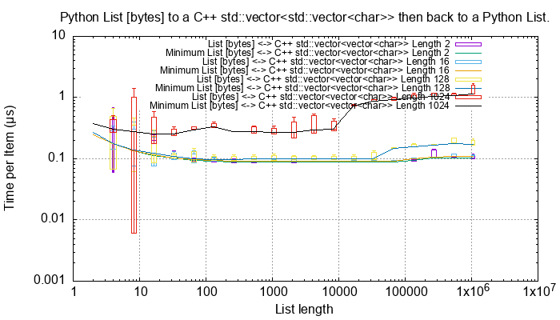

And a Python list of ``bytes`` for different lengths; 2, 16, 128 and 1024 bytes long via a C++ ``std::list``:

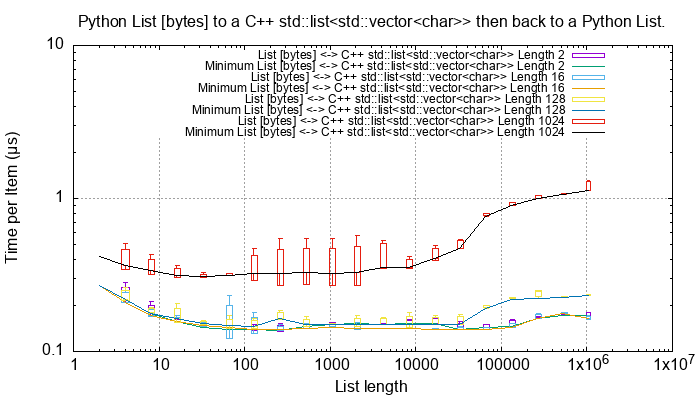

Given the size of each object this *round trip* time for lists can be summarised as:

=============== ======================= =========================== =========================== ===================
Object          Time per object (µs)    Rate (million/s)            Rate (Mb/s)                 Notes
=============== ======================= =========================== =========================== ===================
bytes[2]        0.1                     10                          20
bytes[16]       0.1                     10                          160
bytes[128]      0.1                     10                          1280
bytes[1024]     0.4 to 2.0              0.5 to 2.5                  500 to 2500
=============== ======================= =========================== =========================== ===================

Python List of ``str``
^^^^^^^^^^^^^^^^^^^^^^^^^^^^^^^^^^^^^^^^^^^^^^^^^^^^^^^^^^^^^^

And a Python list of ``str`` for different lengths; 2, 16, 128 and 1024 via a C++ ``std::vector``:

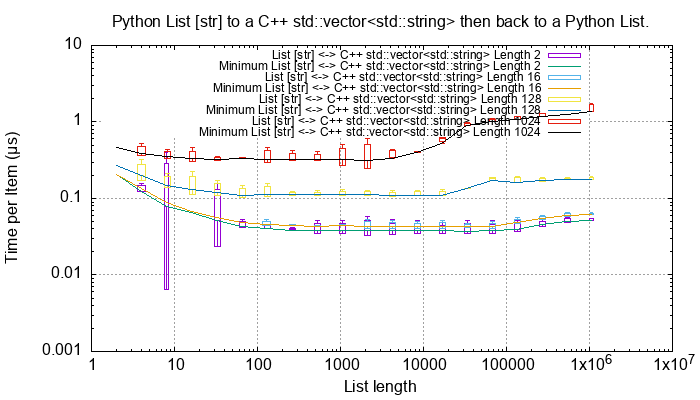

And via a C++ ``std::list``:

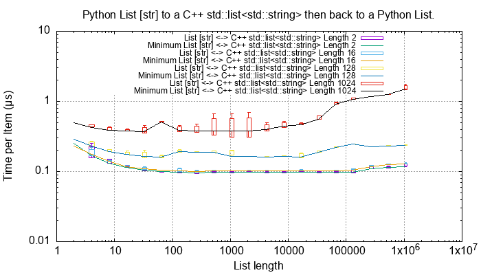

Given the size of each object this *round trip* time for lists can be summarised as:

=============== ======================= =========================== =========================== ===================
Object          Time per object (µs)    Rate (million/s)            Rate (Mb/s)                 Notes
=============== ======================= =========================== =========================== ===================
str[2]          0.05 to 0.1             10 to 20                    20 to 40
str[16]         0.05 to 0.1             10 to 20                    160 to 320
str[128]        0.2 to 0.4              2.5 to 5                    320 to 640
str[1024]       0.4 to 1.5              0.7 to 2.5                  700 to 2500
=============== ======================= =========================== =========================== ===================

Lists of ``str`` has, essentially, the same performance as a list of ``bytes``.

Python Sets
------------------------

Python Set of ``int``, ``float`` and ``complex``
^^^^^^^^^^^^^^^^^^^^^^^^^^^^^^^^^^^^^^^^^^^^^^^^^^^^^^^^^^^^^^

Here is the *round trip* performance of a Python set of ``int``, ``float`` and ``complex`` numbers:

.. image:: ../plots/images/roundtrip_set_ints_and_floats_rate.png
    :height: 400px
    :align: center

These are typically *round trip* converted at (for sets < 100,000 long):

* 0.15 µs per object for ``int``, say 6m objects a second.
* 0.2 µs per object for ``float``, say 5m objects a second.
* 0.3 µs per object for ``complex``, say 3m objects a second.

The *round trip* time for a list takes 0.025 µs for ``int``, ``float`` and ``complex`` so a set takes:

* 6x longer for an ``int``
* 8x longer for a ``float``.
* 12x longer for a ``complex`` number.

An explanation would be that the cost of hashing and insertion (and possible re-hashing the container) dominates the
performance compared to the cost of object conversion.

The rise in rate towards larger sets also suggests that re-hashing becomes dominant with larger sets.

Python Set of ``bytes``
^^^^^^^^^^^^^^^^^^^^^^^^^^^^^^^^^^^^^^^^^^^^^^^^^^^^^^^^^^^^^^

And a Python set of bytes for different lengths; 16, 128 and 1024 bytes long:

.. image:: ../plots/images/roundtrip_set_bytes_rate.png
    :height: 400px
    :align: center

Here is the time per object compared with a list:

=============== =================================== =================================== =========== ===================
Object          set (µs)                            list (µs)                           Ratio       Notes
=============== =================================== =================================== =========== ===================
bytes[16]       ~0.6                                0.1                                 x6
bytes[128]      0.6 to 1.5                          0.1                                 x6 to x15
bytes[1024]     1.0 to 5.0                          0.4 to 2                            x2.5
=============== =================================== =================================== =========== ===================

Again, the cost of hashing and insertion explains the difference.

Given the size of each object this *round trip* time for sets can be summarised as:

=============== ======================= =========================== =========================== ===================
Object          Time per object (µs)    Rate (million/s)            Rate (Mb/s)                 Notes
=============== ======================= =========================== =========================== ===================
bytes[16]       ~0.6                    1.7                         27
bytes[128]      0.6 to 1.5              0.7 to 1.7                  90 to 220
bytes[1024]     1.0 to 5.0              0.2 to 1                    200 to 1000
=============== ======================= =========================== =========================== ===================

Python Set of ``str``
^^^^^^^^^^^^^^^^^^^^^^^^^^^^^^^^^^^^^^^^^^^^^^^^^^^^^^^^^^^^^^

TODO:

And a Python set of ``str`` for different lengths; 16, 128 and 1024 bytes long:

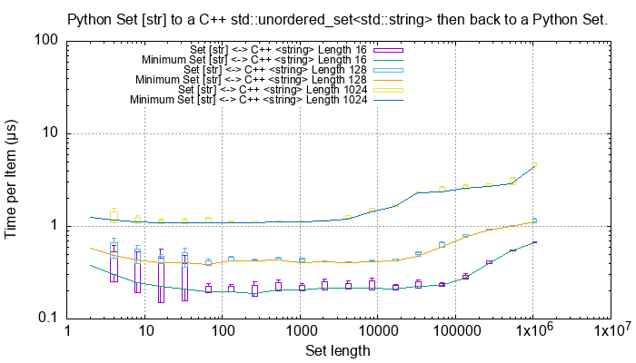

This is near identical with bytes with small strings having a slight edge.

Here is the time per object compared with a list:

=============== =================================== =================================== =========== ===================
Object          set (µs)                            list (µs)                           Ratio       Notes
=============== =================================== =================================== =========== ===================
str[16]         0.3                                 0.05 to 0.1                         x3 to x6
str[128]        0.8                                 0.2 to 0.4                          x2 to x4
str[1024]       1.0 to 5.0                          0.4 to 1.5                          x1 to x10
=============== =================================== =================================== =========== ===================

Again, the cost of hashing and insertion explains the difference.

Given the size of each object this *round trip* time for sets can be summarised as:

=============== ======================= =========================== =========================== ===================
Object          Time per object (µs)    Rate (million/s)            Rate (Mb/s)                 Notes
=============== ======================= =========================== =========================== ===================
bytes[16]       ~0.6                    1.7                         27
bytes[128]      0.6 to 1.5              0.7 to 1.7                  90 to 220
bytes[1024]     1.0 to 5.0              0.2 to 1                    200 to 1000
=============== ======================= =========================== =========================== ===================

Python Dictionaries
-----------------------------

Python Dict of ``int``, ``float`` and ``complex``
^^^^^^^^^^^^^^^^^^^^^^^^^^^^^^^^^^^^^^^^^^^^^^^^^^^^^^^^^^^^^^

Here is the round trip time for a Python dict to and from a C++ ``std::unordered_map<long, long>``.
This plots the *round trip* cost *per key/value pair* against dict size.

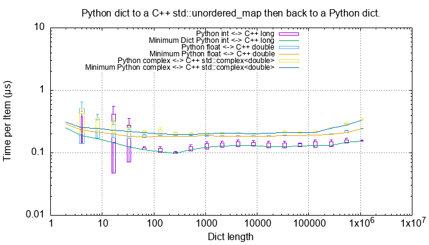

And for conversion via a C++ ``std::map``:

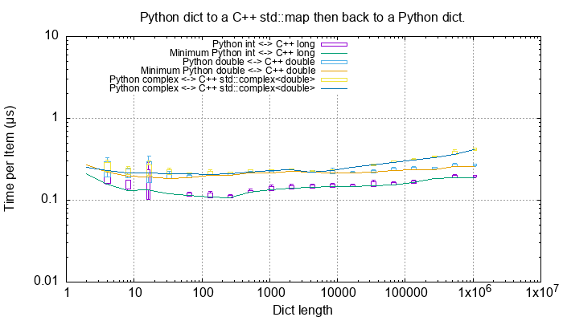

These are typically *round trip* converted at:

TODO:

* 0.2 µs per object for an int or float, say fm objects a second.
* 0.25 µs per object for a complex number, say 4m objects a second.

This is identical to the values for the set but includes the conversion time for both key and value.
The hashing, insertion and potential re-hashing dominate the performance.

Python Dict of ``bytes``
^^^^^^^^^^^^^^^^^^^^^^^^^^^^^^^^^^^^^^^^^^^^^^^^^^^^^^^^^^^^^^

TODO:

Here is the *round trip* time for a Python dict [bytes, bytes] to and from a C++
``std::unordered_map<std::vector<char>, std::vector<char>>`` for different lengths; 16, 128 and 1024 bytes long.
The key and the value are the same length.

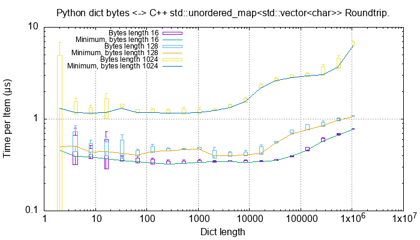

And via a C++ ``std::map``:

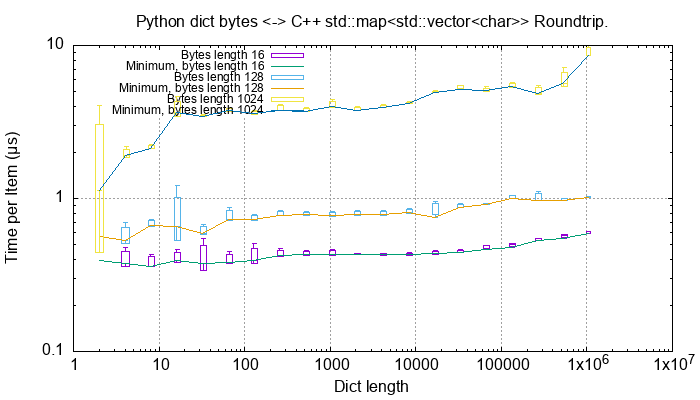

This *round trip* time for both keys and values for dicts can be summarised as:

=============== ======================= =========================== =========================== ===================
Object          Time per object (µs)    Rate (million/s)            Rate (Mb/s)                 Notes
=============== ======================= =========================== =========================== ===================
bytes[16]       0.5                     2                           32
bytes[128]      0.6 to 2                0.5 to 1.5                  64 to 256
bytes[1024]     2 to 6                  0.15 to 0.5                 150 to 512
=============== ======================= =========================== =========================== ===================

Python Dict of ``str``
^^^^^^^^^^^^^^^^^^^^^^^^^^^^^^^^^^^^^^^^^^^^^^^^^^^^^^^^^^^^^^

Here is the *round trip* time for a Python dict [str, str] to and from a C++
``std::unordered_map<std::string, std::string>`` for different lengths; 16, 128 and 1024 bytes long.
The key and the value are the same length.

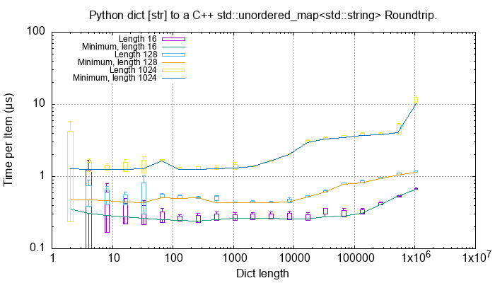

And via a C++ ``std::map``:

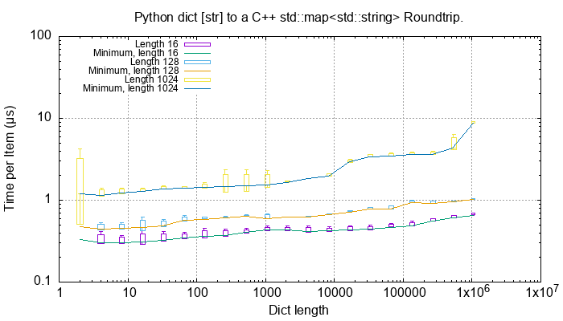

This *round trip* time for both keys and values for dicts can be summarised as:

=============== ======================= =========================== =========================== ===================
Object          Time per object (µs)    Rate (million/s)            Rate (Mb/s)                 Notes
=============== ======================= =========================== =========================== ===================
str[16]         0.4 to 1                1 to 2.5                    16 to 48
str[128]        0.6 to 2                0.5 to 1.7                  64 to 220
str[1024]       2 to 8                  0.125 to 0.5                125 to 500
=============== ======================= =========================== =========================== ===================

Unicode Strings of Different Codepoint Sizes
^^^^^^^^^^^^^^^^^^^^^^^^^^^^^^^^^^^^^^^^^^^^^^^^^^

TODO: roundtrip_list_vector_str16_String_length_2.dat etc.

Here is a plot of round tripping a dict of ``[int, str]`` for unicode sizes of 8 bit, 16 bit and 32 bit to a
C++ ``std::map`` and back:

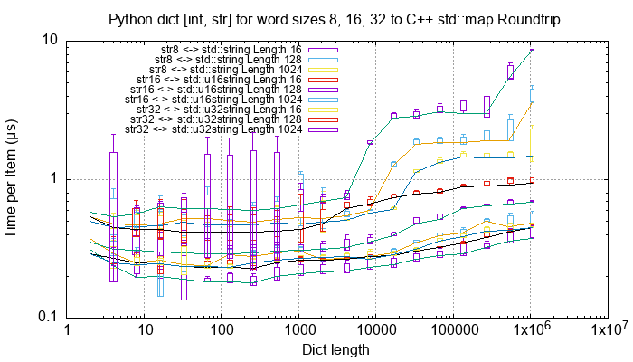

.. todo::

    Commentary.

And, simplified for 1024 length strings.

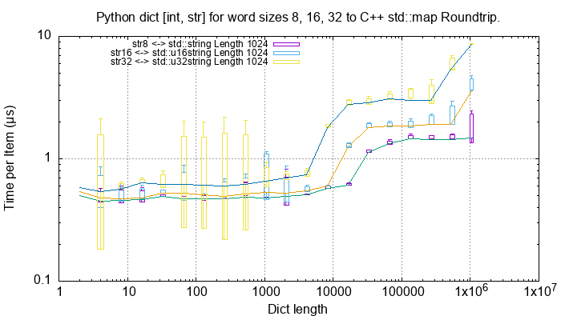

.. todo::

    Commentary.

And similar plots for converting to a ``std::unordered_map``:

.. todo::

    Commentary.

And, simplified for 1024 length strings.

.. todo::

    Commentary.

TODO: add roundtrip_list_vector_str16_String_length_2.dat (8 files).

Summary
------------------

The fairly simple summary is that the round trip performance, as measured by the Python interpreter, agrees very
closely with the total cost Python -> C++ and C++ -> Python.
In some cases the performance is twice that figure but no more.
